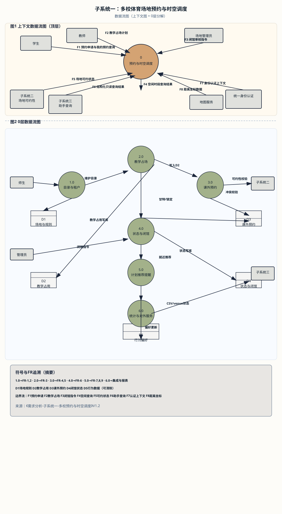
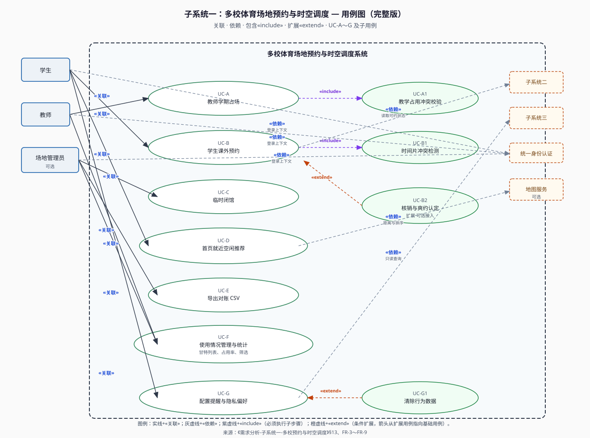

# 软件工程课程需求分析文档（子系统一）

## 多校体育场地预约与时空调度子系统

---

### 1. 文档说明

| 项目 | 内容 |
|------|------|
| 子系统名称 | 多校体育场地预约与时空调度子系统 |
| 文档类型 | 需求分析（课程作业） |
| 版本 | V1.3 |
| 关联系统 | 智慧校园体育场地综合管理平台 |

---

### 2. 引言与编写目的

本需求分析针对「智慧校园体育场地综合管理平台」中的**预约与时空调度**能力进行界定。高校体育资源具有**多主体共用、时段冲突敏感、校际与校内政策差异大**等特点；本系统需在统一技术架构下，支撑**各校独立配置**的体育上课场地预约规则，并兼顾**课外空闲时段**面向学生的开放预约。编写目的在于明确该子系统的业务边界、用户角色期望、功能与非功能需求，为概要设计、接口划分及测试验收提供依据。

---

### 3. 参考资料与行业实践（检索摘要）

国内多所高校已建设或升级**体育馆与场地线上预约**能力。公开通知与报道中较常见的共性包括：**移动端或统一门户入口**、预约前对**日期、时段、场地类型**的确认、**提前预约天数与固定放号时刻**（缓解电话预约繁琐与现场排队）、以及与智慧校园相关的**状态展示或管理看板**思路。本课程文档将上述共性抽象为**可配置需求**（如提前 N 天、每日 M 点开放新号源），**不绑定某一厂商或某一所高校的具体系统**，以便后续概要设计阶段自由选型。

---

### 4. 背景与问题陈述

当前高校体育场地普遍存在信息分散、预约规则不统一、冲突难以及时发现等问题。教师需为本校体育课锁定专用场地与时段；学生在课余希望使用体育场，却常因不了解空闲情况而排队或跑空。多校共建统一平台时，必须避免**跨校数据串扰**，并尊重各校在开放时间、审批流程、收费或押金策略上的差异。本子系统在多校并存前提下，提供体育课场地预约、学生空闲时段预约、使用情况统计与导出，并通过**时间规划与提醒**降低爽约，通过**位置与空闲联合推荐**缩短约场路径；行为数据的采集须**合规、可关闭、可审计**。

---

### 5. 术语与缩写

- **学校租户**：以学校为粒度隔离数据与配置的逻辑主体。
- **时间片**：场地在某一连续时段内的可占用单元，可与课程节次或自定义时段绑定。
- **空闲时段**：未被教学占用且政策允许学生预约的时段。
- **爽约**：用户已确认预约后未在规定时间到场且未按规则取消（认定细则由各校配置）。

---

### 6. 系统目标与范围

**6.1 目标**

- 为各校师生提供**可审计、可冲突检测**的场地时段预约能力，区分**教学占用**与**课外开放**两类资源池。
- 提供**使用情况管理**：掌握各场地在任意时段的占用状态（教学、训练、维护锁定、空闲可约等），支持统计与导出。
- 提供**时间规划表**：以日历或列表聚合已确认预约，并支持**提醒**（应用内必选、短信或邮件可选、日历导出可选）。
- 在首页提供**智能入口**：结合用户授权位置与场地实时空闲，**优先推荐距离近且近期可约**的场地；**记录预约与浏览习惯**（偏好时段、场地类型、校区等），为后续推荐或规则引擎提供输入，且须支持**关闭个性化**与**删除行为数据**。

**6.2 范围（In Scope）**

- 多租户隔离下的场地目录、时段模板、预约规则（提前量、取消时限、并发预约上限、放号策略等）。
- 体育课程关联场地的占用（课表导入、教师申请或管理员维护等流程由校方选择，本文描述能力）。
- 学生课外空闲时段预约、冲突校验；可选候补或排队规则可在概要设计中与子模块「智能调度」合并实现。
- 用户个人预约视图与提醒策略配置。

**6.3 范围外（由其他子系统负责）**

- 场地清洁、负责人档案、灯光与用具等**运维与资产**细节由**子系统二**负责；本子系统仅消费其输出的**场地是否可约**等信号。
- 自然语言交互与新手引导由**子系统三（DeepSeek）**负责；本子系统须提供**预约与空闲查询类 API** 供助手在授权下调用。

---

### 7. 用户与干系人

**主要用户**

- **学生**：课外锻炼、社团活动、个人训练等场景下预约空闲场地；查看个人时间规划与提醒。
- **教师**：体育课程或训练占场；协调补课、调场；查看所负责班级或课程关联场地使用情况。
- **场地管理员（可选）**：审核异常预约、临时闭馆、政策性关闭。

**干系人**

- **学校体育管理部门或场馆中心**：开放时段、定价（若适用）、违约与爽约规则。
- **信息化部门**：统一身份认证、账号与租户归属对接。

---

### 8. 功能性需求

**FR-1 多校与权限隔离**  
区分学校租户；同一用户在不同学校的身份与数据相互隔离；教师、学生仅在本校范围内预约与查询。

**FR-2 场地目录与分组**  
维护场地名称、类型、坐标或校区层级、容量、是否对学生开放课外预约；支持场地分组以便检索与推荐。

**FR-3 体育上课场地预约**  
将课程或教学活动与场地、重复周次、节次绑定；占用时段在课外池中剔除或标记不可约；支持按学期维护与审计调整。

**FR-4 空闲时段学生预约**  
检索场地、选择日期与连续时段；**时间重叠冲突**校验；支持取消与改期（受规则约束）；可选小组预约且人数不超过容量策略。

**FR-5 可选核验与使用确认**  
预留与扫码、闸机或人工核销的对接，将预约状态推进为「已使用」或认定爽约（实现形态设计阶段确定）。

**FR-6 使用情况管理**  
甘特图或列表视图；按场地、日期、用途筛选；临时闭馆一键锁定；占用率、爽约次数、热门时段等统计；明细导出 CSV 并记审计日志。

**FR-7 时间规划表与提醒**  
「我的预约」时间线或日历；课前或开场前提醒；提醒中含场地、时间、地图入口（若对接）。

**FR-8 首页就近空闲推荐**  
授权定位时按**距离与空闲**联合排序；无定位时按常用或最近校区降级；展示最近可约时段与距离说明（地图 API 计算）。

**FR-9 用户习惯数据**  
在隐私政策与用户同意下记录时段偏好、场地类型偏好、取消率等；提供**关闭个性化推荐**与**清除行为数据**；不得用于与本平台无关的营销用途。

---

### 9. 数据与状态（需求层概要）

建议区分预约状态：`草稿`、`待审核`（若启用）、`已确认`、`已取消`、`已过期`、`已核销`、`爽约` 等。时间片状态：`空闲`、`教学占用`、`学生预约占用`、`维护锁定`、`政策性关闭`。详细枚举在详细设计中落库。

---

### 10. 非功能性需求

- **性能**：高峰抢约场景下列表与冲突校验响应可接受（如 P95 设计目标由校方与运维约定）。
- **可靠性**：预约提交具备**幂等或事务**语义，避免重复占用时段。
- **安全**：写操作鉴权；跨租户访问拦截并记安全日志；凭证号防枚举。
- **合规**：位置与行为数据最小必要；支持用户权利请求与学校隐私政策对齐。

---

### 11. 外部集成（可选）

统一身份认证（OAuth2、SAML、CAS 等）；地图服务（距离与路线）；可选一卡通或闸机回传（仅描述状态同步需求）。

#### 11.1 数据流图（上下文图与 0 层分解）

与 `docs/dfd/dfd-子系统一-多校预约与时空调度.svg` 为同一矢量图，见第 13.1 节用例图前后文对照。

---

### 12. 假设与约束

- 场地主数据由管理端维护或由子系统二同步；坐标精度影响距离排序。
- 与教务对接方式因校而异，以「支持导入与接口同步」为需求表述。
- 第三方服务不可用时的降级策略（仅展示列表、不排序距离等）须在概要设计中说明。

---

### 13. 典型用例详述（课程可映射用例图）

- **UC-A 教师学期占场**：教师选择课程、周次与场地，系统校验与已有教学占用、维护锁定无冲突后生成学期占用计划，学生端对应时段显示为不可约。
- **UC-B 学生课外预约**：学生按日期与场地类型筛选，系统展示可约时间片；确认后生成凭证；若启用爽约策略，未签到超时释放并可能记入信用。
- **UC-C 临时闭馆**：管理员或运维标记闭馆后，新预约被拒绝，已预约用户收到改期或取消通知（渠道可配置）。
- **UC-D 首页一键直达**：用户授权位置后，列表顶部展示「附近且下一时段可约」的场地，点击进入预约页并预填推荐时段。
- **UC-E 导出对账**：授权角色导出某场地区间明细 CSV，系统记录导出操作者与时间，防止批量数据外泄无迹可查。

---

### 13.1 用例图（UML）

下图为本子系统**完整用例图**（主用例 UC-A～G、子用例 UC-A1/UC-B1/UC-B2/UC-G1，并标出 **«关联» «依赖» «include» «extend»**）。矢量文件便于插入 Word / PPT；另见同目录 `usecase-subsystem-1-booking.svg`（与中文同名文件内容一致）。

#### 13.1.1 关系说明（与上图一一对应）

下列关系按 UML 习惯书写：**关联**（参与者—用例，实线）、**与外部协作方的交互**（用例—外部系统，图中为虚线并带简要语义）。方向按“谁依赖谁获取信息”叙述；接口细节在概要设计中落地。

**一、参与者 ↔ 用例（关联）**

| 编号 | 参与者 | 关系 | 用例 | 简要说明 |
|------|--------|------|------|----------|
| R1 | 教师 | 关联 | UC-A 教师学期占场 | 维护课程与场地、周次占用，形成学期占用计划。 |
| R2 | 学生 | 关联 | UC-B 学生课外预约 | 检索空闲时间片、提交预约、取消或改期（受规则约束）。 |
| R3 | 场地管理员 | 关联 | UC-C 临时闭馆 | 一键闭馆或政策性关闭，拒绝新预约并触发通知（渠道可配置）。 |
| R4 | 学生 | 关联 | UC-D 首页就近空闲推荐 | 在授权定位前提下获得距离与空闲联合排序的推荐入口。 |
| R5 | 场地管理员（或校方授权的导出角色） | 关联 | UC-E 导出对账 CSV | 导出指定范围明细并记审计日志；具体授权角色由学校配置。 |
| R6 | 教师 | 关联 | UC-F 使用情况管理与统计 | 查看与课程或职责相关的场地占用与使用情况视图。 |
| R7 | 场地管理员 | 关联 | UC-F 使用情况管理与统计 | 全场或分区统计、闭馆与占用视图、报表侧管理功能。 |
| R8 | 学生 | 关联 | UC-G 配置提醒与隐私偏好 | 「我的预约」相关提醒策略；关闭个性化、清除行为数据等（FR-9）。 |

**二、用例 ↔ 外部系统 / 子系统（图中虚线）**

| 编号 | 用例 | 关系 | 外部元素 | 简要说明 |
|------|------|------|----------|----------|
| X1 | UC-B | 交互 / 依赖 | 子系统二（场地可约） | 课外预约前需结合运维侧「是否可约」等信号做约束或提示（只读）。 |
| X2 | UC-D | 交互 / 依赖 | 地图服务（可选） | 距离计算、路线或排序所需坐标与路径能力；不可用时可降级为列表（需求文档假设）。 |
| X3 | UC-G（及助手触发的查询场景） | 交互 / 依赖 | 子系统三（助手 API） | 智能助手通过本子系统提供的结构化查询接口完成只读查询；**不改变预约事务**，最终以用户在本系统的确认为准（见 §16）。 |
| X4 | 全体需登录用例 | 交互 / 依赖 | 统一身份认证 | 登录、租户（学校）上下文与权限边界（OAuth2/SAML/CAS 等，§11）。 |

**三、未单独展开但在详细设计中常见的关系（可选用例扩展）**

| 说明 |
|------|
| **FR-5 核验与核销**：可作为 UC-B 的扩展用例（扫码/闸机核销、爽约认定）。 |
| **FR-9 行为数据**：可在 UC-G 下列出 «extend» 或单独子用例「清除行为数据」「关闭个性化推荐」。 |

---

### 14. 运营与报表（可选增强）

可在二期提供：按校区、场地类型的**利用率热力**；爽约率与高峰时段曲线；开放策略调整前后的对比（需定义基线周）。报表仅对授权角色开放，默认脱敏个人标识。

---

### 15. 验收要点（摘要）

教学占场与课外预约无双重预订；用户完成「检索—选时—确认—提醒—取消或改期」闭环；首页在授权定位下体现距离与空闲联合排序；关闭个性化后行为数据不参与排序；高峰抽样无超卖。

---

### 16. 与其他子系统协作（摘要）

- **子系统二**：只读获取 `venue` 是否可约及原因码。
- **子系统三**：提供结构化查询接口供 DeepSeek 工具调用；助手不直接写预约事务。

---

**文档版本**：V1.3（第 11.1 节补充 DFD 图，与 dfd 目录一致）
