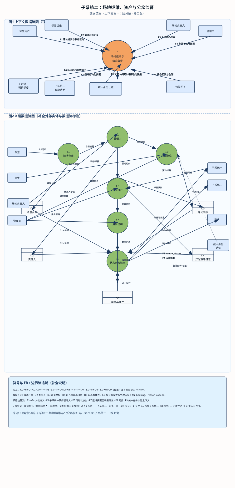
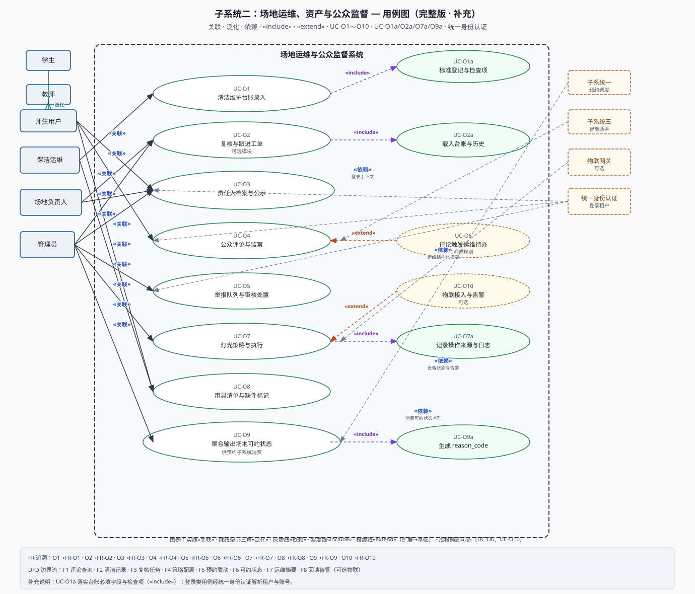

# 软件工程课程需求分析文档（子系统二）

## 场地运维、资产与公众监督子系统

---

### 1. 文档说明

| 项目 | 内容 |
|------|------|
| 子系统名称 | 场地运维、资产与公众监督子系统 |
| 文档类型 | 需求分析（课程作业） |
| 版本 | V1.5 |
| 关联系统 | 智慧校园体育场地综合管理平台 |

---

### 2. 引言与编写目的

体育场地除「时段预约」外，还涉及**日常清洁、设施完好、灯光能耗、器材配置**等运维问题；师生作为高频使用者，对地面湿滑、照明不足、器材缺失等情况往往最早感知。本子系统将**运维流程数字化**，并建立**面向注册用户的监督与评论机制**，使场地状态透明、责任可追溯。本文档用于课程需求分析阶段，明确功能边界及与子系统一（预约调度）、子系统三（智能助手）的协作关系。

---

### 3. 行业参考与技术趋势（检索摘要）

### 3.1 体育照明与物联网（概括）

公开资料中，**物联网与体育照明**的结合强调：通过通讯网络对灯具亮度、场景模式、开关时序进行集中管理，支持远程监控与能耗数据统计，并可在训练、清场等不同场景下切换策略，有利于**按需用能**。本校级平台可将能力降维为：**预约时段联动开灯规则**、故障申报、操作与回读日志；**不强制绑定硬件厂商**，可先以人工录入与策略引擎为主。

### 3.2 智慧场馆综合管理（借鉴思路）

大型体育中心智慧化案例常提及**多子系统打通、设备接入、统一运维视图、告警闭环**等。高校场馆规模不同，但可借鉴「**统一状态视图 + 异常可处置**」：将清洁、灯光、器材缺件、评论热点纳入同一运维工作台，减少信息孤岛。

---

### 4. 背景与问题陈述

若仅完成预约而缺乏运维闭环，易出现「场地脏、灯不亮、球网缺失仍被约满」等体验问题。通过**可审计的维护记录**与**开放评论监察**，把责任落实到人与事件，并为子系统一提供「是否适宜开放」的辅助信号（如严重故障时暂停预约）。多校场景下，各校后勤与外包模式不同，系统应支持**从纯人工到半物联**的渐进演进。

---

### 5. 系统目标与范围

**5.1 目标**

- **维护情况可视化**：记录每日或每场次的清洁是否完成、执行人、质量自评或抽检；可选照片；**未达标或维护中**时可联动禁止预约。
- **责任人体系**：每场地绑定负责人（主任、场馆管理员或勤工岗等），联系方式按隐私分级展示。
- **公众监察与评论**：认证用户可发表评价或反馈（星级、文字、图片）；举报与审核流程；可选点赞、校方回复。
- **灯光管理**：手动、定时或与预约联动；记录开关来源与故障单号；策略与**子系统一**时间窗同步。
- **用具管理**：标配器材清单，明确**场地提供、需自带、可选租赁**；在预约确认页与子系统一联动展示。

**5.2 范围（In Scope）**

场地主数据扩展（负责人、清洁标准、灯光配置、器材清单）；清洁台账；评论与内容治理；向子系统一输出可约性 API。

**5.3 范围外**

子系统一的时段冲突与课表占场；子系统三的 DeepSeek 对话（评论摘要检索权限需单独设计）。

---

### 6. 用户与干系人

- **学生、教师**：查看运维公开信息、发表评论、查看自带器材说明与负责人信息。
- **保洁与运维人员**：录入清洁记录、灯光检查、器材补充或缺件标记。
- **场地负责人**：接收反馈、协调维修、更新状态。
- **管理员**：责任人档案、评论审核、灯光与用具策略、争议工单。
- **后勤与保卫**：夜间灯光与安全政策协同。

#### 6.1 角色与操作权限（摘要）

下列为需求层粗粒度约束，实现时可按学校 IAM 与租户策略细化；**写操作**均应在后台留痕。

| 角色 | 台账与复核 | 责任人档案 | 评论/举报 | 灯光与用具策略 | 可约性规则治理 |
|------|------------|------------|-----------|----------------|----------------|
| 师生用户 | 只读公开摘要（今日清洁、公告等） | 只读脱敏联系方式 | 发评、自删、举报 | 无 | 无 |
| 保洁运维 | 录入/更新台账（FR-O1） | 一般不写 | 一般不写 | 现场操作灯光记录（若授权）、缺件标记（FR-O8） | 无 |
| 场地负责人 | 复核、待办、协同整改（FR-O2） | 触发变更申请（受流程约束） | 协同处置、场地侧回复 | 策略建议与紧急协同（校规内） | 一般无 |
| 管理员 | 全量读写与工单 | 维护档案（FR-O3） | 审核、下架、禁言等（FR-O5） | 灯光/用具策略与例外（FR-O7、FR-O8） | 配置对外输出规则（FR-O9） |

---

### 7. 功能性需求

**FR-O1 清洁与维护台账**  
按场地、按日期查询；字段含执行人、时间段、检查项、结果（合格、待整改、不合格）、备注与附件；**今日状态**默认高亮。

**FR-O2 复核与工单（可选）**  
负责人或管理员复核记录；可标记需二次清洁并生成跟进任务。

**FR-O3 责任人信息**  
主负责人、备岗、办公电话或企业微信（脱敏展示）；变更留痕。

**FR-O4 公众评论与监察**  
登录用户可发布评论；时间倒序、热度或置顶；作者删除自有评论；管理员置顶公告（如跑道养护）。

**FR-O5 举报与处置**  
涉政涉暴、人身攻击、虚假图片等进入审核队列；隐藏、删除、禁言等操作留痕。

**FR-O6 评论与运维联动（可选）**  
高频负面反馈可生成负责人待办（规则可配置）。

**FR-O7 灯光管理**  
控制方式：手动、定时表、物联网关（可选）；预约前若干分钟至结束后若干分钟开灯；记录操作来源（策略、人工、设备回读）；**紧急全开或全关**仅限高权限；故障时可限制夜间开放范围（策略由学校制定）。

**FR-O8 用具与自带说明**  
每类场地默认模板，单场地可覆盖；预约成功页与详情页同步展示；缺件时醒目提示。

**FR-O9 向子系统一输出可用性**  
维护中、清洁未达标、灯光全故障等返回**不可约或部分不可约**及原因文案。

**FR-O10（可选物联）**  
对接网关时：设备注册、状态订阅、离线或异常告警；指令通道认证与防重放。

#### 7.1 用例标识与功能需求对应（课程追溯）

与 `docs/dfd/usecase-子系统二-场地运维与公众监督.svg` 中主/子用例编号一致；可选能力单独标注。

| 用例标识 | 短名称 | 对应 FR | 备注 |
|----------|--------|---------|------|
| UC-O1 | 清洁维护台账录入 | FR-O1 | 核心主线 |
| UC-O2 | 复核与跟进工单 | FR-O2 | 可选模块 |
| UC-O2a | 载入台账与历史 | FR-O1、FR-O2 | «include» 子步骤 |
| UC-O3 | 责任人档案与公示 | FR-O3 | |
| UC-O4 | 公众评论与监察 | FR-O4 | |
| UC-O5 | 举报队列与审核处置 | FR-O5 | |
| UC-O6 | 评论触发运维待办 | FR-O6 | 可选规则 |
| UC-O7 | 灯光策略与执行 | FR-O7 | |
| UC-O7a | 记录操作来源与日志 | FR-O7 | «include» 子步骤 |
| UC-O8 | 用具清单与缺件标记 | FR-O8 | |
| UC-O9 | 聚合输出场地可约状态 | FR-O9 | 对外接口语义承载 |
| UC-O9a | 生成 reason_code 等 | FR-O9 | «include» 子步骤 |
| UC-O10 | 物联接入与告警 | FR-O10 | 可选 |

---

### 8. 非功能性需求

- **内容安全**：评论防刷、限流；敏感词与图片审核符合校规。
- **审计**：清洁与灯光日志防篡改或关键字段变更留痕；管理员操作可追溯。
- **可用性**：移动端便于保洁快速录入；无硬件时核心业务仍完整可用。
- **物联安全**：若对接硬件，采用 TLS、令牌或证书、权限分级，符合学校网络安全规范。

---

### 9. 数据实体与字段示例（需求层）

| 实体 | 关键字段（示例） | 说明 |
|------|------------------|------|
| CleaningLog | venue_id, date, operator_id, time_range, checklist, result, photos | 清洁与复核 |
| VenueSteward | venue_id, primary_contact, backup_contact, duty_scope | 责任人 |
| Comment | venue_id, author_id, rating, text, images, status | 评论与审核 |
| LightingPolicy | venue_id, mode, pre_minutes, post_minutes | 与预约联动 |
| LightingActionLog | venue_id, action, source, device_ack | 开关追溯 |
| EquipmentItem | venue_id, name, provision_type, qty, condition | 用具与自带策略 |

#### 9.1 数据流图（0 层）与数据存储（与 `dfd-子系统二-场地运维与公众监督.svg` 一致）

| 编号 | 类型 | 名称 | 与 FR 的直觉对应 |
|------|------|------|------------------|
| 1.0 | 加工 | 清洁台账 | FR-O1、FR-O2 |
| 2.0 | 加工 | 责任人 | FR-O3 |
| 3.0 | 加工 | 评论监察 | FR-O4～FR-O6 |
| 4.0 | 加工 | 灯光执行 | FR-O7、FR-O10 |
| 5.0 | 加工 | 用具说明 | FR-O8 |
| 6.0 | 加工 | 状态聚合输出 | FR-O9 |
| D1 | 存储 | 清洁台账 | CleaningLog 等 |
| D2 | 存储 | 责任人 | VenueSteward |
| D3 | 存储 | 评论举报 | Comment |
| D4 | 存储 | 灯光策略日志 | LightingPolicy、LightingActionLog |
| D5 | 存储 | 用具与缺件 | EquipmentItem |

#### 9.2 上下文边界数据流（F1～F8）

| 流 | 方向（摘要） | 说明 |
|----|----------------|------|
| F1 | 师生 → 本子系统 | 评论提交与状态查询 |
| F2 | 保洁 → 本子系统 | 清洁台账记录 |
| F3 | 场地负责人 → 本子系统 | 复核待办任务 |
| F4 | 管理员 → 本子系统 | 审核与策略配置 |
| F5 | 子系统一 → 本子系统 | 预约时段联动数据 |
| F6 | 本子系统 → 子系统一 | 场地可约状态输出 |
| F7 | 本子系统 → 子系统三 | 运维结构化摘要（只读消费） |
| F8 | 物联网关 ↔ 本子系统 | 设备回读与告警（可选） |

#### 9.3 数据流图（上下文图与 0 层分解）

与 `docs/dfd/dfd-子系统二-场地运维与公众监督.svg` 为同一矢量图，下图便于在 Markdown 中直接浏览；正式排版可插入 Word 后取消链接或嵌入 EMF。

---

### 10. 数据与接口边界（概念层）

- **输出**：`venue_status`、`maintenance_flags`、`equipment_policy`、`lighting_status` 等供预约与首页推荐消费。
- **输入**：用户 `comments`、运维 `cleaning_logs`、可选物联告警。

建议向子系统一输出最小字段：`venue_id`、`open_for_booking`、`reason_code`、`effective_until`（可选）。

#### 10.1 可约性输出与 reason_code（概念枚举示例）

`reason_code` 供子系统一做文案映射与埋点；各校可增加前缀或租户命名空间。以下为**示例**，实现时可改为枚举表配置。

| reason_code（示例） | 含义（简述） | 对预约的典型影响 |
|---------------------|--------------|------------------|
| `OK` / 缺省 | 无运维侧阻断 | 可约（仍受子系统一自身规则约束） |
| `MAINTENANCE` | 场地维护中 | 不可约或仅管理员约 |
| `CLEANING_PENDING` | 清洁未达标/待复检 | 不可约或限时不可约 |
| `LIGHTING_FAULT` | 照明故障或全回路异常 | 夜间时段不可约或部分区域关闭 |
| `EQUIPMENT_SHORTAGE` | 关键器材缺件（安全相关） | 警告；严重时可配置为不可约 |
| `POLICY_HOLD` | 管理员策略性暂停（大型活动清场等） | 按策略 |

`effective_until` 用于临时状态（如「复检中」预计解除时间），便于子系统一缓存与到期刷新。

---

### 11. 测试需求要点（摘要）

功能测试覆盖清洁录入、评论发布与举报、用具与缺件警告、灯光规则触发（含模拟预约数据）；接口测试验证维护中、清洁不合格、灯光故障等边界下输出正确；安全测试验证越权修改评论、跨租户访问被拒绝；物联场景抽样验证防重放（若启用）。

---

### 12. 风险与对策

虚假评论：校内实名、信用分、管理员复核；物联误判：设备回读与人工 override 双轨；供应商锁定：灯光适配器抽象便于更换协议。

---

### 13. 典型用例详述（课程可映射用例图）

- **UC-O1 清洁维护台账**：保洁与运维按场地、日期录入清洁与检查记录；与 FR-O1、可选复核 FR-O2 对应；图中 «include» **UC-O1a**（标准登记与检查项）；可选 «extend» **UC-O1b**（责任人复核待办）。
- **UC-O2 责任人信息**：展示负责人及联系方式（分级脱敏）；对应 FR-O3。
- **UC-O3 评论与举报处置**：师生发起评论或举报，管理员与责任人协同处置；«include» **UC-O3a**（内容审核与处置）；对应 FR-O4～FR-O6。
- **UC-O4 灯光管理**：策略、日志与预约联动；«include» **UC-O4a**（预约联动开灯）；物联场景下可选 «extend» **UC-O4b**（网关回读与告警）；对应 FR-O7、FR-O10（可选）。
- **UC-O5 用具与自带说明**：器材清单与自带说明，与预约路径联动展示；对应 FR-O8。
- **UC-O6 可约性输出与同步**：向子系统一输出可约标志与原因码，并与预约时段同步；助手侧摘要查询经子系统三，图中抽象为对子系统三的依赖；对应 FR-O9。

---

### 13.1 用例图（UML）

下图为本子系统**完整用例图**（主用例 UC-O1～O6、子用例 UC-O1a/O1b/O3a/O4a/O4b，并标出 **«关联» «依赖» «include» «extend»**）。矢量文件便于插入 Word / PPT；另见同目录 `usecase-subsystem-2-operations.svg`（与中文同名文件内容一致）。

#### 13.1.1 关系说明（与上图一一对应）

下列关系按 UML 习惯书写：**关联**（参与者—用例，实线）、**依赖**（用例—外部协作方，图中灰虚线并附语义）。**«include»** 为紫虚线箭头，**«extend»** 为橙虚线箭头。

**一、参与者 ↔ 用例（关联）**

| 编号 | 参与者 | 关系 | 用例 | 简要说明 |
|------|--------|------|------|----------|
| R1 | 学生 | 关联 | UC-O3 评论与举报处置 | 发表评论、举报及查看处置进度。 |
| R2 | 教师 | 关联 | UC-O3 评论与举报处置 | 与学生侧监督类能力一致。 |
| R3 | 学生 | 关联 | UC-O5 用具与自带说明 | 在预约相关路径查看器材与自带说明。 |
| R4 | 教师 | 关联 | UC-O5 用具与自带说明 | 同上。 |
| R5 | 保洁运维 | 关联 | UC-O1 清洁维护台账 | 录入清洁与现场检查记录。 |
| R6 | 场地负责人 | 关联 | UC-O1 清洁维护台账 | 现场确认与协同整改。 |
| R7 | 场地负责人 | 关联 | UC-O2 责任人信息 | 维护或触发责任人信息更新（受权限约束）。 |
| R8 | 场地负责人 | 关联 | UC-O3 评论与举报处置 | 协同处置与场地侧反馈。 |
| R9 | 管理员 | 关联 | UC-O2 责任人信息 | 责任人档案与权限配置。 |
| R10 | 管理员 | 关联 | UC-O3 评论与举报处置 | 审核规则、争议工单与下架规程。 |
| R11 | 管理员 | 关联 | UC-O4 灯光管理 | 灯光策略、日志与审计。 |
| R12 | 管理员 | 关联 | UC-O5 用具与自带说明 | 用具模板与缺件策略。 |
| R13 | 管理员 | 关联 | UC-O6 可约性输出与同步 | 可约性规则与对外接口治理。 |

**二、包含与扩展**

| 编号 | 类型 | 源 → 目标 | 简要说明 |
|------|------|-----------|----------|
| I1 | «include» | UC-O1 → UC-O1a | 台账必须落到标准登记项与检查项（FR-O1）。 |
| I2 | «include» | UC-O3 → UC-O3a | 评论举报须经内容审核与处置闭环（FR-O4～FR-O6）。 |
| I3 | «include» | UC-O4 → UC-O4a | 与预约时段联动开灯（FR-O7）。 |
| E1 | «extend» | UC-O1b → UC-O1 | 责任人复核待办为台账的可选增强（FR-O2）。 |
| E2 | «extend» | UC-O4b → UC-O4 | 网关回读与告警为物联可选能力（FR-O10）。 |

**三、用例 ↔ 外部系统（依赖，图中灰虚线）**

| 编号 | 用例 | 关系 | 外部元素 | 简要说明 |
|------|------|------|----------|----------|
| X1 | UC-O4、UC-O6 等 | 依赖 | 子系统一 | 预约时段、可约标志与策略同步（本书 §10、§17）。 |
| X2 | UC-O6 等 | 依赖 | 子系统三 | 摘要类只读查询供助手使用；不改变本子系统事务。 |
| X3 | 涉登录用例 | 依赖 | 统一身份认证 | 登录与租户（学校）上下文（姊妹文档 §11 口径一致）。 |
| X4 | UC-O4b（可选） | 依赖 | 物联网网关 | 设备回读与告警指令通道（FR-O10）。 |

---

### 14. 假设与约束

保洁具备终端操作条件或配备代录；不对接硬件时以人工录入为准，仍保证流程一致性与可追溯。

---

### 15. 验收要点（摘要）

今日清洁可查可核；责任人准确且变更可审计；评论与举报闭环可用；自带说明在预约路径可见；维护中场地不可盲选或明确提示原因；灯光策略在测试环境可演示日志；可选物联告警可确认处置。

---

### 16. 演进路线（可选）

一期：人工台账、评论、用具说明、灯光规则与日志。二期：照明网关回读与告警、简单能耗看板。三期：与学校统一安防或消防订阅联动（须安全评估）。

---

### 17. 数据留存与舆情协同

清洁与灯光操作日志建议保留不少于一个自然年或按学校档案规定执行；评论与图片可配置保留期限与归档策略（如每学期末打包只读存档）。若学校宣传或舆情部门介入，系统应支持按工单号关联评论处置记录，便于复盘；**个人可删除自己评论**与**管理员依规程下架**的规则须在用户协议中明示。

---

### 18. 与预约子系统的联动时序（概念）

当运维将场地置为「维护中」或「清洁复检中」时，应在秒级到分钟级内反映到子系统一的可约性接口；已存在预约是否自动改签或仅通知用户，由各校策略表配置，本需求要求**状态传播可靠、用户可感知**。

---

**文档版本**：V1.5（第 9.3 节补充 DFD 图；§13 用例图与姊妹文档对齐）
