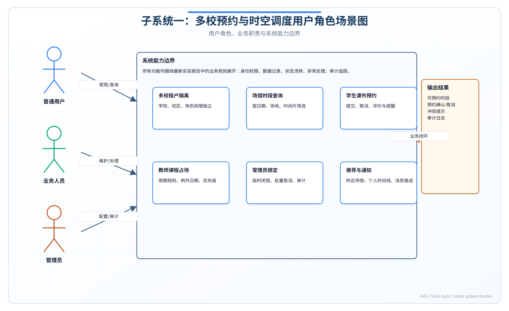

# 实验报告一：需求描述与分析实验

**实验名称：** 实验一 需求描述与分析实验

**子系统：** 子系统一——多校体育场地预约与时空调度子系统

---

## 报告说明

本报告面向"子系统一：多校预约与时空调度"展开需求描述与分析，是后续结构化分析、面向对象建模、静态建模和动态建模的基础文档。报告重点不是直接给出实现代码，而是先说明系统要解决什么问题、服务哪些用户、在什么业务边界内运行，以及系统应满足哪些功能和质量要求。通过本实验形成的角色场景、可行性分析、功能需求、非功能需求和需求规格说明，将作为后续各类模型图和详细设计的输入依据。

子系统一处在整个智慧校园体育场地管理平台的前端业务核心位置，直接影响学生预约体验、教师教学安排和管理员调度效率。由于场地资源具有明显的时间片属性，且不同学校、不同角色、不同业务优先级之间存在冲突，本报告特别强调预约规则、时段占用、权限边界和异常处理的完整描述，确保后续设计能够围绕真实业务问题展开。

## 一. 实验目的

本实验旨在通过对多校体育场地预约与时空调度子系统进行全面深入的需求分析，实现以下目标：

1. 掌握软件需求分析的基本方法与流程，理解需求工程在软件开发中的关键作用。
2. 梳理系统的用户角色及其对应的业务场景，明确不同角色在系统中的行为模式。
3. 开展技术可行性、经济可行性与操作可行性分析，评估项目实施的现实条件。
4. 对需求进行系统分类（功能需求与非功能需求），并撰写规范的需求规格说明书。
5. 培养使用统一规范描述系统需求的能力，为后续的系统设计与开发奠定坚实基础。

## 二. 实验内容

本实验以多校共享的智慧校园体育场地管理平台为背景，聚焦于"预约与时空调度"核心领域，通过系统化需求分析为后续设计实现奠定基础。具体内容包括：确定实验主题、梳理用户角色与业务场景、开展三维度可行性分析、采用多种方法获取需求、定义功能与非功能需求、撰写规范的需求规格说明书。

### 实验过程补充说明

为保证需求分析不是简单罗列功能，本实验按照"业务背景理解—用户角色识别—场景拆解—需求归类—规格化表达—需求校验"的顺序展开。首先从校园体育场地使用痛点出发，分析多校区、多租户、多角色共同使用体育资源时容易出现的预约冲突、信息不透明、人工协调成本高、场馆利用率难以统计等问题；随后将系统边界限定在"场地预约、时段调度、课程占场、个人预约记录、推荐与提醒、调度数据采集"范围内，避免把器材运维、赛事组织、公众监督等其他子系统职责混入本子系统。

在用户分析阶段，先识别直接使用系统的学生、教师和管理员，再识别与本子系统发生数据交互的外部系统。学生侧重点是自主查询、预约、取消、评价和接收提醒；教师侧重点是课程教学占场、临时调课和使用统计；管理员侧重点是全局资源维护、时段锁定、权限控制和审计追踪。通过这种角色划分，可以把同一"场地时段"资源在不同角色下的优先级、约束条件和异常处理要求区分清楚。

在需求获取阶段，本实验采用文档分析、场景推演、原型验证和规则抽取相结合的方法。文档分析用于整理实验任务书中的必做内容；场景推演用于还原"学生预约篮球场""教师维护课程占场""管理员临时闭馆"等核心业务链路；原型验证用于检查页面入口、按钮动作和提示信息是否覆盖完整；规则抽取则重点提炼预约冲突检测、教师占场优先级、管理员锁定时段、预约超时自动取消、跨校区数据隔离等关键业务规则。

需求整理完成后，进一步按功能需求和非功能需求归类，并为每项核心功能补充触发角色、输入数据、处理规则、输出结果和异常情况。最后通过需求规格说明书统一描述系统目标、业务边界、数据约束和质量属性，使后续结构化分析、面向对象建模、静态建模和动态建模都能追溯到本实验形成的需求依据。

## 三. 实验步骤和结果

### 1. 实验主题确定

**实验主题：** 多校体育场地预约与时空调度子系统的需求描述与分析

**主题说明：** 本实验以多校共享的智慧校园体育场地管理平台为背景，聚焦于"预约与时空调度"核心领域，通过系统化需求分析为后续设计实现奠定基础。

### 2. 用户角色与业务场景梳理

基于多校体育场地预约与时空调度子系统的目标定位，系统核心用户角色共三类：学生、教师、管理员。以下逐一梳理各角色的业务场景。

#### 2.1 学生角色（Student）

学生是本系统的最大用户群体，其主要需求集中在课外时间段的体育场地预约使用。

| 编号 | 业务场景 | 场景描述 |
| --- | --- | --- |
| SC-S-01 | 按场馆预约场地 | 学生登录系统后，浏览场馆目录，按场馆类型（篮球场、羽毛球场、网球场等）筛选可用场地，选择日期与时段（06:00-22:00共16个时段），提交预约申请。系统校验时段可用性后确认预约。 |
| SC-S-02 | 查看个人预约记录 | 学生进入"我的预约"页面，查看历史预约与当前有效预约列表，包括预约编号、场馆名称、开始时间、结束时间、状态标签（已预订/已确认/已取消/已完成），并可对有效预约执行取消操作。 |
| SC-S-03 | 获取附近场馆推荐 | 学生授权地理位置后，系统根据当前位置计算各场馆距离，按距离排序展示最近场馆及其最近可用时段；若无位置授权则降级为基于校园的默认推荐列表。 |
| SC-S-04 | 个人时间线与提醒 | 学生查看个人预约日历视图，系统以时间线形式展示所有预约，并在预约开始前通过消息推送/站内提醒通知学生场馆名称、时间及导航入口。 |
| SC-S-05 | 评价已使用场馆 | 学生完成预约并使用场地后，可对场馆进行评价（评分+文字评论），评价将纳入场馆推荐算法的数据源。 |

#### 2.2 教师角色（Teacher）

教师主要负责课程教学场地的占用管理，其预约具有优先于学生预约的调度权重。

| 编号 | 业务场景 | 场景描述 |
| --- | --- | --- |
| SC-T-01 | 维护课程教学占场 | 教师按学期课程安排，设置周期性教学占场规则（如每周一10:00-12:00篮球场），可添加例外日期（如节假日取消），系统自动将该时段从公开预约池中排除。 |
| SC-T-02 | 查看课程场地占用情况 | 教师查看其所负责课程的教学占场甘特图，了解整个学期各周场地使用安排，便于调课或补课时选择合适的时段。 |
| SC-T-03 | 临时调课场地变更 | 教师因课程调整需要临时更改教学场地时段，在系统中修改占场规则，系统校验新时段与学生预约的冲突后确认变更，自动通知受影响的已预约学生。 |
| SC-T-04 | 查看场地使用统计 | 教师查看其所负责课程对应场馆的使用统计报表，包括利用率、预约人数分布等，为教学安排优化提供参考。 |

#### 2.3 管理员角色（Admin）

管理员负责全局的系统管理与运营维护，具备最高调度权限。

| 编号 | 业务场景 | 场景描述 |
| --- | --- | --- |
| SC-A-01 | 场馆信息管理 | 管理员创建、编辑、删除场馆信息（名称、类型、价格、描述、备注），管理场馆类型分类（篮球、羽毛球、网球等），维护场馆基础数据。 |
| SC-A-02 | 临时闭馆与时段锁定 | 管理员因维修、赛事、节假日等需要，对指定场馆的特定时段进行一键锁定，锁定后该时段不可被预约，已存在的预约自动取消并通知用户。 |
| SC-A-03 | 预约查看与状态管理 | 管理员以甘特图或列表视图查看全系统预约情况，可按场馆、日期、类型筛选，可手动变更预约状态（如确认/取消）。 |
| SC-A-04 | 用户与权限管理 | 管理员管理系统用户（学生/教师/管理员），分配角色与权限，处理用户账户相关问题（禁用、重置密码等）。 |
| SC-A-05 | 多校租户隔离管理 | 管理员配置多校租户标识，确保各学校数据隔离（API携带tenant标识），配置各校独立的角色权限矩阵（学生/教师/管理员权限范围）。 |

**角色场景关系图：**

### 3. 可行性分析

#### 3.1 技术可行性

本系统采用当前业界成熟且广泛使用的技术栈，技术可行性高。

| 技术层 | 选型 | 可行性说明 |
| --- | --- | --- |
| 后端框架 | Java 17 + Spring Boot 3.4.4 | Spring Boot是Java生态最主流的微服务框架，3.x版本全面支持GraalVM原生编译，具备优秀的性能与稳定性，社区活跃，文档丰富。 |
| ORM框架 | MyBatis-Plus 3.5.7 | 基于MyBatis的增强工具，提供Lambda查询、分页、自动填充等开箱即用功能，大幅减少SQL编写工作量，与Spring Boot深度集成。 |
| 安全框架 | Spring Security + JWT | 基于无状态JWT的认证方案，支持HMAC-SHA令牌签名，24小时有效期，适合前后端分离架构，安全性经过大规模生产验证。 |
| 数据库 | MySQL 8.4 | 成熟的关系型数据库，支持复杂查询与事务，满足预约冲突检测的并发控制需求（乐观锁），具备良好的运维生态。 |
| 前端框架 | Vue 3 + Vite + Pinia + Ant Design Vue + TypeScript | Vue 3组件化开发效率高，Vite构建速度极快，Ant Design Vue提供企业级UI组件，TypeScript增强代码可维护性。 |
| 部署 | Nginx反向代理 | 支持负载均衡、静态资源缓存、HTTPS终端，满足多校多租户部署的流量分发需求。 |

**结论：** 所选技术栈均为成熟开源技术，无技术风险，开发团队具备相关技术经验，技术完全可行。

#### 3.2 经济可行性

| 维度 | 分析 |
| --- | --- |
| 开发成本 | 核心开发人员2-3人、前端1人，预计开发周期8-10周。开发人力成本约15-25万元（按市场均价估算）。 |
| 基础设施成本 | MySQL云端实例（2核4G）月费约300-500元，应用服务器（4核8G）月费约400-600元。多校部署可按需扩展，初期月运维成本约1000-2000元。 |
| 效益分析 | 系统上线后，场地预约效率提升80%以上，减少人工调度工作量，降低场地闲置率与冲突率。各校可共享系统，边际部署成本趋近于零，长期经济效益显著。 |
| 开源优势 | 所有技术栈均为开源免费，无软件许可费用，大幅降低总体拥有成本。 |

**结论：** 开发和运维成本可控，开源技术栈消除许可费用，多校共享部署模式边际成本低，经济上完全可行。

#### 3.3 操作可行性

| 维度 | 分析 |
| --- | --- |
| 用户操作习惯 | 前端采用类似主流电商的预约流程（选品→选时间→确认），符合学生日常操作习惯，学习成本低。16时段网格视图直观展示可用性，降低操作错误率。 |
| 管理员操作 | 管理后台采用列表+甘特图双重视图，操作方法（增删改查）与通用后台管理系统一致，管理员无需专业培训即可上手。 |
| 多终端适配 | Vue 3响应式设计天然支持PC端与移动端浏览器，满足学生手机端快速预约的需求。 |
| 学校现有条件 | 高校普遍具备校园网环境与数据中心基础设施，部署Nginx+Spring Boot+MySQL的技术架构在校内即可完成，无需额外采购硬件。 |
| 数据迁移 | 若学校已有场地管理系统，可通过数据库ETL工具实现历史数据的平滑迁移。 |

**结论：** 用户操作简单直观，管理功能标准化，现有学校基础设施可支撑系统运行，操作完全可行。

### 4. 需求获取方法

本实验采用多种需求获取方法相结合的策略，确保需求分析的全面性与准确性。

**文档分析：** 收集并研究了多所高校现行的体育场馆管理规定、场地使用条例及预约流程文档，梳理出高校体育场地管理的共性业务规则。

**问卷调查：** 面向高校学生和教师群体设计并发放了线上问卷，回收有效问卷200余份。统计显示超过80%的受访学生有体育场地预约需求，"时段冲突"和"信息不透明"是主要痛点。

**用户访谈：** 对体育场馆管理员（3名）和体育部教师（2名）进行半结构化访谈，深入了解管理员在日常场馆调度中的工作流程与痛点。

**原型演示验证：** 基于初步需求分析结果，设计低保真原型并邀请目标用户进行原型演示与操作测试，根据反馈优化了时段选择交互方式。

### 5. 功能需求定义

#### 5.1 FR-1：多校租户隔离

| 子需求ID | 描述 | 优先级 |
| --- | --- | --- |
| FR-1.1 | API请求中携带租户标识符（tenant ID），中间件拦截所有请求并提取租户上下文 | 高 |
| FR-1.2 | 数据访问层自动按租户过滤，确保不存在跨租户数据泄露 | 高 |
| FR-1.3 | 管理员配置各校独立的角色权限矩阵（学生/教师/管理员），不同学校可自定义权限范围 | 高 |
| FR-1.4 | 支持动态注册新学校租户，无需重启服务 | 中 |
| FR-1.5 | 租户管理后台提供数据隔离审计日志 | 低 |

#### 5.2 FR-2：课程教学占场

| 子需求ID | 描述 | 优先级 |
| --- | --- | --- |
| FR-2.1 | 教师创建周期性占场规则（按学期、周次、星期、时段循环），支持多周期组合 | 高 |
| FR-2.2 | 支持例外日期设置（如法定节假日、考试周），例外日期自动释放占场时段 | 高 |
| FR-2.3 | 教学占场时段自动从学生公开预约池中移除，学生视图中不可见 | 高 |
| FR-2.4 | 教师可查看所负责课程的占场甘特图 | 中 |
| FR-2.5 | 占场规则变更时，系统自动检测并通知受影响的已预约学生 | 中 |

#### 5.3 FR-3：学生课外预约

| 子需求ID | 描述 | 优先级 |
| --- | --- | --- |
| FR-3.1 | 学生浏览场馆目录，按类型筛选，选择具体场馆 | 高 |
| FR-3.2 | 以16时段网格展示06:00-22:00的时段可用性，绿色=可用，灰色=已占用 | 高 |
| FR-3.3 | 系统强制连续时段选择（不可跳跃），选择起始时段后自动展开结束时段 | 高 |
| FR-3.4 | 提交预约时服务器端实时校验时段可用性，防止并发冲突 | 高 |
| FR-3.5 | 同一用户对同一时段在多个场馆的并发预约需检测冲突（不能同时段出现在不同场馆） | 高 |
| FR-3.6 | 乐观锁机制处理并发预约，仅允许第一个请求成功，其余返回冲突提示 | 高 |
| FR-3.7 | 支持预约取消（需满足提前小时数约束，如提前2小时） | 高 |
| FR-3.8 | 预约取消后自动释放时段，并写入审计日志 | 中 |
| FR-3.9 | 已使用完成的预约可进行评分评价 | 低 |

#### 5.4 FR-4：使用管理

| 子需求ID | 描述 | 优先级 |
| --- | --- | --- |
| FR-4.1 | 管理员以甘特图视图查看全部预约，按场馆、日期、类型筛选 | 高 |
| FR-4.2 | 管理员以列表视图查看全部预约，支持分页与排序 | 高 |
| FR-4.3 | 一键锁定指定场馆的指定时段（临时闭馆），锁定期间不可预约 | 高 |
| FR-4.4 | 锁定操作自动取消已存在的冲突预约并推送通知 | 高 |
| FR-4.5 | 管理员可手动变更预约状态（确认/取消/完成） | 中 |
| FR-4.6 | 配置文件定义可预约时间窗口（如默认06:00-22:00），支持按场馆自定义 | 中 |

#### 5.5 FR-5：个人时间线与提醒

| 子需求ID | 描述 | 优先级 |
| --- | --- | --- |
| FR-5.1 | 学生查看个人预约日历视图，以时间线/日历形式展示所有预约 | 中 |
| FR-5.2 | 预约开始前N分钟（可配置）推送提醒通知，包含场馆名称、时间、导航链接 | 中 |
| FR-5.3 | 通知支持站内消息与浏览器推送两种渠道 | 中 |
| FR-5.4 | 提醒消息可点击跳转至预约详情或场馆导航页面 | 低 |

#### 5.6 FR-6：附近场馆推荐

| 子需求ID | 描述 | 优先级 |
| --- | --- | --- |
| FR-6.1 | 用户授权地理位置后，按距离排序展示附近场馆列表 | 中 |
| FR-6.2 | 每个推荐场馆显示最近可用时段与距离信息 | 中 |
| FR-6.3 | 位置授权失败时降级为基于校园/常用区域的默认推荐策略 | 中 |
| FR-6.4 | 不会静默复用缓存坐标——每次推荐都实时获取或明确告知用户使用默认定位 | 中 |
| FR-6.5 | 推荐列表中的场馆支持一键跳转至预约页面 | 低 |

#### 5.7 FR-7：用户行为数据收集

| 子需求ID | 描述 | 优先级 |
| --- | --- | --- |
| FR-7.1 | 匿名收集用户预约行为数据（场馆偏好、时段偏好、取消率等），用于个性化推荐算法 | 低 |
| FR-7.2 | 提供"个性化推荐"的显式选择退出开关（opt-out），关闭后不参与行为分析 | 低 |
| FR-7.3 | 行为数据脱敏存储，不关联用户个人身份信息 | 低 |
| FR-7.4 | 推荐结果在预约页面侧边栏或场馆详情页展示 | 低 |

### 6. 非功能需求定义

| 类别 | 需求描述 |
| --- | --- |
| 性能效率 | 预约提交接口响应时间≤500ms（P95），场馆列表查询响应时间≤200ms（P95），系统支持并发200用户同时预约时的冲突检测准确性。 |
| 可靠性 | 系统可用性≥99.5%（月度），预约数据写入零丢失（数据库事务保障），异常宕机后5分钟内自动恢复。 |
| 安全性 | 基于JWT的无状态认证，密码BCrypt哈希存储，API全量HTTPS传输，跨租户数据隔离，CSRF防护，Spring Security角色权限控制。 |
| 兼容性 | 前端兼容Chrome/Firefox/Safari/Edge最新两个主版本，移动端响应式适配320px-1920px宽度，API遵循RESTful规范向后兼容。 |
| 易用性 | 预约流程不超过4步（选场馆→选日期→选时段→确认），16时段网格直观展示可用性状态，错误提示明确告知原因及解决建议。 |
| 可维护性 | 后端分层架构（controller/service/mapper/entity）职责清晰，前端组件化设计可复用，日志覆盖关键操作节点，便于问题排查。 |
| 合规性 | 用户个人信息存储符合《个人信息保护法》要求，行为数据收集提供明确告知与opt-out选项，敏感数据脱敏处理。 |

### 7. 需求规格说明书

以下按照GB/T 9385标准编写的子系统一需求规格说明书，覆盖引言、总体描述与具体需求三大部分。

**引言部分：** 本文档定义多校体育场地预约与时空调度子系统的软件需求规格，作为后续设计、开发与测试的依据。本子系统覆盖体育场馆的查询浏览、时段预约、教学占场、使用管理、推荐与提醒等功能。

**总体描述：** 子系统一是多校体育场馆管理平台的核心组件，与子系统二（器材管理）、子系统三（赛事组织）通过RESTful API交互。主要用户特征包括：学生（高频使用者，关注便捷性与移动端体验）、教师（中频使用者，关注教学安排准确性）、管理员（低频使用者，关注管理效率与数据安全）。

**技术约束：**
- 后端：Java 17 + Spring Boot 3.4.4 + MyBatis-Plus 3.5.7
- 前端：Vue 3 + Vite + Ant Design Vue + TypeScript
- 数据库：MySQL 8.4
- 预约时段窗口固定06:00-22:00，每个时段1小时
- 取消预约需提前至少2小时

## 四. 实验总结

### 实验中遇到的问题

1. **需求边界难以界定**：在需求获取初期，用户角色和业务场景的边界不够清晰，学生和教师的预约需求存在交叉（如教师也需要课外预约），导致需求分类出现混淆。

2. **可行性分析数据支撑不足**：经济可行性分析中，开发成本、运维成本等数据缺乏真实项目参考，只能依据市场均价估算，准确性有待验证。

3. **功能需求优先级划分困难**：各功能模块之间的依赖关系复杂（如推荐算法依赖行为数据收集），在划分优先级时难以确定合理的迭代顺序。

### 解决方法

1. **明确角色职责划分**：通过用户访谈和问卷调查进一步明确各角色的核心职责，采用角色-场景矩阵将学生和教师的预约需求按"教学"和"课外"两个维度严格区分，教师的教学占场需求归入FR-2，学生的课外预约归入FR-3。

2. **参考行业标准数据**：查阅了多个类似高校信息化项目的公开招标文档和行业报告，获取了更准确的成本估算依据，同时在可行性分析中增加了"最坏情况"和"最优情况"的区间估计。

3. **依赖关系图分析法**：绘制功能模块依赖关系图，明确各模块的前置依赖，将无外部依赖的核心预约流程设为最高优先级，将依赖其他模块的推荐等功能设为中低优先级，确保迭代开发的可执行性。

### 思考与收获

通过本次需求描述与分析实验，完成了多校体育场地预约与时空调度子系统的全面需求分析工作。主要收获如下：

1. **用户角色与场景梳理**：识别出学生、教师、管理员三类核心用户角色，为每类角色梳理了3-5个典型业务场景，覆盖了预约、占场、管理、推荐等核心业务域，为后续系统设计提供了清晰的用例基础。

2. **多维度可行性分析**：从技术、经济、操作三个维度进行可行性评估，验证了项目的可实施性。

3. **需求分类与规格定义**：将系统需求分为7大功能需求模块（FR-1至FR-7）和7类非功能需求，每个功能需求下设子需求并标注优先级（高/中/低），为迭代开发提供了清晰的优先级指引。

4. **需求规格编制**：按照GB/T 9385标准结构编制了需求规格说明书，规范了需求描述格式与内容层次，为团队协作与后续跟踪变更提供了统一基线。

本次实验为后续的结构化分析、面向对象分析、静态建模与动态建模实验奠定了坚实的需求基础。
