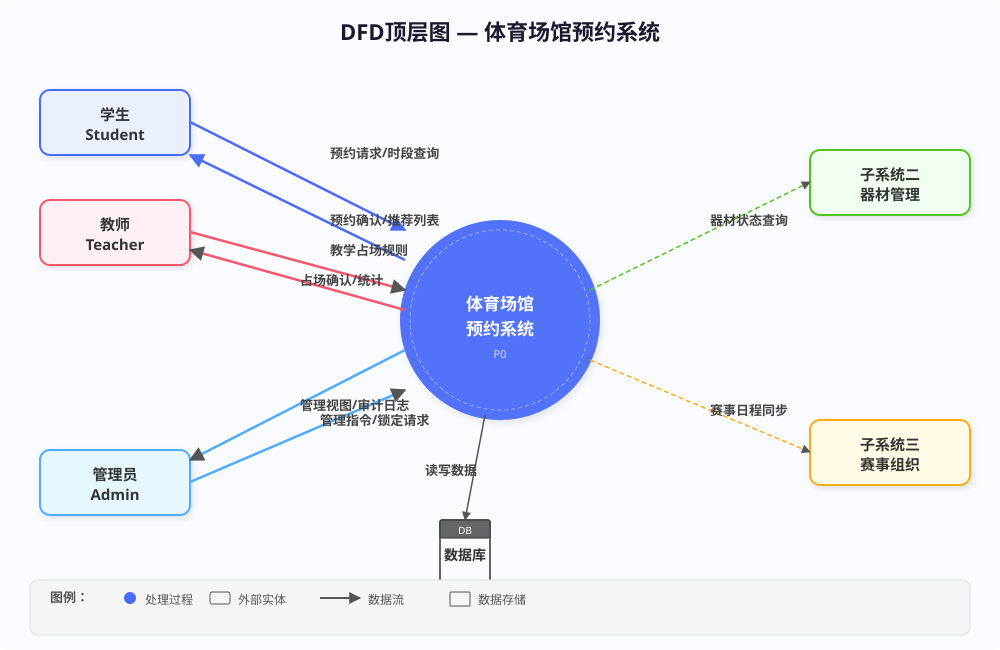
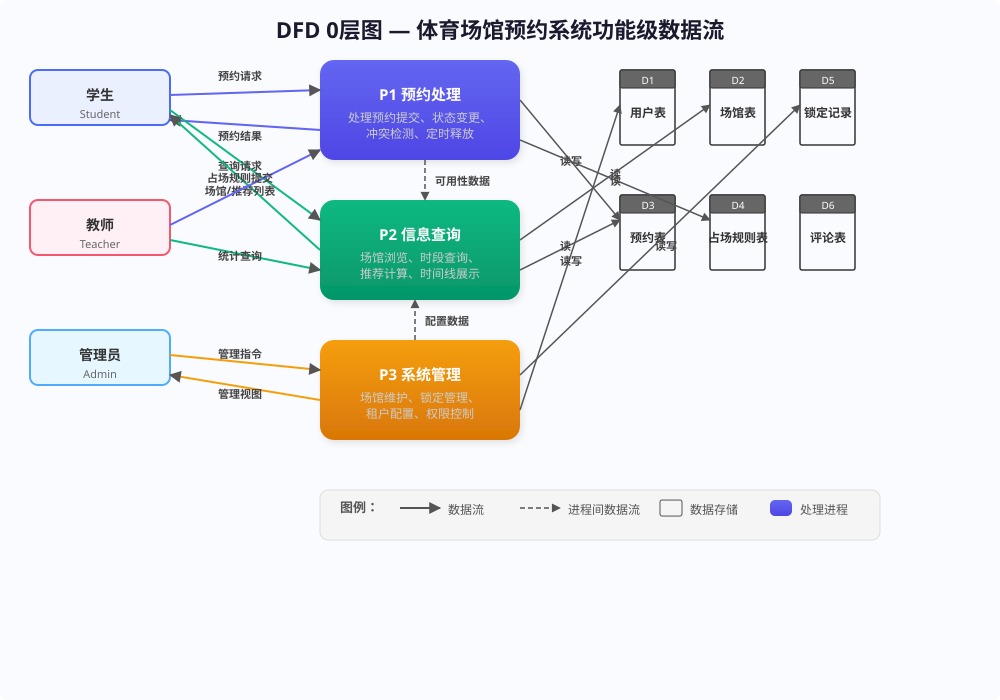
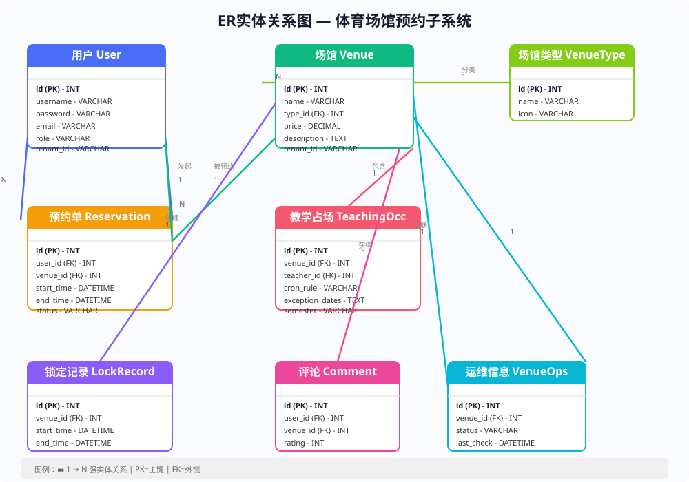
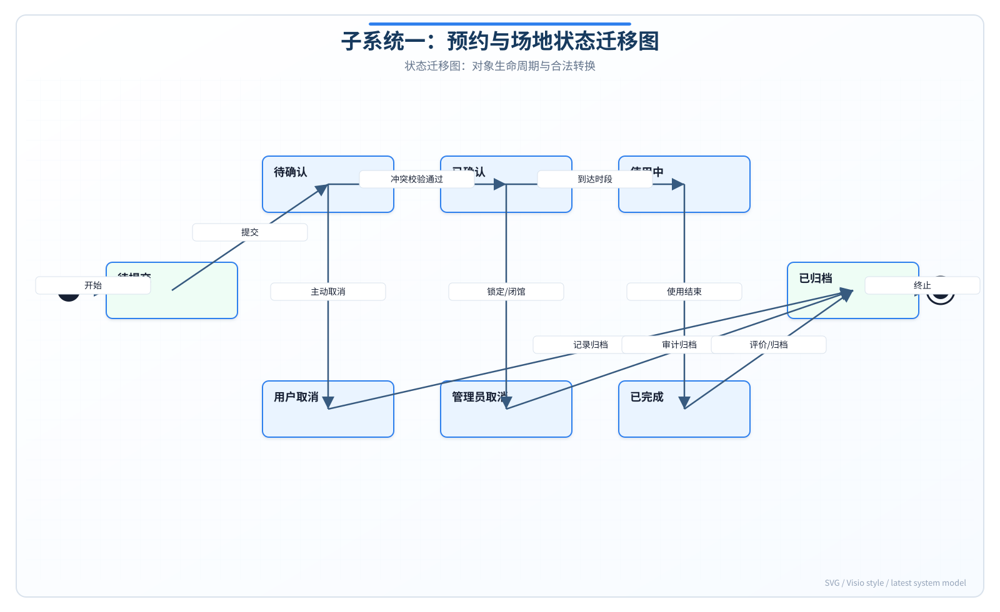

# 实验报告二：结构化分析与设计实验

**实验名称：** 实验二 结构化分析与设计实验

**子系统：** 子系统一——多校体育场地预约与时空调度子系统

**对应代码：** `stadium/src/main/java/com/example/tiyu/service/impl/ReservationServiceImpl.java`

---

## 报告说明

本报告在实验一需求规格基础上，运用结构化分析方法描述子系统一的数据流、数据模型、状态规则与模块设计。所有描述均对照当前 `stadium` 后端与 `first` 前端源码，剔除尚未实现的 `t_lock_record`、`TeachingOccupancy`、多校租户等设计元素。

## 一. 实验目的

1. 掌握分层数据流图（DFD）的绘制方法，描述系统数据流动与处理逻辑。
2. 掌握 ER 图设计，定义实际数据库实体及关系。
3. 掌握状态迁移图绘制，描述预约对象的生命周期。
4. 完成总体设计与详细设计，明确模块划分与核心算法。
5. 使结构化模型与 `db.sql` 表结构、`ReservationServiceImpl` 业务逻辑一致。

## 二. 实验内容

绘制三层 DFD、ER 图、状态迁移图，开展四层架构总体设计与预约创建详细设计（含伪代码），为面向对象建模提供结构化蓝图。

## 三. 实验步骤和结果

### 1. 分层数据流图（DFD）

#### 1.1 顶层 DFD

**外部实体：**
- **学生/教师**：提交预约请求，接收预约结果
- **管理员**：查看全量预约、删除预约
- **子系统二（场地运维）**：提供场地可约性查询结果
- **数据库（MySQL tiyu）**：持久化预约与场馆数据

**顶层数据流：**
- 用户 → 系统：预约请求 `{ venueId, startTime, endTime }`
- 系统 → 子系统二：查询 `getAvailability(venueId)`
- 子系统二 → 系统：可约性结果 `{ available, reason }`
- 系统 → 数据库：INSERT/SELECT/DELETE `t_reservation`
- 系统 → 用户：预约成功/失败响应



#### 1.2 0 层 DFD

**P1 预约处理：** 接收 `POST /api/reservations`，执行时间校验、可约性校验、用户自身冲突检测、写入预约记录。

**P2 场馆查询：** 响应 `GET /api/venues`、`GET /api/venue-types`，读取 `t_venue`、`t_venue_type`。

**P3 预约管理：** 响应 `GET /api/reservations`（个人/全量）、`DELETE /api/reservations/{id}`。



#### 1.3 1 层 DFD（P1 预约处理细化）

| 子过程 | 输入 | 输出 | 对应代码 |
| --- | --- | --- | --- |
| P1.1 时间校验 | startTime, endTime | 合法/非法 | `createReservation()` L27-29 |
| P1.2 可约性校验 | venueId | available/reason | `venueOpsService.getAvailability()` |
| P1.3 用户冲突检测 | userId, venueId, 时段 | 冲突/无冲突 | `lambdaQuery()` L36-44 |
| P1.4 保存预约 | Reservation 对象 | 写入成功 | `save(reservation)`，status=BOOKED |

**注意：** 当前未实现跨用户时段冲突检测（P1.3 仅检测同用户）、教学占场排除、锁定记录排除。

### 2. ER 实体关系图

#### 2.1 实际实体（来自 `db.sql`）

| 实体 | 表名 | 核心属性 |
| --- | --- | --- |
| User | t_user | id, username, password, email, role, created_at |
| VenueType | t_venue_type | id, name |
| Venue | t_venue | id, name, type_id, price, description, notes |
| Reservation | t_reservation | id, user_id, venue_id, start_time, end_time, status |
| VenueOps | t_venue_ops | id, venue_id, maintenance_status, cleaning_status, lighting_status, equipment_status, ... |

**关系：**
- User 1:N Reservation
- Venue 1:N Reservation
- VenueType 1:N Venue
- Venue 1:1 VenueOps（子系统二维护，子系统一消费）

**未落库实体（规划中）：** TeachingOccupancy、LockRecord



### 3. 状态迁移图

#### 3.1 预约单（Reservation）状态机（当前实现）

| 状态 | 说明 | 触发条件 |
| --- | --- | --- |
| BOOKED | 已预订 | `createReservation()` 写入时固定设置 |
| （记录删除） | 物理删除 | `DELETE /api/reservations/{id}` → `removeById()` |

**当前简化模型：** 系统未实现 PENDING/CONFIRMED/COMPLETED/CANCELLED 状态机，取消预约等价于物理删除记录。冲突检测过滤条件使用 `status != "CANCELED"`，但后端从未写入 `CANCELED` 状态。

#### 3.2 场地可约性（由子系统二驱动）

预约能否创建取决于 `VenueOpsServiceImpl.getAvailability()` 返回的 `available` 字段，阻断条件包括：
- `maintenanceStatus` ∈ {MAINTENANCE, CLOSED}
- `cleaningStatus` ∈ {NEED_CLEANING, PENDING_RECHECK}
- `lightingStatus` = FAULT
- `equipmentStatus` ∈ {MISSING, DAMAGED}



### 4. 系统总体设计

#### 4.1 技术架构分层

| 层次 | 技术组件 | 职责 |
| --- | --- | --- |
| 表示层 | Vue 3 + Ant Design Vue | `Reservation.vue`、`MyReservations.vue` |
| 控制层 | ReservationController | REST API、权限校验、参数绑定 |
| 业务层 | ReservationServiceImpl | 预约创建、冲突检测 |
| 数据层 | ReservationMapper + MySQL | 持久化 `t_reservation` |

#### 4.2 功能模块划分

| 模块 | 组件 | 功能 |
| --- | --- | --- |
| 预约管理 | ReservationController/Service/ServiceImpl/Mapper | 创建、查询、删除预约 |
| 场馆查询 | VenueController/VenueService | 场馆列表与 CRUD |
| 可约性联动 | VenueOpsService（子系统二） | 预约前可约性校验 |
| 用户认证 | AuthController + JWT | 登录注册与令牌签发 |

### 5. 详细设计

#### 5.1 预约创建接口

**端点：** `POST /api/reservations`

**权限：** `ADMIN`、`TEACHER`、`STUDENT`、`USER`

**请求体（ReservationCreateRequest）：**

| 字段 | 类型 | 必填 |
| --- | --- | --- |
| venueId | Long | 是 |
| startTime | LocalDateTime | 是 |
| endTime | LocalDateTime | 是 |

**响应体（ApiResponse\<Reservation\>）：** `{ code: 0, msg: "预约成功", data: { id, userId, venueId, startTime, endTime, status: "BOOKED" } }`

#### 5.2 预约创建流程伪代码（对照源码）

```
function createReservation(request, currentUserId):
    // Step 1: 时间合法性
    if start == null or end == null or not start.isBefore(end):
        throw BusinessException("预约时间不合法，开始时间必须早于结束时间")

    // Step 2: 场地可约性（子系统二）
    availability = venueOpsService.getAvailability(request.venueId)
    if not availability.available:
        throw BusinessException("场地暂不可预约：" + availability.reason)

    // Step 3: 同用户同场地重叠检测
    overlap = query where userId=currentUserId
                    and venueId=request.venueId
                    and status != "CANCELED"
                    and startTime < end and endTime > start
    if overlap.exists():
        throw BusinessException("预约冲突：该用户在该场地已有重叠预约")

    // Step 4: 写入预约
    reservation = new Reservation(userId, venueId, start, end, status="BOOKED")
    save(reservation)
    return reservation
```

#### 5.3 接口契约（实际 API）

| 端点 | 方法 | 权限 | 说明 |
| --- | --- | --- | --- |
| /api/reservations | POST | STUDENT/TEACHER/ADMIN/USER | 创建预约 |
| /api/reservations | GET | 登录用户 | 个人预约列表 |
| /api/reservations?all=true | GET | ADMIN/STAFF | 全量预约 |
| /api/reservations/{id} | DELETE | 本人或 ADMIN/STAFF | 物理删除 |

#### 5.4 前端交互流程（Reservation.vue）

1. `onMounted` → `api.getVenues()` 加载场馆
2. 用户选择场馆 + 起止时间（DatePicker 或快捷按钮 `setQuickTime`）
3. 客户端校验 `start < end`
4. `api.createReservation()` → 成功跳转 `/my-reservations`

## 四. 实验总结

### 实验中遇到的问题

1. 原报告中的教学占场、锁定记录、乐观锁等设计与代码不符，需按实际实现简化模型。
2. 预约"取消"在代码中是物理删除，与传统状态机模型不同。

### 解决方法

1. ER 图和 DFD 仅保留 `db.sql` 中实际存在的表和处理流程。
2. 状态迁移图改为"BOOKED → 物理删除"简化模型，并在报告中说明扩展方向。

### 思考与收获

结构化分析的价值在于把 `ReservationServiceImpl` 中 56 行业务逻辑拆解为可追踪的数据流和处理步骤。通过对照源码，明确了预约创建的四个串行校验环节及其与子系统二的依赖关系，为后续用例规格和顺序图提供了精确输入。
