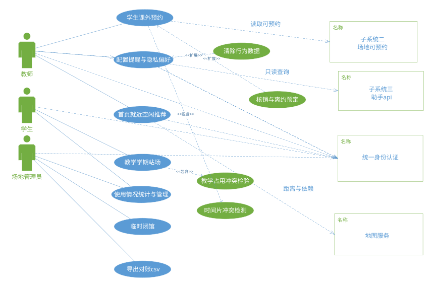

# 实验报告三：面向对象分析与设计实践

**实验名称：** 实验三 面向对象分析与设计实践

**子系统：** 子系统一——多校体育场地预约与时空调度子系统

---

## 报告说明

本报告从面向对象分析与设计角度，对子系统一的核心业务能力进行用例建模。前两次实验已经明确了系统需求、数据流和数据结构，本实验则进一步从用户目标出发，说明学生、教师、管理员、时间调度器和外部子系统如何与系统交互，以及每个核心用例在正常路径和异常路径下应如何执行。

用例模型是连接需求分析和系统设计的重要桥梁。它既能帮助开发人员理解用户真正要完成的业务目标，也能帮助测试人员提取验收场景。本报告通过用例图和用例规格说明，把"预约场地""维护课程占场""临时闭馆""查看推荐并预约"等场景写成可追踪、可验证的业务契约，保证后续静态模型和动态模型都有明确来源。

## 一. 实验目的

本实验旨在运用面向对象分析与设计方法，对多校体育场地预约与时空调度子系统进行用例驱动的分析与建模。主要目标如下：

1. 掌握用例驱动分析的方法，识别系统参与者与用例。
2. 掌握用例图的绘制规范，正确表达参与者与用例之间的关联关系以及用例间的包含（include）与扩展（extend）关系。
3. 为每个核心用例撰写完整的用例规格说明，包括前置条件、后置条件、基本流程与异常流程。
4. 培养运用用例分析方法完整描述系统功能需求的能力。

## 二. 实验内容

本实验运用面向对象分析方法对子系统一进行用例驱动的需求建模。通过识别系统参与者与用例，绘制UML用例图并建立用例间的包含、扩展与泛化关系。针对学生课外预约、教师维护课程占场、管理员临时闭馆、查看推荐并跳转预约四个核心用例，撰写完整的用例规格说明，包含前置条件、后置条件、基本事件流和异常事件流。

### 实验过程补充说明

本实验从结构化分析结果出发，将DFD中的外部实体和处理过程转换为面向对象视角下的参与者与用例。参与者识别时遵循"是否主动触发系统服务、是否接收系统结果、是否代表外部系统边界"三个判断标准，因此学生、教师、管理员属于主要参与者，时间调度器和外部子系统属于辅助参与者或外部系统参与者。这样可以避免把数据库、内部模块等实现细节误当作用例参与者。

用例识别采用"目标驱动"原则，即每个用例都应代表参与者希望通过系统完成的一个完整业务目标，而不是单个按钮或数据库操作。例如"提交课外预约"是完整业务目标，包含查询时段可用性、填写预约信息、提交预约申请和接收确认结果；而"点击提交按钮"只能作为基本事件流中的一个步骤。通过目标驱动划分，可以让用例图更贴近用户需求，也便于后续编写用例规格说明。

在建立用例关系时，本实验区分包含关系和扩展关系的适用场景。多个预约相关用例都会执行"查询时段可用性"，因此将其作为被包含用例；"查看附近推荐"并不是每次预约都必须发生，而是在用户需要推荐入口时才触发，因此更适合建模为扩展关系。管理员锁定时段需要先查看全系统预约情况，这属于必要前置行为，也可以通过包含关系表达。

用例规格说明按照"前置条件—触发条件—基本事件流—备选事件流—异常事件流—后置条件"展开。基本事件流描述正常成功路径，备选事件流描述权限、时间、资源选择等合法分支，异常事件流描述冲突、参数错误、无可用时段、外部服务不可用等失败情况。每个用例都补充业务规则和数据变化结果，使规格说明既能指导界面设计，也能指导接口与测试用例设计。

为保证面向对象分析与前序实验一致，本实验还进行追踪检查：用例必须能追溯到实验一的功能需求，核心用例必须能对应实验二DFD中的处理过程，用例产生或读取的数据必须能映射到ER图中的实体。通过这种检查，可以减少需求遗漏和模型之间的矛盾。

## 三. 实验步骤和结果

### 1. 参与者识别

对子系统一的参与者进行分析，识别出以下系统参与者：

| 参与者 | 类型 | 说明 |
|--------|------|------|
| **学生 (Student)** | 主要参与者 | 系统的最大用户群体，使用系统进行课外体育场地的查询、预约、取消与评价 |
| **教师 (Teacher)** | 主要参与者 | 使用系统进行课程教学场地的周期占场管理与课程统计查看 |
| **管理员 (Admin)** | 主要参与者 | 全局管理人员，负责场馆管理、时段锁定、用户管理、租户配置 |
| **时间 (Time)** | 外部参与者 | 系统定时器/调度器，触发超时自动取消、预约到期自动完成等定时任务 |
| **子系统二（器材管理）** | 外部系统 | 与本子系统通过API交互，查询器材状态以辅助场馆预约决策 |
| **子系统三（赛事组织）** | 外部系统 | 与本子系统通过API交互，同步赛事日程以协调场馆使用 |

### 2. 用例图

#### 2.1 核心用例清单

1. 浏览场馆列表
2. 查询时段可用性
3. 提交课外预约（包含查询时段可用性，可扩展至查看附近推荐）
4. 查看个人预约
5. 取消预约
6. 维护教学占场
7. 管理场馆信息
8. 查看全系统预约
9. 锁定时段/闭馆（包含查看全系统预约）
10. 用户与权限管理
11. 查看附近推荐（包含浏览场馆列表）
12. 评价已用场馆
13. 超时自动取消（由时间参与者触发）
14. 预约到期完成（由时间参与者触发）

#### 2.2 用例图

#### 2.3 用例关系分析

**include（包含）关系：**

| 基用例 | 包含用例 | 说明 |
|--------|----------|------|
| 提交课外预约 | 查询时段可用性 | 预约提交前必须先查询目标场馆指定时段的可用性状态 |
| 锁定时段/闭馆 | 查看全系统预约 | 管理员执行锁定操作前需查看全系统预约以评估影响范围 |

**extend（扩展）关系：**

| 基用例 | 扩展用例 | 扩展条件 |
|--------|----------|----------|
| 提交课外预约 | 查看附近推荐 | 用户通过推荐入口进入预约流程时触发 |
| 用户与权限管理 | 租户配置 | 管理员进行多校多租户场景下的权限隔离配置时触发 |

### 3. 用例规格说明

#### UC-1 学生课外预约场地

| 属性 | 内容 |
|------|------|
| **用例编号** | UC-1 |
| **用例名称** | 学生课外预约场地 |
| **参与者** | 学生(Student) |
| **简述** | 学生登录系统后，浏览场馆清单，选择目标场馆与可用时段，提交预约申请，系统校验后完成预约。 |
| **优先级** | 高 |
| **关系** | include: 查询时段可用性; extend: 查看附近推荐 |

**前置条件：**
1. 学生已通过JWT认证登录系统。
2. 学生处于校园网络环境中（或已通过VPN接入）。
3. 学生已选择目标场馆及至少一个连续的可用时段。
4. 预约时段处于系统开放时间窗口（06:00-22:00）内。

**后置条件（成功）：**
1. 预约记录以PENDING状态写入数据库（t_reservation表）。
2. 所选时段在公众预约视图中标记为"已占用"。
3. 学生收到预约提交成功的确认通知。
4. 预约行为记录写入审计日志。

**后置条件（失败）：**
1. 系统状态不变，预约未创建。
2. 学生收到明确的错误提示及建议操作。

**基本流程：**

| 步骤 | 描述 |
|------|------|
| 1 | 学生点击首页"立即预约"按钮或导航至预约页面。 |
| 2 | 系统展示场馆选择下拉框（支持搜索），学生输入关键词筛选并选择目标场馆。 |
| 3 | 系统加载所选场馆的基本信息卡及可用性概况。 |
| 4 | 学生通过日期选择器选择预约日期。 |
| 5 | 系统渲染16格时段网格（06:00-22:00），绿色=可用，灰色=已占用。 |
| 6 | 学生点击一个绿色时段格作为起始时段，系统自动高亮连续时段为蓝色（选定状态）。 |
| 7 | 学生在预约摘要栏确认场馆名称、日期、时段和总价，点击"确认预约"按钮。 |
| 8 | 前端向POST /api/reservations提交ReservationCreateRequest。 |
| 9 | 服务端执行时间有效性校验、场馆可用性评估、冲突检测、并发限制检测。 |
| 10 | 在MySQL事务中执行INSERT，采用乐观锁版本号机制。 |
| 11 | 预约成功，返回ApiResponse.success，系统异步发送预约确认通知。 |

**异常流程：**

| 步骤 | 描述 |
|------|------|
| E1 | 时段被抢先预约：返回"该时段已被他人预约，请重新选择"。 |
| E2 | 权限不足：返回HTTP 403。 |
| E3 | 网络异常：前端捕获Axios请求异常，展示"网络连接失败，请检查网络后重试"。 |
| E4 | 场馆维护中：场馆当前维护中/已闭馆，暂不接受预约。 |
| E5 | 并发乐观锁冲突：时段已被抢先预约，事务回滚。 |

#### UC-2 教师维护课程占场

| 属性 | 内容 |
|------|------|
| **用例编号** | UC-2 |
| **用例名称** | 教师维护课程教学占场 |
| **参与者** | 教师(Teacher) |
| **简述** | 教师为所授课程创建周期性教学占场规则，指定场地、学期、周次与时段，系统自动将规则中时段从学生公开预约池中排除。 |
| **优先级** | 高 |

**前置条件：**
1. 教师已通过JWT认证登录系统。
2. 教师具有TEACHER角色权限。
3. 教师已关联至少一门课程。

**基本流程：**

| 步骤 | 描述 |
|------|------|
| 1 | 教师登录系统后进入"教学占场管理"页面。 |
| 2 | 教师选择关联课程，点击"新建占场规则"。 |
| 3 | 系统展示规则配置表单：选择场馆、设置学期、设置周次范围或每周循环模式、设置时段。 |
| 4 | 系统支持添加例外日期列表，例外日期时段自动释放。 |
| 5 | 教师提交规则，系统校验规则参数合法性，检测冲突预约。 |
| 6 | 教师确认后，规则写入数据库，冲突预约自动取消。 |
| 7 | 系统返回占场规则创建成功，并在教师甘特图视图中展示。 |

#### UC-3 管理员临时闭馆

| 属性 | 内容 |
|------|------|
| **用例编号** | UC-3 |
| **用例名称** | 管理员锁定时段/临时闭馆 |
| **参与者** | 管理员(Admin) |
| **简述** | 管理员因维修、赛事或节假日需要锁定场馆指定时段。 |
| **优先级** | 高 |
| **关系** | include: 查看全系统预约 |

**基本流程：**

| 步骤 | 描述 |
|------|------|
| 1 | 管理员登录管理后台，进入"场馆管理"→"时段锁定"页面。 |
| 2 | 管理员选择目标场馆，设定锁定时间范围。 |
| 3 | 系统展示该时段内当前预约列表供管理员预览影响范围。 |
| 4 | 管理员填写锁定原因，点击"确认锁定"。 |
| 5 | 系统在数据库事务中：插入锁定记录、批量取消冲突预约、写入审计日志。 |
| 6 | 系统异步通知所有受影响用户。 |

#### UC-4 查看推荐并跳转预约

| 属性 | 内容 |
|------|------|
| **用例编号** | UC-4 |
| **用例名称** | 查看附近场馆推荐并跳转预约 |
| **参与者** | 学生(Student) |
| **简述** | 学生查看按距离排序的附近场馆推荐列表并跳转预约。 |
| **优先级** | 中 |
| **关系** | include: 浏览场馆列表 |

**基本流程：**

| 步骤 | 描述 |
|------|------|
| 1 | 学生进入首页，系统自动发起推荐请求。 |
| 2 | 系统检测学生地理位置授权状态（已授权/未授权）。 |
| 3 | 后端计算各场馆与学生的距离，按距离升序排序。 |
| 4 | 对于每个推荐场馆，系统查询其最近的一个可用时段。 |
| 5 | 系统返回推荐列表，前端以卡片列表渲染。 |
| 6 | 学生点击感兴趣的场馆卡片，跳转至预约页面并预填充场馆信息。 |

## 四. 实验总结

### 实验中遇到的问题

1. **用例粒度的把握**：在识别用例时，容易将业务步骤误识别为独立用例（如"查询时段可用性"是"提交课外预约"的一个步骤还是独立用例），导致用例粒度不统一。

2. **include与extend关系的混淆**：在区分"提交课外预约"与"查询时段可用性"之间是include还是extend关系时，需要判断是"必须包含"还是"可选扩展"，初期容易混淆。

3. **用例规格说明的完整性**：为每个核心用例编写完整的异常流程时，需要覆盖所有可能的失败场景，但容易出现遗漏边界条件的情况。

### 解决方法

1. **采用用例粒度判断标准**：采用"参与者是否可以直接触发并获取独立业务价值"作为判断标准。"查询时段可用性"虽然可以被独立触发，但在预约场景中是预约流程的必经步骤，因此设为include关系。

2. **严格区分依赖类型**：include关系表示基用例必须执行被包含用例才能完成，而extend关系表示在特定条件分支下可选择性地执行扩展用例。通过业务场景分析确认："提交课外预约"必须"查询时段可用性"（include），而仅在特定入口时才会"查看附近推荐"（extend）。

3. **系统化的异常分析**：采用"输入异常→权限异常→业务规则异常→系统异常"的四维异常分类框架，为每个核心用例的系统化异常分析提供结构化方法，确保异常场景覆盖完整。

### 思考与收获

通过本次面向对象分析与设计实践，完成了多校体育场地预约与时空调度子系统的用例驱动分析工作。主要收获如下：

1. **参与者识别**：识别出学生、教师、管理员三种人类参与者，以及时间（定时器）与外部子系统（器材管理、赛事组织）三种非人类参与者，全面覆盖了系统的交互边界。

2. **用例建模**：绘制了包含14个核心用例的UML用例图，正确表达了参与者与用例间的关联关系，以及用例间的include关系和extend关系。

3. **用例规格说明**：为UC-1至UC-4四个核心用例撰写了完整的规格说明，每个用例均包含前置条件、后置条件、基本流程和异常流程，规格说明与实际系统实现紧密对应。

4. **业务规则梳理**：通过用例规格说明明确了教学占场优先于学生预约、乐观锁并发控制、地理位置降级策略等关键业务规则，为后续的静态建模与动态建模提供了准确的需求依据。
