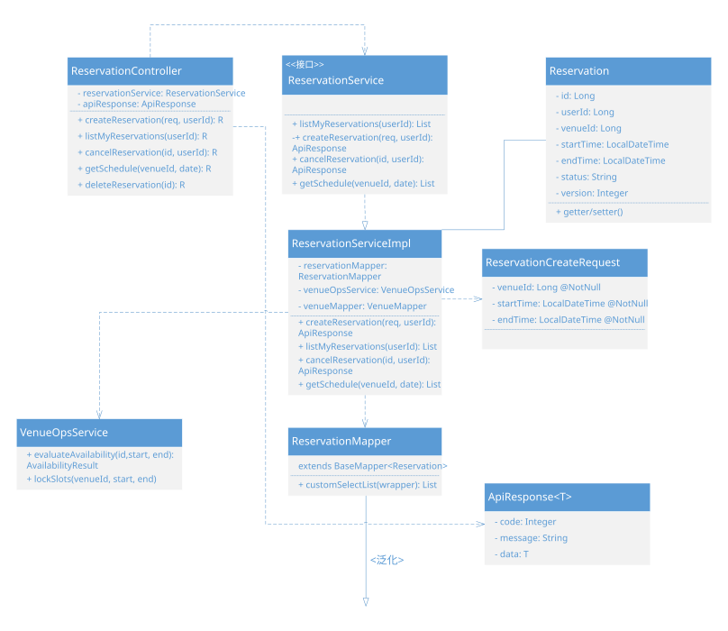
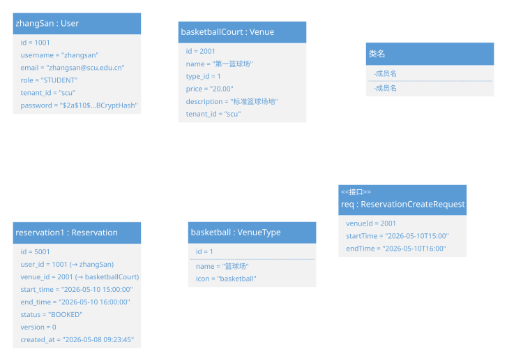
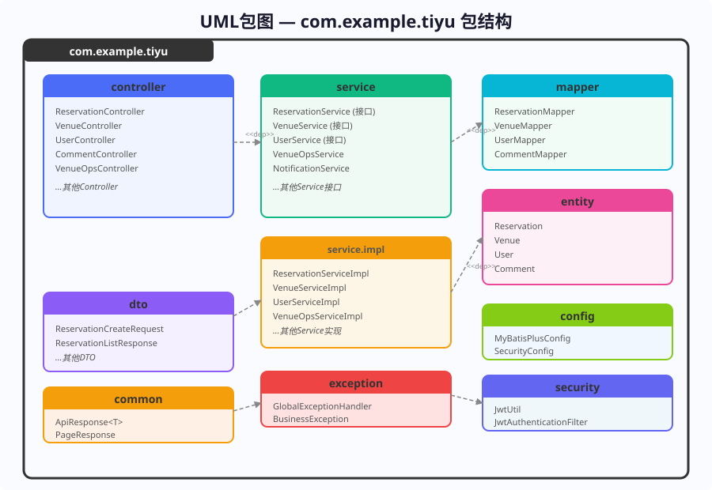
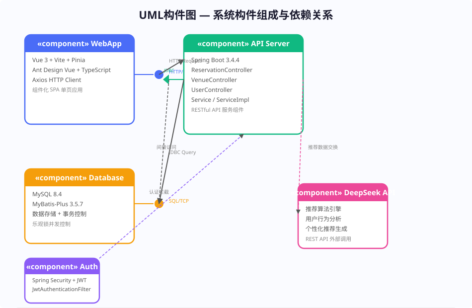
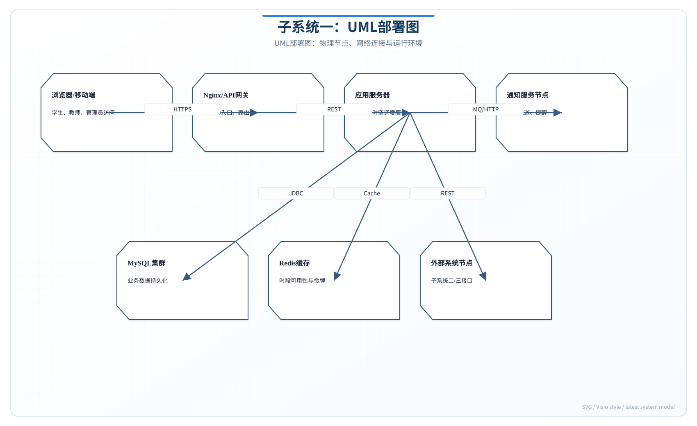

# 实验报告四：静态建模实践

**实验名称：** 实验四 静态建模实践

**子系统：** 子系统一——多校体育场地预约与时空调度子系统

---

## 报告说明

本报告面向子系统一的软件结构进行静态建模，重点说明系统由哪些类、对象、包、构件和部署节点组成。前三次实验已经从需求、数据流和用例角度描述了系统，本实验进一步把这些分析结果转化为UML静态模型，使系统的业务对象、服务职责、数据访问关系和部署结构更加清晰。

静态模型的作用在于建立系统的长期结构骨架。对于多校预约与时空调度子系统来说，预约、场馆、场地、用户、时段、锁定记录等对象之间存在稳定关系；控制器、服务、Mapper、DTO和统一响应对象之间也存在明确职责边界。本报告通过类图、对象图、包图、构件图和部署图，从不同层次说明这些结构关系，并检查其是否满足可维护、可扩展和多租户隔离要求。

## 一. 实验目的

本实验旨在运用UML静态建模方法，对多校体育场地预约与时空调度子系统进行系统的静态结构建模。主要目标如下：

1. 掌握UML类图的绘制方法，正确定义类的属性、方法及类间关系（关联、泛化、依赖、实现）。
2. 掌握UML对象图的绘制，以具体场景实例展示对象间的链接关系与属性值。
3. 掌握UML包图的绘制，清晰展示系统的包组织结构与包间依赖关系。
4. 掌握UML构件图与部署图的绘制，描述系统的物理组成与部署架构。
5. 通过多种静态建模视图全面刻画系统的静态结构。

## 二. 实验内容

本实验运用UML静态建模技术对子系统一进行全面的结构建模。通过类图展示核心类的属性、方法和类间关系（依赖、实现、泛化、关联）；通过对象图展示"张三预约篮球场"场景的对象实例快照；通过包图组织系统的分层包结构；通过构件图描述系统的软件构件组成；通过部署图展示多校多租户的物理部署架构。此外，对建模结果进行优化分析，提出改进建议。

### 实验过程补充说明

本实验以需求规格说明、结构化分析模型和用例规格说明为输入，重点描述系统在静态视角下由哪些类、对象、包、构件和部署节点组成。静态建模不是对代码目录的简单复制，而是把业务概念、数据实体、服务职责和技术组件组织成稳定的结构模型。因此建模时先确定业务核心对象，再确定控制类、服务类、数据访问类和数据传输类，最后补充跨层依赖和部署关系。

类图设计采用"边界类—控制类—实体类—服务类—数据访问类"分层识别方法。控制层类负责接收前端请求并封装响应，服务接口定义业务能力，服务实现承载预约冲突检测、权限校验和状态转换等核心逻辑，实体类映射数据库表，Mapper类负责持久化访问，DTO类用于隔离外部输入。通过这种分类，可以体现系统的职责分离，避免把控制逻辑、业务逻辑和数据库操作混杂在同一个类中。

对象图用于验证类图在具体业务场景下是否成立。本实验选择"张三预约篮球场"作为典型快照，是因为该场景同时涉及用户、学校、场馆、场地、预约单、时间段和响应对象，能够检验类图中关联关系和属性设计是否足够支撑真实业务。对象图中的每个对象都应能在类图中找到对应类型，每条对象链接都应能追溯到类图中的关联或依赖关系。

包图、构件图和部署图分别从不同层次补充系统结构。包图强调源代码组织和层间依赖方向，要求表现层只能依赖服务接口或控制入口，数据访问层不能反向依赖控制层；构件图强调运行时软件构件之间的接口协作，如前端应用、后端服务、数据库、消息通知模块和推荐服务；部署图强调多校多租户环境下的服务器、数据库、缓存、网关和客户端部署关系。

建模完成后，本实验从一致性、可维护性和可扩展性三个方面检查模型。类名和属性必须与ER实体及用例数据保持一致；依赖关系应遵循单向分层原则；多校区扩展、场馆类型扩展、通知方式扩展和推荐算法扩展应尽量通过服务接口或配置实现，避免直接修改核心预约流程。

## 三. 实验步骤和结果

### 1. 类图设计

#### 1.1 核心类识别

子系统一的核心类包括以下几类：

| 类别 | 类名 | 职责 |
|------|------|------|
| **控制层** | ReservationController | 处理预约相关HTTP请求，参数绑定与响应封装 |
| **服务接口** | ReservationService | 定义预约业务操作接口（面向接口编程） |
| **服务实现** | ReservationServiceImpl | 预约业务逻辑的具体实现，包含冲突检测、校验等核心逻辑 |
| **实体类** | Reservation | 预约数据模型，与t_reservation表映射 |
| **数据映射** | ReservationMapper | MyBatis-Plus BaseMapper，提供数据库CRUD操作 |
| **数据传输** | ReservationCreateRequest | DTO，携带创建预约的请求参数 |
| **响应封装** | ApiResponse | 统一响应封装类，包含code/message/data |
| **工具类** | VenueOpsService | 场馆可用性评估与时段锁定管理 |

#### 1.2 类间关系

| 关系类型 | 源类 | 目标类 | 说明 |
|----------|------|--------|------|
| **依赖** | ReservationController | ReservationService | Controller依赖Service接口实现业务逻辑 |
| **实现** | ReservationServiceImpl | ReservationService | ServiceImpl实现Service接口 |
| **依赖** | ReservationServiceImpl | ReservationMapper | ServiceImpl依赖Mapper进行数据访问 |
| **依赖** | ReservationServiceImpl | VenueOpsService | ServiceImpl依赖VenueOpsService进行可用性评估 |
| **泛化** | ReservationMapper | BaseMapper | Mapper继承MyBatis-Plus的BaseMapper |
| **关联** | ReservationServiceImpl | Reservation | ServiceImpl的create方法创建并返回Reservation对象 |
| **依赖** | ReservationController | ReservationCreateRequest | Controller接收DTO参数 |
| **依赖** | ReservationController | ApiResponse | Controller通过ApiResponse封装响应 |

**类图：**

### 2. 对象图

**场景描述：** 用户张三（id=1001, role="STUDENT"）于2026年5月8日通过系统提交了预约篮球场的请求，预约了2026年5月10日下午3:00-4:00时段。

**对象图展示了以下对象实例及其链接关系：**
- `zhangSan : User` — 学生用户张三
- `basketballCourt : Venue` — 第一篮球场
- `reservation1 : Reservation` — 预约记录5001
- `basketball : VenueType` — 场馆类型"篮球场"
- `req : ReservationCreateRequest` — 预约请求DTO

**对象图：**

### 3. 包图

子系统一的后端代码组织在 `com.example.tiyu` 根包下，采用分层架构组织子包：

| 包名 | 职责 | 包含的主要类 |
|------|------|-------------|
| `controller` | REST API端点 | ReservationController, VenueController, UserController |
| `service` | 业务逻辑接口 | ReservationService, VenueService, UserService, VenueOpsService |
| `service.impl` | 业务逻辑实现 | ReservationServiceImpl, VenueServiceImpl, UserServiceImpl |
| `mapper` | 数据访问层 | ReservationMapper, VenueMapper, UserMapper |
| `entity` | 数据实体 | Reservation, Venue, User, Comment |
| `dto` | 数据传输对象 | ReservationCreateRequest, ReservationListResponse |
| `config` | 配置类 | MyBatisPlusConfig, SecurityConfig |
| `security` | 安全认证 | JwtUtil, JwtAuthenticationFilter |
| `common` | 公共工具 | ApiResponse, PageResponse |
| `exception` | 异常处理 | GlobalExceptionHandler, BusinessException |

**包间依赖关系：** controller → service → service.impl → mapper/entity；service.impl → dto；各层均可能依赖 common 与 exception。

**包图：**

### 4. 构件图

系统由以下核心构件组成：

| 构件 | 类型 | 说明 |
|------|------|------|
| **WebApp** | 前端构件 | Vue 3 SPA，通过Axios HTTP Client调用后端API |
| **API Server** | 后端构件 | Spring Boot 3.4.4应用，暴露RESTful API端点 |
| **Database** | 数据构件 | MySQL 8.4数据库实例，MyBatis-Plus作为ORM桥接 |
| **Auth** | 安全构件 | Spring Security + JWT实现认证与授权 |
| **DeepSeek API** | 外部构件 | 外部AI推荐服务，提供个性化场馆推荐 |

**构件间依赖：** WebApp通过HTTP/REST调用API Server；API Server通过JDBC/TCP访问Database；Auth构件拦截API Server的请求链路；API Server通过HTTPS调用DeepSeek API获取推荐结果。

**构件图：**

### 5. 部署图

系统采用多校多租户部署架构，每个学校独立部署MySQL数据库实例，共享同一套Spring Boot应用服务。

**部署节点规划：**

| 节点 | 类型 | 配置 | 部署内容 |
|------|------|------|----------|
| **浏览器** | device | 任意 | Vue SPA前端 |
| **Nginx v1.26** | server | CPU:2核, RAM:4GB | 反向代理、SSL终端、负载均衡、静态资源缓存 |
| **Spring Boot App** | server | CPU:4核, RAM:8GB, Java 17 JVM | Spring Boot 3.4.4后端应用 |
| **MySQL 学校A** | database | CPU:2核, RAM:4GB | 学校A独立数据库(tenant_id='scu') |
| **MySQL 学校B** | database | CPU:2核, RAM:4GB | 学校B独立数据库(tenant_id='nju') |
| **DeepSeek API** | external | 云端SaaS | 推荐算法外部服务 |

**部署图：**

### 6. 静态建模结果优化分析

**类设计评估：**

| 评估维度 | 分析 | 评价 |
|----------|------|------|
| **类内聚性** | ReservationServiceImpl集中承担了预约校验、冲突检测、乐观锁写入等全部预约相关逻辑，职责高度内聚但单一类负担较重 | 高内聚，可考虑按职责进一步拆分 |
| **Controller-Service解耦** | Controller仅负责请求路由与参数绑定，通过接口依赖Service，符合依赖倒置原则 | 低耦合，设计良好 |
| **Service-Mapper依赖** | ServiceImpl直接依赖Mapper接口进行数据访问 | 中度耦合，MyBatis-Plus约定可接受 |
| **实体与DTO分离** | Reservation实体类与ReservationCreateRequest DTO分离，避免API层暴露数据库模型 | 低耦合，符合分层规范 |

**优化建议：**
- 可将冲突检测逻辑从ReservationServiceImpl中抽取为独立的ConflictDetectionService。
- 建议按业务域拆分子包：`service.reservation`、`service.venue`、`service.user`。

**部署优化建议：**
- 引入Redis缓存：场馆列表（TTL=5分钟）、时段可用性网格（TTL=30秒）。
- 预约表venue_id + start_time + end_time建立复合索引，加速冲突检测。
- 预约表可按tenant_id进行水平分表。

## 四. 实验总结

### 实验中遇到的问题

1. **类间关系的选择困难**：在类图设计中，对于Service层和Mapper层之间使用依赖关系还是关联关系存在困惑，两者的区别在UML规范中较为微妙。

2. **对象图场景选择**：对象图需要展示运行时的实例级快照，选择合适的场景实例以保证能覆盖所有核心类间的链接关系是个挑战。

3. **部署图的多租户表达**：多校多租户的部署架构在UML部署图中难以直观表达"共享应用服务器但独立数据库"的混合拓扑结构。

### 解决方法

1. **明确关系语义**：采用"生命周期依赖"作为区分标准——依赖关系表示源类的方法参数或返回值使用了目标类（临时使用），关联关系表示源类持有目标类的引用（长期持有）。ServiceImpl通过Spring DI注入Mapper，属于长期持有，但为了简化建模，按照MyBatis-Plus的惯用设计将其表达为依赖关系。

2. **选择典型业务场景**：选择"张三预约篮球场"这一贯穿用户、场馆、预约、场馆类型、请求DTO五个对象的核心场景，确保对象图能够覆盖类图中定义的所有核心类之间的实例级链接。

3. **分层展示部署拓扑**：采用"共享层+独立层"的分层表达方式，将Nginx和Spring Boot App放在共享层，将不同学校的MySQL实例放在独立层，并通过注释说明多租户路由机制。

### 思考与收获

通过本次静态建模实践，完成了多校体育场地预约与时空调度子系统的全面静态结构建模。主要收获如下：

1. **类图设计**：识别了8个核心类，明确定义了每个类的属性与方法，通过依赖、实现、泛化、关联四种关系完整描述了类间的静态耦合。

2. **对象图实例化**：以"张三预约篮球场"的具体场景为驱动，绘制了5个对象实例及其链接关系图，验证了类图设计的合理性。

3. **包图组织**：将11个子包按分层架构组织，清晰展示了controller→service→service.impl→mapper→entity的纵向依赖链。

4. **构件图与部署图**：从软件构件和物理部署两个维度描述了系统的组成与分布，展示了多校多租户的物理部署架构。

5. **建模结果优化分析**：对类设计进行了内聚性与耦合性评估，从缓存策略、负载均衡、数据库索引与分表角度给出了优化建议。

静态建模为后续的动态建模（顺序图、通讯图、状态图、活动图）提供了完整的类结构基础。
