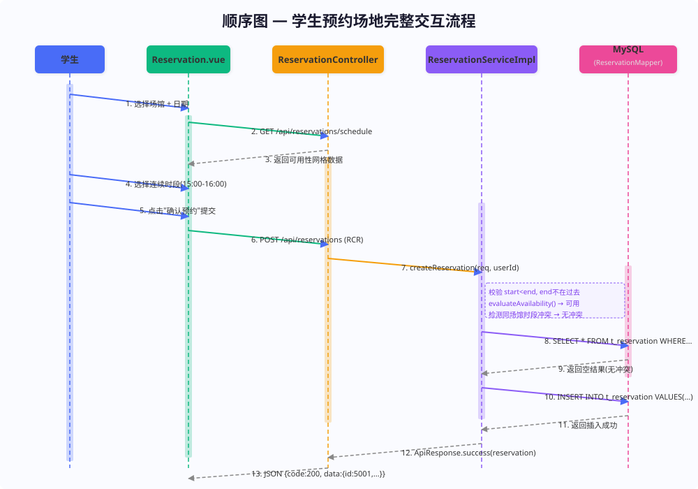
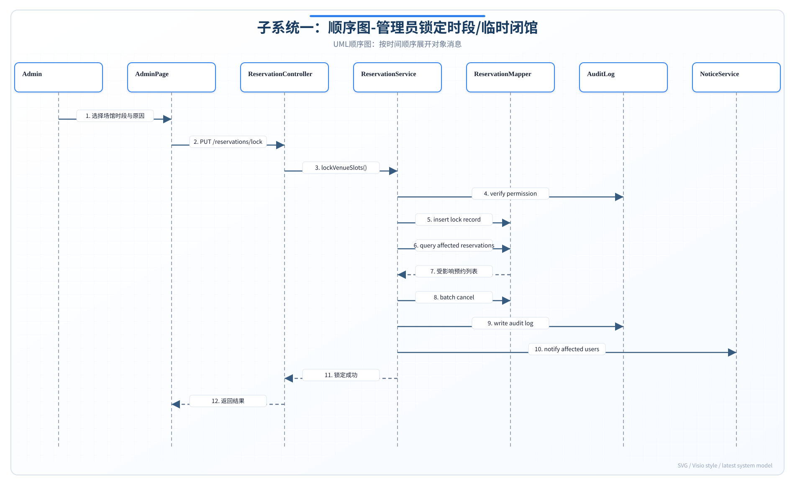
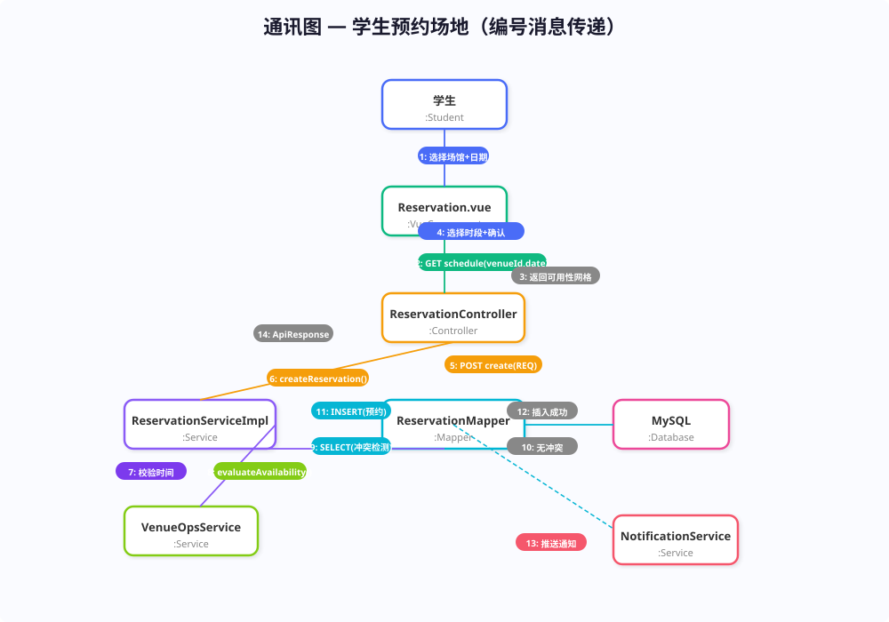
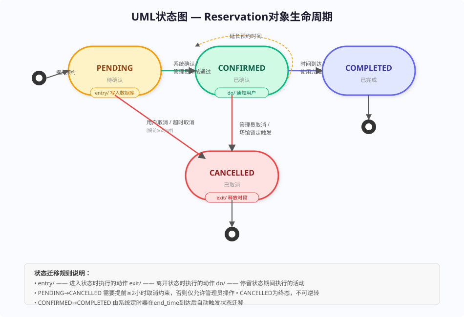
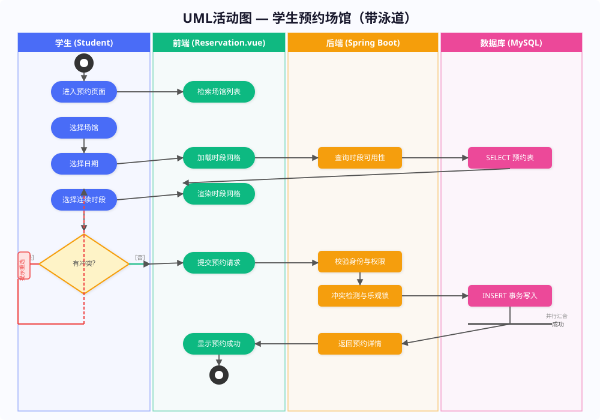

# 实验报告五：动态建模与系统交互实践

**实验名称：** 实验五 动态建模与系统交互实践

**子系统：** 子系统一——多校体育场地预约与时空调度子系统

---

## 一、实验目的

本实验旨在运用UML动态建模方法，对多校体育场地预约与时空调度子系统的运行时行为进行全面的动态描述。主要目标如下：

1. 掌握UML顺序图的绘制方法，描述对象间交互的消息传递与时间顺序。
2. 掌握UML通讯图的绘制，从空间协调角度描述对象间的消息传递关系。
3. 掌握UML状态图的绘制，刻画核心对象（Reservation）在生命周期中的状态变化与转移条件。
4. 掌握UML活动图的绘制，描述业务流程中的动作序列、分支逻辑与并行操作。
5. 通过多种动态视图完整描述系统的运行时行为，为代码实现提供精确的交互模型。

---

## 二、顺序图

### 2.1 场景一：学生预约场地

**场景描述：** 学生登录系统后，通过Reservation.vue页面选择场馆、日期与时段，提交预约请求。系统经历前端验证→后端Controller→Service→Mapper→MySQL的完整调用链，最终返回预约成功结果。

**参与对象：** 学生(用户)、Reservation.vue(前端)、ReservationController(控制层)、ReservationServiceImpl(业务层)、MySQL/ReservationMapper(数据层)

**消息交互序列：**

| 序号 | 调用方 | 被调方 | 消息 | 说明 |
|------|--------|--------|------|------|
| 1 | 学生 | Reservation.vue | 选择场馆+日期 | 用户操作 |
| 2 | Reservation.vue | ReservationController | GET schedule | 获取时段可用性网格 |
| 3 | Controller | Vue | 返回可用性数据 | 绿色/灰色时段网格 |
| 4 | 学生 | Vue | 选择时段+确认 | 用户选择 |
| 5 | Vue | Controller | POST create(RCR) | 提交预约请求 |
| 6 | Controller | ServiceImpl | createReservation() | 委托业务层 |
| 7 | ServiceImpl | (自调用) | 校验时间有效性 | start<end, end不在过去 |
| 8 | ServiceImpl | VenueOpsService | evaluateAvailability() | 检测教学占场与锁定 |
| 9 | ServiceImpl | Mapper/MySQL | SELECT冲突检测 | 同场馆同时段查询 |
| 10 | MySQL | ServiceImpl | 返回空集(无冲突) | 查询结果 |
| 11 | ServiceImpl | Mapper/MySQL | INSERT INTO t_reservation | 乐观锁写入 |
| 12 | MySQL | ServiceImpl | 插入成功 | 返回id |
| 13 | ServiceImpl | Controller | ApiResponse.success | 成功响应 |
| 14 | Controller | Vue | JSON响应 | HTTP 200 |
| 15 | ServiceImpl | NotificationService | 异步通知 | 预约确认 |

**时序特点：**
- 前端到后端为HTTP/JSON请求响应模式。
- 后端Service层串行执行校验→可用性检测→冲突检测→保存四步。
- 乐观锁机制在INSERT时通过版本号防并发冲突。
- 通知推送为异步操作，不阻塞主响应流。

**顺序图：**

### 2.2 场景二：管理员锁定时段

**场景描述：** 管理员登录管理后台，通过AdminManage.vue选择目标场馆、设定锁定时段范围与原因，系统在数据库事务中插入锁定记录、批量取消冲突预约、写入审计日志，并异步通知受影响用户。

**参与对象：** 管理员、AdminManage.vue、ReservationController、ReservationServiceImpl、MySQL

**关键消息序列：**

| 序号 | 调用方 | 被调方 | 消息 | 说明 |
|------|--------|--------|------|------|
| 1 | 管理员 | AdminManage.vue | 进入时段锁定页面 | 管理后台 |
| 2 | 管理员 | Vue | 选择场馆+时段+原因 | 表单操作 |
| 3 | Vue | Controller | PUT lockVenueSlots | 锁定请求 |
| 4 | Controller | ServiceImpl | lockVenueSlots() | 委托业务层 |
| 5 | ServiceImpl | (自调用) | 验证时段+权限 | 业务校验 |
| 6 | ServiceImpl | MySQL | INSERT t_lock_record | 写入锁定记录 |
| 7 | MySQL | ServiceImpl | 写入成功 | 返回确认 |
| 8 | ServiceImpl | MySQL | UPDATE t_reservation SET CANCELLED | 批量取消冲突预约 |
| 9 | MySQL | ServiceImpl | 更新成功 | 返回影响行数 |
| 10 | ServiceImpl | MySQL | INSERT t_audit_log | 审计日志 |
| 11 | MySQL | ServiceImpl | 写入成功 | 审计完成 |
| 12 | ServiceImpl | Controller | ApiResponse.success | 成功响应 |
| 13 | ServiceImpl | NotificationService | 异步通知 | 受影响用户收到消息 |

**数据库事务保证：** 步骤6-10在一个MySQL事务中执行，任一步骤失败则整体回滚，确保数据一致性。

**顺序图：**

---

## 三、通讯图

**场景：** 基于顺序图中"学生预约场地"的场景，转换为通讯图。

通讯图（Communication Diagram）强调对象间的连接关系，用带编号的消息箭头表达交互顺序。在本场景中：

- **中心对象**：ReservationServiceImpl 作为业务逻辑核心，连接前端Controller、Mapper、VenueOpsService和NotificationService。
- **链路关系**：
  - 学生 ↔ Reservation.vue ↔ ReservationController ↔ ReservationServiceImpl
  - ReservationServiceImpl ↔ VenueOpsService（可用性评估）
  - ReservationServiceImpl ↔ ReservationMapper ↔ MySQL（数据持久化）
  - ReservationServiceImpl → NotificationService（异步通知）

**消息编号体系：**
1. 选择场馆+日期
2. GET schedule(查询时段可用性)
3. 返回可用性数据
4. 选择时段+确认
5. POST create(RCR)
5.1 createReservation() 委托业务层
5.1.1 校验时间有效性
5.1.2 evaluateAvailability() 可用性评估
5.1.3 SELECT冲突检测
5.1.4 INSERT预约记录
5.1.5 异步推送通知
5.2 返回ApiResponse

**通讯图：**

---

## 四、状态图

**建模对象：** Reservation（预约单）的生命周期状态机。

### 状态定义

| 状态 | 说明 | 入口动作 | 内部活动 | 出口动作 |
|------|------|----------|----------|----------|
| **PENDING** | 待确认 | entry/写入数据库 | — | — |
| **CONFIRMED** | 已确认 | entry/通知用户 | do/等待使用 | — |
| **COMPLETED** | 已完成 | — | — | — |
| **CANCELLED** | 已取消 | — | — | exit/释放时段 |

### 状态迁移规则

| 源状态 | 目标状态 | 触发事件 | 守卫条件 | 动作 |
|--------|----------|----------|----------|------|
| (初始) | PENDING | 提交预约 | — | INSERT t_reservation |
| PENDING | CONFIRMED | 系统确认 | 校验通过 | 发送通知 |
| PENDING | CANCELLED | 用户取消 | 提前≥2小时 | 释放时段 |
| PENDING | CANCELLED | 超时取消 | 超过保留期限 | 释放时段 |
| CONFIRMED | COMPLETED | 时间到达 | end_time到期 | 标记完成 |
| CONFIRMED | CANCELLED | 管理员取消 | — | 释放时段+通知 |
| CONFIRMED | CANCELLED | 场馆锁定 | 锁定操作触发 | 释放时段+通知 |
| CONFIRMED | CONFIRMED | 延长预约 | 新时段可用 | 更新时间 |

**状态图：**

---

## 五、活动图

**建模场景：** 学生预约场馆的完整业务流程（带泳道）。

### 泳道划分

| 泳道 | 参与者 | 负责活动 |
|------|--------|----------|
| **学生** | Student | 进入页面、选择场馆、选择日期、选择时段 |
| **前端** | Reservation.vue | 检索场馆列表、加载时段网格、渲染可视化、提交请求、显示结果 |
| **后端** | Spring Boot | 查询时段可用性、校验身份权限、冲突检测与乐观锁、返回预约详情 |
| **数据库** | MySQL | SELECT查询、INSERT事务写入 |

### 流程控制逻辑

1. **开始** → 学生进入预约页面。
2. **Fork节点①（并行分叉）**：进入页面后，系统产生两条并行分支——
   - **分支1：** 前端向后台发起GET /api/venues请求，异步加载场馆列表数据。
   - **分支2：** 前端初始化页面框架与基础组件渲染。
   **Join节点①（同步汇合）**：场馆列表数据返回后两分支汇合，学生方可进行场馆选择。
3. 学生选择目标场馆，选择预约日期。
4. 前端请求后端查询时段可用性 → 数据库SELECT返回数据 → 前端渲染16格时段网格（绿色=可用，灰色=已占用）。
5. 学生选择连续时段后点击"确认预约"。
6. **决策节点（Decision）**：[后端冲突检测结果]？
   - **[Guard: conflicts_detected == true]** → 前端提示"时段已被占用，请重新选择" → **Merge节点** → 返回步骤5重新选择。
   - **[Guard: conflicts_detected == false]** → 进入下一步。
7. **Fork节点②（并行分叉）**：系统并行执行——
   - **分支1：** 后端校验用户身份与操作权限。
   - **分支2：** 后端检测场馆可用性与教学占场状态（evaluateAvailability）。
   **Join节点②（同步汇合）**：两者均通过后进入预约保存阶段。
8. 后端执行乐观锁INSERT写入数据库 → 事务提交成功。
9. **Fork节点③（并行分叉）**：预约写入成功后，系统并行执行——
   - **分支1：** 后端返回ApiResponse.success给前端，前端渲染预约成功页面。
   - **分支2：** 异步触发NotificationService，推送预约确认通知给用户。
10. **Join节点③（最终汇合）**：所有分支均完成后，流程结束。

### 5.1 并行逻辑分析

下表总结了活动图中三个并行节点对应的分支逻辑与汇合点：

| 并行节点 | 分支1 | 分支2 | 汇合点 |
|---------|-------|-------|--------|
| Fork①：学生进入预约页面后 | 前端加载场馆列表（GET /api/venues） | 前端初始化页面组件渲染 | Join①：场馆列表返回后汇合，进入场馆选择 |
| Fork②：提交预约请求后 | 后端校验用户身份与操作权限 | 后端检测场馆可用性与教学占场状态 | Join②：两者均通过后进入预约保存 |
| Fork③：预约写入成功后 | 后端返回预约详情至前端显示成功页 | 异步推送确认通知给用户 | Join③：通知发送完成后流程结束 |

**活动图中的控制流节点汇总：**

| 节点类型 | 数量 | 位置说明 |
|----------|------|----------|
| **初始节点（Initial Node）** | 1 | 流程开始处 |
| **活动节点（Action Node）** | 8 | 场馆选择、日期选择、时段选择、时段网格查询、提交预约、冲突检测、数据库写入、返回结果 |
| **Fork节点（Fork Bar）** | 3 | 页面加载时、预约提交后、预约成功后 |
| **Join节点（Join Bar）** | 3 | 对应三个Fork的汇合 |
| **决策节点（Decision Node）** | 1 | 冲突检测结果判断 |
| **Merge节点（Merge Node）** | 1 | 冲突时返回重新选择 |
| **结束节点（Final Node）** | 1 | 流程结束处 |

**活动图：**

---

## 六、实验总结

通过本次动态建模与系统交互实践，完成了多校体育场地预约与时空调度子系统的全面动态行为建模。主要收获如下：

1. **顺序图建模**：为两个核心场景（学生预约、管理员锁定）绘制了完整的UML顺序图，清晰展示了从前端到Controller→Service→Mapper→MySQL的完整调用链，明确标注了同步/异步消息、自调用校验步骤、乐观锁并发控制等关键交互。

2. **通讯图转换**：将学生预约场景的顺序图转换为通讯图，以对象间链接关系为核心视角，通过编号消息体系（1→1.1→1.1.1层次编号）完整表达了多对象间的消息传递协调。

3. **状态图设计**：为Reservation对象设计了包含PENDING/CONFIRMED/COMPLETED/CANCELLED四种状态、六种迁移路径的完整状态机，明确标注了每种状态的entry/do/exit动作以及每个迁移的触发事件与守卫条件。

4. **活动图设计**：以四泳道（学生/前端/后端/数据库）划分了学生预约的完整业务流程，包含3个Fork节点（并行分叉）与对应的3个Join节点（同步汇合）、1个决策节点（带Guard守卫条件的分支判断）与1个Merge节点（分支合并），以及1个初始节点和1个结束节点。通过并行逻辑分析表清晰展示了每个并行节点对应的分支逻辑与汇合点，完整刻画了从开始到结束的业务操作序列、并行处理与分支逻辑。

五种动态建模视图（顺序图、通讯图、状态图、活动图）从时间交互、空间协调、状态转移、业务流程四个维度全面刻画了系统的运行时行为，为后续的代码实现和测试用例设计提供了精确的交互契约和流程规范。
