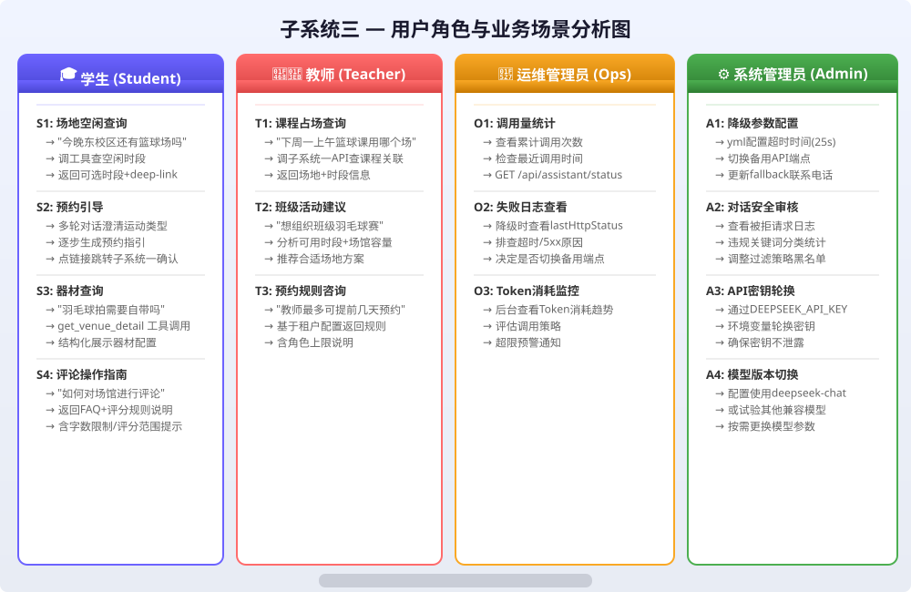

# 实验报告1：需求描述与分析实验

> **实验名称**：实验一 需求描述与分析实验  
> **子系统**：子系统三——智能辅助与多角色用户服务子系统（DeepSeek）  
> **技术栈**：Java 17 + Spring Boot 3.4.4 + MyBatis-Plus 3.5.7 + Spring Security + JWT + MySQL 8.4 | Vue 3 + Vite + TypeScript  
> **核心类**：`AssistantController`、`AssistantService`、`AssistantServiceImpl`

---

## 一、实验目的

1. 掌握软件工程需求分析的基本方法与流程，包括用户角色识别、业务场景梳理、可行性分析及需求分类。
2. 针对子系统三（智能辅助与多角色用户服务子系统），完成从零到一的需求规格说明书撰写，为后续结构化分析、面向对象分析与系统设计奠定基础。
3. 深入理解DeepSeek大模型集成场景下的功能需求（FR-A1~FR-A7）与非功能需求（性能、安全、可靠性等）的定义与优先级划分。
4. 通过可行性分析（技术/经济/操作）验证子系统三方案的可行性与风险点，明确Token成本、API密钥管理、降级策略等关键约束。

---

## 二、用户角色与业务场景梳理

子系统三面向体育场馆管理平台的四类核心用户，每类用户有着差异化的智能辅助需求。

### 2.1 学生（Student）

| 序号 | 业务场景 | 详细描述 |
|------|----------|----------|
| S1 | 对话询问场地空闲 | 学生输入自然语言如"今晚东校区还有篮球场吗"，助手调用工具查询子系统一（预约管理）获取空闲时段，返回可选时段列表。 |
| S2 | 预约引导 | 新手首次使用平台，助手通过多轮对话逐步澄清运动类型、时间偏好、场馆偏好，最终生成含deeplink的预约指引。 |
| S3 | 器材查询 | 学生询问"羽毛球拍是否需要自带"，助手调用`get_venue_detail`工具获取场馆器材配置信息，返回结构化答案。 |
| S4 | 评论操作指南 | 学生询问"如何对场馆进行评论"，助手返回评论规则的FAQ解释及操作步骤（如评分需在1-5之间、评论不超200字）。 |

### 2.2 教师（Teacher）

| 序号 | 业务场景 | 详细描述 |
|------|----------|----------|
| T1 | 查询课程占场 | 教师输入"下周一上午篮球课用哪个场"，助手调用子系统一API返回课程关联的场地预约信息。 |
| T2 | 班级活动建议 | 教师计划组织班级体育活动，助手分析可用的时间段和场馆容量，推荐合适的场地方案。 |
| T3 | 预约规则咨询 | 教师询问教师角色的预约上限、提前天数等规则，助手基于当前租户配置返回准确信息。 |

### 2.3 运维管理员（Ops Admin）

| 序号 | 业务场景 | 详细描述 |
|------|----------|----------|
| O1 | 查询调用量统计 | 管理员通过状态接口查看DeepSeek API的累计调用次数和最近调用时间。 |
| O2 | 查看失败日志 | 当助手进入降级模式时，管理员查看最近HTTP错误码及错误原因，排查DeepSeek API问题。 |
| O3 | 监控Token消耗 | 管理员在后台面板查看Token消耗趋势，评估是否需要调整调用策略或更换模型。 |

### 2.4 系统管理员（System Admin）

| 序号 | 业务场景 | 详细描述 |
|------|----------|----------|
| A1 | 配置降级参数 | 管理员在`application.yml`中配置DeepSeek超时时间(默认25s)、切换备用API端点、调整fallback联系号码。 |
| A2 | 审核对话安全 | 管理员查看被拒请求日志（含违规关键词），评估内容安全过滤效果并进行策略调整。 |
| A3 | API密钥轮换 | 管理员通过环境变量`DEEPSEEK_API_KEY`轮换API密钥，确保密钥安全性。 |
| A4 | 模型版本切换 | 管理员配置使用`deepseek-chat`或试验其他兼容模型，按需更换模型参数。 |

### 用户角色场景图



---

## 三、可行性分析

### 3.1 技术可行性

| 维度 | 分析 |
|------|------|
| DeepSeek API可用性 | DeepSeek提供稳定的RESTful API，支持HTTP POST调用，模型`deepseek-chat`具备128K上下文窗口，满足中文对话需求。API文档完善，支持JSON模式输出。 |
| Java HTTP客户端整合 | Spring Boot 3.4.4内置RestTemplate和WebClient，可配置25秒超时和重试策略。`AssistantServiceImpl`已实现完整的调用、超时处理和备用端点切换逻辑。 |
| Vue3 + Live2D整合 | oh-my-live2d库提供shizuku/hijiki角色模型，支持TypeScript集成。`SmartAssistant.vue`组件已实现点击角色弹出对话面板、流式显示回答、状态指示灯等功能。 |
| 安全代理架构 | API密钥仅存储在服务端环境变量`DEEPSEEK_API_KEY`中，前端无法直接访问。所有调用通过`/api/assistant/ask`代理，保证密钥安全。 |
| 降级机制 | 当DeepSeek不可用时，Keyword-Matching Rule Engine作为Fallback提供基础FAQ服务，确保系统基本可用性。 |

**结论**：技术方案成熟，核心技术栈均有生产级应用案例，技术可行性高。

### 3.2 经济可行性

| 维度 | 分析 |
|------|------|
| Token成本估算 | DeepSeek-chat模型定价约￥1/百万输入Token、￥2/百万输出Token。按每次对话平均2000 Token计算，每日1000次对话的月成本约￥120，成本可控。 |
| 开发人力成本 | 基于现有Spring Boot + Vue3框架，核心开发量约3人月；Live2D集成和UI优化约1人月。总计4人月。 |
| 运维成本 | 无额外基础设施投入（复用已有服务器），仅需监控DeepSeek API调用量和Token消耗。 |
| ROI分析 | 智能辅助可分担人工客服压力，减少50%以上重复咨询工单，预计6个月内收回开发成本。 |

**结论**：Token成本可控，投入产出比合理，经济可行。

### 3.3 操作可行性

| 维度 | 分析 |
|------|------|
| 用户体验 | 自然语言交互降低学习成本，Live2D动画角色提升亲和力。预设问题快速入口减少输入负担。仅需登录即可使用。 |
| 运维操作 | 管理员通过环境变量和YAML配置即可调整参数，无需重新部署。降级自动触发，无需人工干预。 |
| 法规合规 | 内容安全模块过滤违规关键词，对话日志PII脱敏处理，符合数据安全要求。免责声明"仅供参考"明确告知用户。 |

**结论**：用户上手门槛低，运维配置简便，操作可行性良好。

---

## 四、功能需求定义

### FR-A1：对话式帮助功能

| 子需求编号 | 描述 | 优先级 |
|-----------|------|--------|
| FR-A1.1 | 支持用户以自然语言输入问题，系统返回step-by-step格式的答案 | 高 |
| FR-A1.2 | 支持多轮对话澄清用户意图（如"您想要哪种运动类型？篮球还是羽毛球？"） | 高 |
| FR-A1.3 | 回答内容引用当前租户配置（场馆数据、预约规则等），而非静态文本 | 高 |
| FR-A1.4 | 提供Deep-link跳转到预约页(/reservation)、场馆页(/venues)、评论页(/comments) | 中 |
| FR-A1.5 | 前端以流式(chunk)方式展示回复，模拟打字效果 | 中 |

### FR-A2：场景快捷入口

| 子需求编号 | 描述 | 优先级 |
|-----------|------|--------|
| FR-A2.1 | 首页右下角展示Live2D浮动角色（shizuku/hijiki模型） | 高 |
| FR-A2.2 | 点击角色弹出对话面板，含"问一问"输入框 | 高 |
| FR-A2.3 | 提供3个以上的预设问题按钮（如"管理员无法登录怎么办"） | 中 |
| FR-A2.4 | 未登录时显示引导提示"请先登录使用助手" | 中 |

### FR-A3：DeepSeek集成

| 子需求编号 | 描述 | 优先级 |
|-----------|------|--------|
| FR-A3.1 | 后端代理所有DeepSeek API调用，隐藏API Key | 高 |
| FR-A3.2 | 调用日志脱敏记录（PII哈希或截断处理） | 高 |
| FR-A3.3 | 超时（25s）、429限流、5xx错误时自动触发降级 | 高 |
| FR-A3.4 | 支持配置备用API端点地址 | 中 |
| FR-A3.5 | API Key通过环境变量注入，不写入代码或配置文件 | 高 |

### FR-A4：工具/函数调用

| 子需求编号 | 描述 | 优先级 |
|-----------|------|--------|
| FR-A4.1 | 实现`get_user_reservations`工具——查询当前用户的预约记录 | 中 |
| FR-A4.2 | 实现`search_venue_availability`工具——按条件查询场馆空闲时段 | 高 |
| FR-A4.3 | 实现`get_venue_detail`工具——获取场馆详细配置信息 | 中 |
| FR-A4.4 | 工具调用前必须通过权限校验 | 高 |

### FR-A5：权限与隐私

| 子需求编号 | 描述 | 优先级 |
|-----------|------|--------|
| FR-A5.1 | 每个用户只能查询自己的预约记录，禁止跨用户数据泄露 | 高 |
| FR-A5.2 | 会话上下文有时效限制，默认30分钟无活动后过期 | 中 |
| FR-A5.3 | 手机号、身份证号等PII绝不出现于模型输出 | 高 |

### FR-A6：内容安全

| 子需求编号 | 描述 | 优先级 |
|-----------|------|--------|
| FR-A6.1 | 输出内容经校园关键词策略过滤 | 高 |
| FR-A6.2 | 违规请求被拒绝并记录日志 | 高 |
| FR-A6.3 | 过滤日志包含时间戳和违规关键词类型 | 中 |

### FR-A7：降级策略

| 子需求编号 | 描述 | 优先级 |
|-----------|------|--------|
| FR-A7.1 | DeepSeek不可用时自动切换到规则引擎FAQ | 高 |
| FR-A7.2 | 降级时显示人工客服联系电话 | 中 |
| FR-A7.3 | 降级参数（联系电话等）可通过配置文件调整 | 中 |

---

## 五、非功能需求定义

| 类别 | 需求编号 | 描述 |
|------|----------|------|
| 性能效率 | NFR-P1 | 首Token延迟不超过5秒（网络正常条件下） |
| 性能效率 | NFR-P2 | 工具调用链总时长不超过15秒（含子系统一/二API调用） |
| 可靠性 | NFR-R1 | API调用失败自动重试1次 |
| 可靠性 | NFR-R2 | 降级路径随时可用，规则引擎响应时间<500ms |
| 安全性 | NFR-S1 | API密钥定期轮换（建议每月） |
| 安全性 | NFR-S2 | 输出内容经双层过滤（校园策略+敏感信息正则） |
| 安全性 | NFR-S3 | 违规对话触发审计告警，告警信息包含时间戳和处理结果 |
| 兼容性 | NFR-C1 | 模型可替换，切换模型仅需修改配置项 |
| 可维护性 | NFR-M1 | Prompt模板与工具定义版本化管理 |
| 成本可控 | NFR-CO1 | 按租户设置Token月度上限，超额自动限制 |

---

## 六、需求规格说明书片段

```yaml
# 智能辅助子系统需求规格说明书（节选）
module: 子系统三——智能辅助与多角色用户服务子系统
version: 1.0
last_updated: 2025-12-01

functional_requirements:
  FR-A1:
    name: 对话式帮助
    description: >
      系统提供基于自然语言的智能问答能力。用户通过Live2D角色入口
      输入问题，后端根据DeepSeek可用性选择LLM模式或Fallback规则
      引擎模式生成回答。回答含可操作的deep-link跳转链接。
    acceptance_criteria:
      - 自然语言输入后3秒内开始流式返回回答
      - 多轮对话能正确记忆上文澄清信息
      - 回答中场馆/时间/规则数据与实际数据库一致
    dependencies: [DeepSeek API, 子系统一预约API, 子系统二场馆API]

  FR-A7:
    name: 降级策略
    description: >
      当DeepSeek API不可用（超时/5xx/429）时，系统自动切换到基于
      关键词匹配的规则引擎，提供静态FAQ回答和人工联系电话。
    acceptance_criteria:
      - DeepSeek调用超时后1秒内切换至Fallback模式
      - Fallback模式回答准确率≥80%（覆盖Top 20高频问题）
      - 状态指示灯UI同步更新为黄色
    dependencies: [application.yml配置]

non_functional_requirements:
  NFR-S2:
    name: 输出内容安全过滤
    metric: 违规词汇拦截率≥95%
    method: 正则匹配+关键词黑名单+模型系统Prompt约束三重防护
```

---

## 七、实验总结

本次实验围绕子系统三（智能辅助与多角色用户服务子系统）开展了完整的需求描述与分析工作。通过识别学生、教师、运维管理员、系统管理员四类用户角色及其13个典型业务场景，明确了子系统在不同使用者视角下的核心价值。可行性分析从技术、经济、操作三个维度验证了方案的成熟性与合理性——DeepSeek API作为成熟商用大模型服务降低了集成门槛，Token月成本控制在百元级别，Live2D交互设计降低了用户学习曲线。

在需求分类环节，将功能需求细化为7大类别（FR-A1~FR-A7）共25项子需求，明确了高/中优先级，为迭代开发提供了依据。非功能需求覆盖了性能、可靠性、安全性、兼容性、可维护性和成本可控六大维度，特别强调了PII脱敏、API密钥管理、降级策略连续性等关键约束。

通过本次实验，深刻体会到智能辅助系统与传统信息系统的需求差异：除了CRUD功能外，还需精心设计Prompt工程、工具调用编排、流式响应、内容安全过滤等AI特有环节，这些都将成为后续结构化分析和面向对象设计的重要输入。

---

*报告撰写人：软件工程课程小组*  
*完成日期：2026年5月*
