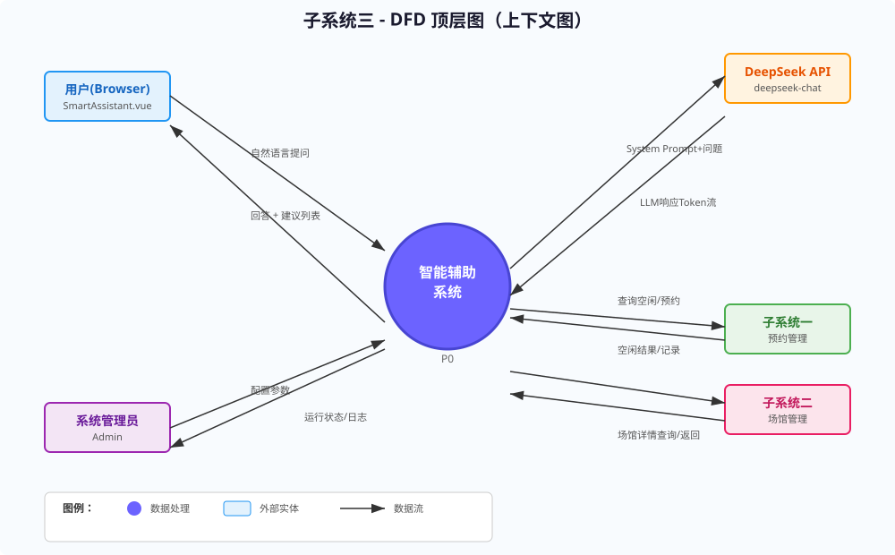
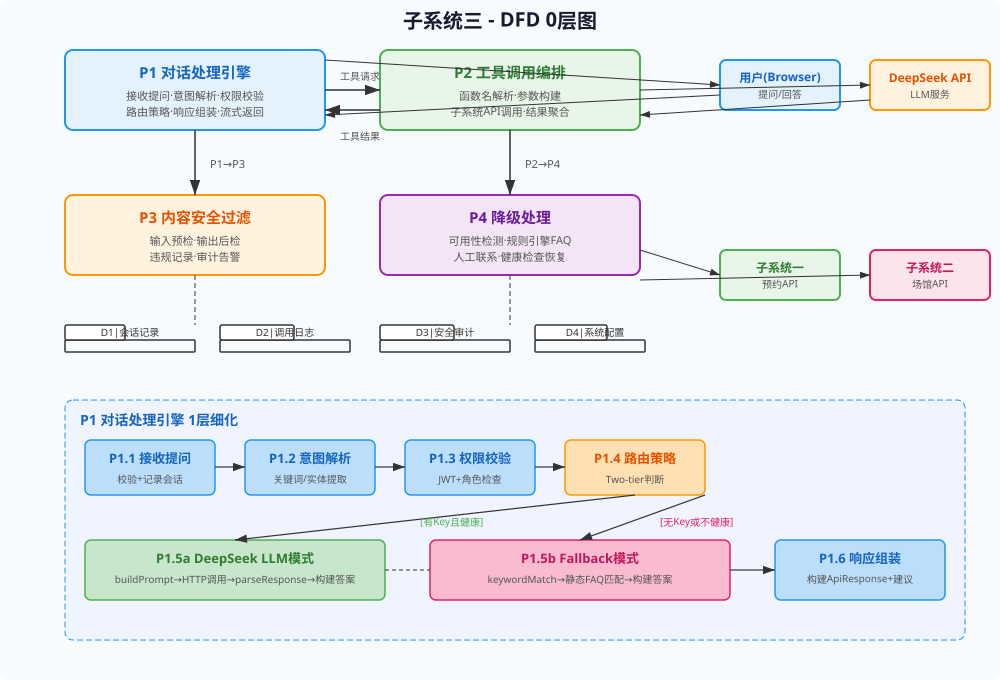
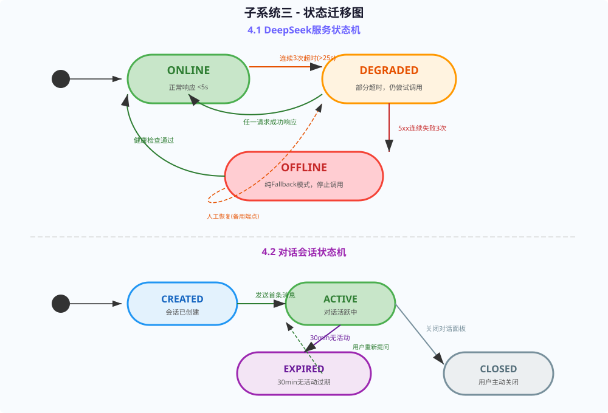

# 实验报告2：结构化分析与设计实验

> **实验名称**：实验二 结构化分析与设计实验  
> **子系统**：子系统三——智能辅助与多角色用户服务子系统（DeepSeek）

---

## 一、实验目的

1. 掌握结构化分析方法，针对子系统三绘制分层数据流图（DFD），从顶层到1层逐步细化数据流和处理逻辑。
2. 掌握数据库概念建模方法，绘制子系统三核心实体的ER图（实体-关系图）。
3. 掌握状态-迁移图绘制方法，对DeepSeek服务状态和对话会话状态进行建模。
4. 完成子系统三的总体设计（模块划分与架构设计）和详细设计（模块实现细节、接口定义、流程逻辑）。
5. 通过结构化分析与设计，为后续面向对象分析和编码实现提供设计蓝图。

---

## 二、分层数据流图（DFD）

### 2.1 顶层DFD（上下文图）

子系统三"智能辅助系统"作为单一处理节点，与五个外部实体交互：

| 外部实体 | 输入数据流 | 输出数据流 | 说明 |
|----------|-----------|-----------|------|
| 用户（Browser） | 自然语言提问（question） | 自然语言回答 + 建议列表 | SmartAssistant.vue 前端交互 |
| DeepSeek API | 已构建的System Prompt+User Message | LLM生成文本(token流) | 云端AI服务 |
| 子系统一（预约管理） | 场地空闲查询结果、预约记录 | 场地查询请求、用户预约查询 | 工具调用 |
| 子系统二（场馆管理） | 场馆详情数据 | 场馆详情查询请求 | 工具调用 |
| 系统管理员 | 配置参数（yml/environ） | 运行状态（status/dashboard） | 运维入口 |

### 2.2 0层DFD

将顶层系统分解为四大核心处理模块：

| 处理编号 | 处理名称 | 输入 | 输出 | 数据存储 |
|----------|---------|------|------|----------|
| P1 | 对话处理引擎 | 用户提问、用户上下文 | 格式化答案、UI渲染指令 | D1:会话记录表 |
| P2 | 工具调用编排 | 工具调用请求（函数名+参数） | 工具调用结果 | D2:工具调用日志表 |
| P3 | 内容安全过滤 | 待输出文本、用户输入 | 过滤后文本/拒绝标记 | D3:安全审计日志 |
| P4 | 降级处理 | DeepSeek可用性检测结果 | Fallback回答/人工联系方式 | D4:系统配置表 |

### 2.3 1层DFD（对话处理引擎细化）

P1对话处理引擎进一步细化为六个子处理：

```
P1.1 接收提问 → P1.2 意图解析 → P1.3 权限校验 → P1.4 路由策略判断 → P1.5 DeepSeek调用(或) → P1.6 Fallback关键词匹配 → P1.5 响应组装
```

**P1.4 路由策略详情（two-tier判断逻辑）：**
- 步骤1：检查环境变量 `DEEPSEEK_API_KEY` 是否配置
- 步骤2：检查DeepSeek最近健康状态（是否处于DEGRADED/OFFLINE状态）
- 步骤3：若两者通过→走DeepSeek LLM模式（P1.5a）
- 步骤4：若任一不通过→走Fallback关键字匹配模式（P1.5b）
- 步骤5：两种路径的输出统一进入P1.6响应组装

**P1.5a DeepSeek LLM模式详细流程：**
1. `buildPrompt()` —— 拼接系统提示词（含场馆事实+当前用户username/role）
2. HTTP POST → DeepSeek API (`https://api.deepseek.com/v1/chat/completions`)
3. 配置 model="deepseek-chat", temperature=0.7, max_tokens=1024, timeout=25s
4. `parseResponse()` —— 解析JSON响应提取 `choices[0].message.content`
5. 构建 `AssistantAnswerResponse`，provider="deepseek"

**P1.5b Fallback关键字匹配模式详细流程：**
1. `keywordMatch(question)` —— 执行关键词分类匹配算法
2. 匹配类别：登录/注册FAQ、预约操作指南、评论规则、管理员操作、器材与定价
3. 返回预定义的静态中文回答文本
4. 构建 `AssistantAnswerResponse`，provider="fallback"




---

## 三、ER图（实体关系图）

子系统三涉及四个核心数据实体：

### 3.1 实体定义

| 实体 | 属性 | 说明 |
|------|------|------|
| 会话记录（SessionRecord） | session_id(PK), user_id, role, question, answer, provider, tokens_used, created_at, expires_at | 记录每次问答 |
| 工具调用记录（ToolCallLog） | call_id(PK), session_id(FK), function_name, parameters, result, call_time, duration_ms | 记录工具调用详情 |
| 用户反馈（UserFeedback） | feedback_id(PK), session_id(FK), user_id, rating, comment, created_at | 用户对回答的评价 |
| 配置参数（AssistantConfig） | config_id(PK), config_key, config_value, updated_at, updated_by | 存储动态配置 |

### 3.2 实体关系

- **会话记录 1——N 工具调用记录**：一次对话可能调用0~N个工具函数
- **会话记录 1——1 用户反馈**：一次对话可有一次用户反馈
- **配置参数**：独立实体，与会话记录无直接外键关系


---

## 四、状态-迁移图

### 4.1 DeepSeek服务状态机

子系统三管理DeepSeek API的服务状态，定义四种状态：

| 状态 | 说明 | 迁移条件 | 目标状态 |
|------|------|----------|----------|
| ONLINE | API正常响应，延迟<5s | 连续3次请求超时>25s | DEGRADED |
| DEGRADED | 部分降级，仍在尝试调用 | 任一请求响应<25s | ONLINE |
| DEGRADED | 部分降级，仍在尝试调用 | 收到5xx错误连续3次 | OFFLINE |
| OFFLINE | 启用纯Fallback模式 | 健康检查通过（定时探测） | ONLINE |

### 4.2 对话会话状态机

| 状态 | 说明 | 迁移条件 | 目标状态 |
|------|------|----------|----------|
| CREATED | 会话已创建 | 用户发送第一条消息 | ACTIVE |
| ACTIVE | 会话活跃中 | 30分钟无用户交互 | EXPIRED |
| EXPIRED | 会话过期 | 用户发送新消息 | ACTIVE（重新激活） |
| ACTIVE | 会话活跃中 | 用户主动关闭对话面板 | CLOSED |



---

## 五、总体设计

### 5.1 技术架构分层

子系统三采用经典四层架构：

```
┌─────────────────────────────────────────────┐
│          表示层（Vue 3 Frontend）              │
│  SmartAssistant.vue + oh-my-live2d + Pinia  │
├─────────────────────────────────────────────┤
│          业务层（Spring Boot Controller）      │
│  AssistantController → POST /api/assistant/ask│
│                      → GET /api/assistant/status│
├─────────────────────────────────────────────┤
│          代理层（AssistantServiceImpl）         │
│  Prompt构建 + 路由策略 + 工具编排 + 响应组装    │
├─────────────────────────────────────────────┤
│          AI服务层（DeepSeekProxy）              │
│  HTTP Client + 超时控制 + 备用端点切换          │
└─────────────────────────────────────────────┘
```

### 5.2 模块划分

| 模块编号 | 模块名称 | 核心职责 | 对应技术组件 |
|----------|---------|---------|-------------|
| M1 | 对话引擎 | 接收提问、意图解析、响应组装 | `AssistantController` |
| M2 | DeepSeek代理 | LLM调用、Prompt管理、响应解析 | `AssistantServiceImpl.answer()` |
| M3 | 工具调用 | 函数调用编排、子系统API查询 | `FunctionCallManager` |
| M4 | 内容安全 | 敏感词过滤、违规记录、审计告警 | `ContentSafetyFilter` |
| M5 | 降级处理 | 可用性检测、静态FAQ、健康检查 | `FallbackRuleEngine` |
| M6 | 监控统计 | 调用量、Token消耗、状态上报 | `AssistantServiceImpl.status()` |

---

## 六、详细设计

### 6.1 对话处理流程伪代码

```
function answer(question, username, role):
    // Step 1: 记录会话
    session = createSession(username, role)
    
    // Step 2: 内容安全预检（输入）
    if isInputBlocked(question):
        logSecurityEvent(question, "BLOCKED_INPUT")
        return buildRejectAnswer()
    
    // Step 3: Two-tier 路由判断
    deepseekKey = System.getenv("DEEPSEEK_API_KEY")
    isHealthy = checkDeepSeekHealth()
    
    if deepseekKey != null AND isHealthy:
        // DeepSeek LLM模式
        try:
            prompt = buildPrompt(venueFacts + userContext)
            rawResponse = deepSeekProxy.call(
                model: "deepseek-chat",
                messages: [system: prompt, user: question],
                timeout: 25s
            )
            answerText = parseLLMResponse(rawResponse)
            providerType = "deepseek"
            tokensUsed = rawResponse.usage.total_tokens
        catch (TimeoutException | Http5xxException ex):
            // 降级到Fallback
            updateServiceState(DEGRADED)
            goto Fallback
    else:
        // Fallback规则引擎模式
        Fallback:
        answerText = ruleEngine.match(question)
        providerType = "fallback"
        tokensUsed = 0
    
    // Step 4: 内容安全后检（输出）
    if isOutputBlocked(answerText):
        answerText = "抱歉，该问题我暂时无法回答。如有紧急需求请联系人工客服：010-12345678"
    
    // Step 5: 组装响应
    return AssistantAnswerResponse(
        answer: answerText,
        suggestions: generateSuggestions(question),
        provider: providerType
    )
```

### 6.2 工具编排策略伪代码

```
function buildPromptWithTools(question, userContext):
    systemPrompt = """
    你是体育场馆管理平台的智能助手。
    当前用户：{username}，角色：{role}
    可用工具：
    - get_user_reservations(): 查询用户预约记录
    - search_venue_availability(date, sportType): 查询场馆空闲
    - get_venue_detail(venueId): 获取场馆详情
    
    规则：
    1. 工具调用后必须进行权限校验
    2. 最终预约确认必须由用户在前端点击完成
    3. 不输出任何手机号、身份证号等PII
    4. 回答末尾添加免责声明"以上信息仅供参考，以页面实际显示为准"
    """
    return systemPrompt
    
function executeToolCall(functionName, params, userContext):
    switch functionName:
        case "get_user_reservations":
            // 权限校验：只能查自己的
            return subsystem1API.getReservations(userContext.username)
        case "search_venue_availability":
            return subsystem1API.searchAvailable(params.date, params.sportType)
        case "get_venue_detail":
            return subsystem2API.getVenueDetail(params.venueId)
```

---

## 七、实验总结

本次实验完成了子系统三（智能辅助与多角色用户服务子系统）的完整结构化分析与设计。通过绘制三层DFD（顶层→0层→1层），清晰地展示了系统与外部实体（用户、DeepSeek API、子系统一、子系统二、管理员）的数据流关系及四大核心处理模块的分解结构。特别地，1层DFD详细刻画了对话处理引擎内部的"接收→意图解析→权限校验→路由策略→DeepSeek/Fallback→响应组装"流水线，为后续编码提供了精确的结构化参照。

ER图设计覆盖了会话记录、工具调用记录、用户反馈和配置参数四个实体及其关系，为数据库表设计提供了概念模型基础。状态-迁移图则对DeepSeek服务健康状态（ONLINE→DEGRADED→OFFLINE）和对话会话生命周期（CREATED→ACTIVE→EXPIRED→CLOSED）进行了形式化建模，为系统可靠性和状态管理实现提供了明确规范。

在总体设计层面，确立了四层架构（表示层→业务层→代理层→AI服务层）和六大模块划分，明确了各模块职责边界。详细设计的伪代码覆盖了two-tier路由判断和工具编排两大核心算法，为开发实现提供了可直接翻译为Java代码的设计级指导。

---

*报告撰写人：软件工程课程小组*  
*完成日期：2026年5月*
