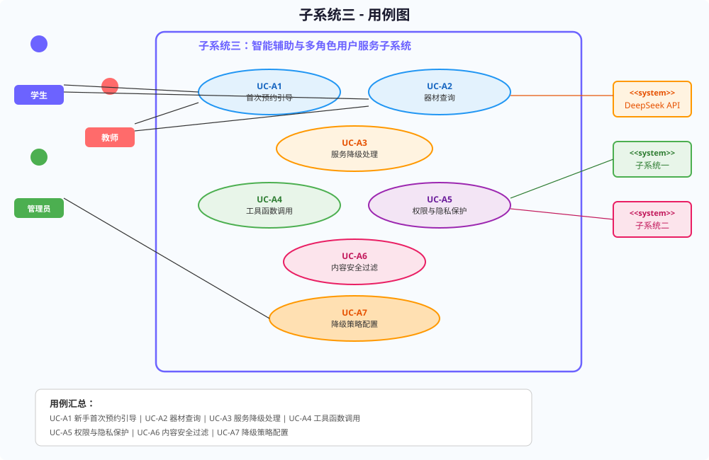

# 实验报告3：面向对象分析与设计实践

> **实验名称**：实验三 面向对象分析与设计实践  
> **子系统**：子系统三——智能辅助与多角色用户服务子系统（DeepSeek）

---

## 一、实验目的

1. 掌握面向对象分析（OOA）中参与者识别、用例建模的方法。
2. 针对子系统三，识别人类参与者（学生、教师、系统管理员）和外部系统参与者（DeepSeek API、子系统一、子系统二），绘制规范的用例图。
3. 掌握用例规格说明的撰写规范，包括前置条件、后置条件、基本流程、异常流程等要素。
4. 通过用例建模明确系统功能边界和交互协议，为后续静态建模和动态建模提供输入。

---

## 二、参与者识别

| 编号 | 参与者 | 类型 | 描述 |
|------|--------|------|------|
| ACT-01 | 学生（Student） | 人类参与者 | 平台主要使用者，需登录。通过Live2D助手询问场地空闲、预约引导、器材要求等问题。 |
| ACT-02 | 教师（Teacher） | 人类参与者 | 平台使用者，需登录。查询课程占场、班级活动建议、预约规则咨询。 |
| ACT-03 | 系统管理员（System Admin） | 人类参与者 | 平台运维者，具有完整管理权限。配置降级参数、审核对话安全、轮换API密钥。 |
| ACT-04 | DeepSeek API | 外部系统参与者 | 云端大语言模型服务，接收结构化Prompt，返回自然语言回答Token流。 |
| ACT-05 | 子系统一（预约管理） | 外部系统参与者 | 提供场地空闲查询、用户预约记录查询等API，被子系统三的工具调用模块调用。 |
| ACT-06 | 子系统二（场馆管理） | 外部系统参与者 | 提供场馆详情查询API，被子系统三的`get_venue_detail`工具调用。 |

---

## 三、用例规格说明

### 3.1 UC-A1：新手完成首次预约引导

| 条目 | 内容 |
|------|------|
| **用例编号** | UC-A1 |
| **用例名称** | 新手完成首次预约引导 |
| **参与者** | 学生（主要）、DeepSeek API（辅助）、子系统一（辅助） |
| **前置条件** | 用户已登录平台；用户当前无未完成的预约记录；DeepSeek服务状态为ONLINE |
| **后置条件** | 用户获得包含可操作跳转链接和可选时段列表的自然语言回答；用户点击链接跳转至子系统一完成最终预约确认 |
| **触发事件** | 用户通过Live2D对话面板输入自然语言问题（如"我想预约一个篮球场"） |
| **基本流程** | |
| 步骤1 | 用户在SmartAssistant.vue中点击Live2D角色，弹出对话面板 |
| 步骤2 | 用户输入问题："我想预约一个篮球场" |
| 步骤3 | 前端POST到`/api/assistant/ask`，提交`AssistantAskRequest("我想预约一个篮球场")` |
| 步骤4 | `AssistantController`接收请求，调用`AssistantService.answer()` |
| 步骤5 | `AssistantServiceImpl`检测到未明确运动类型，返回多轮澄清问题："您想要篮球还是羽毛球？室内还是室外？" |
| 步骤6 | 用户回复："篮球，室外" |
| 步骤7 | `AssistantServiceImpl`调用`search_venue_availability(篮球, 室外)`工具，查询子系统一API |
| 步骤8 | 子系统一返回空闲时段列表。后端将结构化数据嵌入Prompt，调用DeepSeek API |
| 步骤9 | DeepSeek API返回自然语言建议，包含deeplink跳转链接 |
| 步骤10 | 前端流式渲染回答，ChatPanel显示"推荐西校区篮球场2号场，今晚18:00-20:00空闲，[点击预约](/reservation?venueId=3&date=...)" |
| 步骤11 | 用户点击链接，跳转到子系统一预约页面完成最终确认 |
| **异常流程** | |
| 异常1 | **无空闲场地**：子系统一返回空结果 → 助手回复"抱歉，当前时段无空闲篮球场。建议尝试其他时段或羽毛球等其他运动类型。" |
| 异常2 | **无预约权限**：用户角色被限制预约 → 助手返回"您当前不可预约场地，请联系管理员" |
| 异常3 | **DeepSeek超时降级**：DeepSeek调用超过25秒 → 降级到Fallback规则引擎，返回静态FAQ（含预约操作步骤文字说明） |
| 异常4 | **工具调用异常**：子系统一API返回5xx → 助手返回"预约系统暂不可用，请稍后再试。紧急需求请联系人工客服：010-12345678" |

---

### 3.2 UC-A2：查询是否需自带器材

| 条目 | 内容 |
|------|------|
| **用例编号** | UC-A2 |
| **用例名称** | 查询是否需自带器材 |
| **参与者** | 学生/教师（主要）、子系统二（辅助） |
| **前置条件** | 用户已登录；子系统二API正常运行 |
| **后置条件** | 用户获得某场馆器材配置的结构化描述，明确告知"需自带器材清单"或"场馆提供所有器材" |
| **触发事件** | 用户输入问题"羽毛球拍需要自带吗"或"东校区游泳馆提供浮板吗" |
| **基本流程** | |
| 步骤1 | 用户提问"羽毛球场馆提供球拍吗" |
| 步骤2 | 后端意图解析识别为器材查询类问题 |
| 步骤3 | `AssistantServiceImpl`调用`get_venue_detail(venueId=羽毛球馆ID)`工具 |
| 步骤4 | 子系统二API返回场馆属性：`{venueName:"羽毛球馆", providedEquip:["羽毛球拍","羽毛球"], selfBring:[], rentalFee:0}` |
| 步骤5 | 工具调用结果传递给DeepSeek（若可用），生成自然语言简述："羽毛球馆提供羽毛球拍和羽毛球，您无需自行携带。" |
| 步骤6 | 返回`AssistantAnswerResponse{answer:"羽毛球馆已为您准备球拍和球，无需自带。", provider:"deepseek"}` |
| **异常流程** | |
| 异常1 | **场馆不存在**：子系统二返回404 → 助手回复"未找到该场馆信息，请确认名称" |
| 异常2 | **DeepSeek不可用**：走Fallback → 格式化工具返回的原始JSON数据为可读文本 |
| 异常3 | **工具权限不足**：用户无权限查场馆详情 → 提示"您无权查看该场馆的详细数据" |

---

### 3.3 UC-A3：模型服务不可用

| 条目 | 内容 |
|------|------|
| **用例编号** | UC-A3 |
| **用例名称** | 模型服务不可用（降级处理） |
| **参与者** | 学生/教师（主要）、规则引擎（替代系统） |
| **前置条件** | DeepSeek服务状态为DEGRADED或OFFLINE；规则引擎已加载FAQ数据库 |
| **后置条件** | 用户获得基于关键词匹配的基础FAQ回答，同时前端状态指示灯变为黄色 |
| **触发事件** | DeepSeek API连续请求超时(>25s)或返回5xx错误 |
| **基本流程** | |
| 步骤1 | 用户发送问题"如何预约场地" |
| 步骤2 | `AssistantServiceImpl.answer()`检查DeepSeek可用性 → 结果为false |
| 步骤3 | 路由策略选择Fallback模式 |
| 步骤4 | `keywordMatch("如何预约场地")` → 匹配"预约"关键词，命中"预约操作指南"类别 |
| 步骤5 | 返回预定义答案："预约场地流程：1.登录平台；2.选择运动类型与时间；3.查看空闲场地；4.点击确认预约。最终以点击确认为准。" |
| 步骤6 | `AssistantStatusResponse{mode:"fallback", deepseekEnabled:false}` |
| 步骤7 | 前端SmartAssistant.vue状态指示器变为黄色圆点 |
| **异常流程** | |
| 异常1 | **关键词无匹配**：规则引擎未匹配任何类别 → 返回通用回答"抱歉，当前AI服务暂时不可用。如需帮助，请联系人工客服：010-12345678" |
| 异常2 | **Fallback恢复**：DeepSeek健康检查通过 → 自动切回LLM模式，状态指示灯变绿 |

| **业务规则** | |
| BR1 | 最终预约确认必须由用户在子系统一前端显式点击完成，模型输出不作为唯一确认证据 |
| BR2 | "仅供参考"免责声明必须在前端ChatPanel中显示 |
| BR3 | PII绝不出现于模型输出（手机号、身份证号脱敏） |

---

## 四、实验总结

本次实验围绕子系统三的面向对象分析，完成了六类参与者的识别（3名人类参与者 + 3个外部系统参与者）和七个核心用例的定义，绘制了规范的UML用例图。通过对UC-A1（首次预约引导）、UC-A2（器材查询）、UC-A3（降级处理）三个用例的完整规格说明撰写，明确了各用例的前置/后置条件、基本流程（11步、6步、5步）和异常流程分支。

用例规格说明中特别强调了三个核心业务规则：(1)最终确认必须由用户显式点击；(2)"仅供参考"免责必须可见；(3)PII绝不输出。这三个规则贯穿子系统三的整个生命周期，是安全合规的底线约束。本次实验的输出（用例图与用例规格）为后续实验四的静态建模和实验五的动态建模提供了清晰的系统边界和交互场景基础。

---

*报告撰写人：软件工程课程小组*  
*完成日期：2026年5月*
