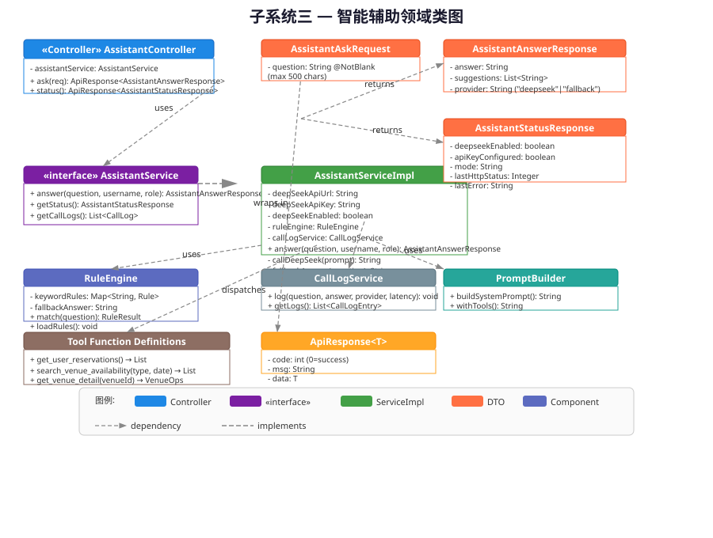
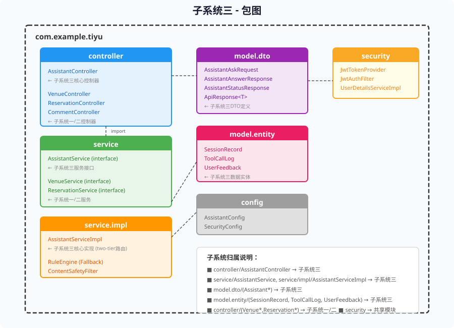
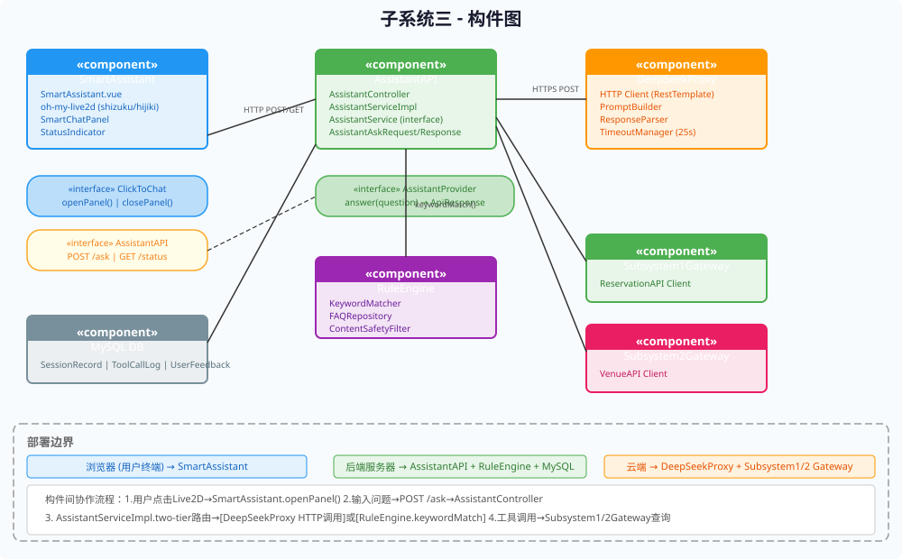
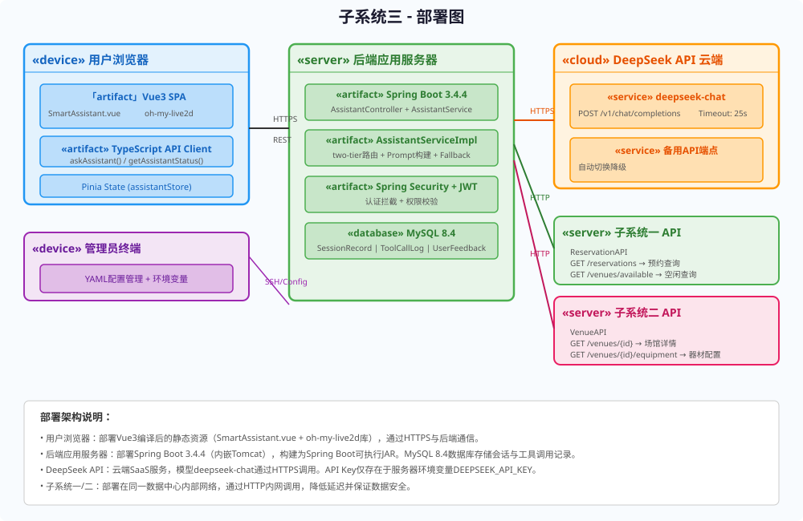

# 实验报告4：静态建模实践

> **实验名称**：实验四 静态建模实践  
> **子系统**：子系统三——智能辅助与多角色用户服务子系统（DeepSeek）

---

## 一、实验目的

1. 掌握UML静态建模方法，针对子系统三的面向对象设计绘制类图、对象图、包图、构件图和部署图。
2. 通过类图明确核心类的属性、方法和关系，理解Controller-Service-DTO的经典分层设计。
3. 通过对象图实例化类模型，验证"张三问篮球场"具体场景下的对象协作关系。
4. 通过包图展示`com.example.tiyu`包层次结构，明确子系统三的代码边界。
5. 通过构件图和部署图展示系统的物理架构，包括前端Live2D构件、后端AssistantAPI构件与DeepSeek云服务的部署关系。

---

## 二、类图

### 2.1 核心类说明

子系统三的类图涵盖以下核心元素：

| 类/接口 | 类型 | 说明 |
|----------|------|------|
| `AssistantController` | Controller | 接收HTTP请求，依赖`AssistantService`接口 |
| `AssistantService` | Interface | 服务接口，定义`answer()`和`status()`契约 |
| `AssistantServiceImpl` | Service | 实现类，包含two-tier路由逻辑、Prompt构建、DeepSeek调用、Fallback匹配 |
| `AssistantAskRequest` | DTO | 请求体，`question`字段`@NotBlank @Size(max=500)` |
| `AssistantAnswerResponse` | DTO | 回答体，`answer + suggestions + provider` |
| `AssistantStatusResponse` | DTO | 状态体，`deepseekEnabled + apiKeyConfigured + mode + lastHttpStatus + lastError` |
| `ApiResponse<T>` | DTO | 通用响应封装，`code + message + data` |

### 2.2 类间关系

- **依赖关系**：`AssistantController` 依赖 `AssistantService` 接口（Spring DI注入），不直接依赖实现类
- **实现关系**：`AssistantServiceImpl` 实现 `AssistantService` 接口
- **使用关系**：`AssistantServiceImpl` 使用三个DTO类（创建并返回`AssistantAnswerResponse`、`AssistantStatusResponse`，包裹于`ApiResponse<T>`中）

### 2.3 关键方法说明

| 类 | 方法 | 功能 |
|----|------|------|
| AssistantController | `ask(req, auth)` | 提取JWT中的username和role，调用`assistantService.answer()`，返回`ApiResponse<AssistantAnswerResponse>` |
| AssistantController | `status()` | 调用`assistantService.status()`，返回`ApiResponse<AssistantStatusResponse>` |
| AssistantServiceImpl | `answer(q, u, r)` | 核心业务方法：执行two-tier路由 → DeepSeek调用或Fallback匹配 → 返回回答 |
| AssistantServiceImpl | `status()` | 返回`AssistantStatusResponse`，包含DeepSeek服务状态、最近HTTP状态码和错误信息 |
| AssistantServiceImpl (private) | `buildPrompt(venueFacts, userCtx)` | 构建包含场馆数据和用户上下文（username+role）的System Prompt |
| AssistantServiceImpl (private) | `keywordMatch(question)` | 对用户问题进行关键词分类匹配，返回预定义FAQ文本 |
| AssistantServiceImpl (private) | `checkAvailability()` | 检查`DEEPSEEK_API_KEY`环境变量和DeepSeek最近健康状态 |

---

## 三、对象图

对象图展示具体场景"学生张三问'今晚东校区还有篮球场吗'并得到DeepSeek回答"在运行时的对象实例快照：

| 对象实例 | 类型 | 关键属性值 |
|----------|------|-----------|
| `张三: Student` | Student | userId=1001, username="zhangsan", role="STUDENT" |
| `request: AssistantAskRequest` | DTO | question="今晚东校区还有篮球场吗" |
| `answer: AssistantAnswerResponse` | DTO | answer="东校区篮球场1号场18:00-20:00空闲，[点击预约]", provider="deepseek" |
| `serviceImpl: AssistantServiceImpl` | Service | deepSeekApiUrl配置完成, deepSeekState=ONLINE |
| `response: ApiResponse<AssistantAnswerResponse>` | DTO | code=0, message="success" |

对象间的消息协作流程：张三(Student) → POST → AssistantController → answer()调用 → AssistantServiceImpl → buildPrompt → DeepSeek API → parseResponse → AssistantAnswerResponse → ApiResponse → 前端渲染。

---

## 四、包图

子系统三的代码组织于`com.example.tiyu`包下，各子包职责分明：

| 包名 | 归属 | 内容 |
|------|------|------|
| `controller` | 跨子系统共享 | `AssistantController`(子系统三)、`VenueController`(子系统二)、`ReservationController`(子系统一) |
| `service` | 跨子系统共享 | `AssistantService`接口(子系统三)、`VenueService`、`ReservationService` |
| `service.impl` | **子系统三主体** | `AssistantServiceImpl`(two-tier路由实现)、`RuleEngine`(Fallback)、`ContentSafetyFilter`(安全过滤) |
| `model.dto` | **子系统三专有** | `AssistantAskRequest`、`AssistantAnswerResponse`、`AssistantStatusResponse`、`ApiResponse<T>` |
| `model.entity` | **子系统三专有** | `SessionRecord`、`ToolCallLog`、`UserFeedback`(会话持久化实体) |
| `config` | 跨子系统共享 | `AssistantConfig`、`SecurityConfig` |
| `security` | 共享模块 | `JwtTokenProvider`、`JwtAuthFilter`、`UserDetailsServiceImpl` |

---

## 五、构件图

子系统三由六大构件协同组成：

| 构件 | 职责 | 关键接口 |
|------|------|----------|
| **SmartAssistant** | 前端Vue3组件，集成oh-my-live2d角色和ChatPanel | Provided: `ClickToChat` | Required: `AssistantAPI` |
| **AssistantAPI** | 后端核心构件，包含Controller和Service | Provided: `AssistantProvider.answer()` |
| **DeepSeekProxy** | 封装DeepSeek API HTTP调用、PromptBuilder、超时控制 | 内部接口 |
| **RuleEngine** | Fallback规则引擎，KeywordMatcher + FAQRepository + ContentSafetyFilter | `keywordMatch(question)` |
| **Subsystem1Gateway** | 子系统一（预约管理）API客户端 | `getReservations()`, `searchAvailable()` |
| **Subsystem2Gateway** | 子系统二（场馆管理）API客户端 | `getVenueDetail()` |
| **MySQL DB** | 数据存储：SessionRecord、ToolCallLog、UserFeedback | JDBC |

构件间协作流程：SmartAssistant(HTTP POST) → AssistantAPI → [DeepSeekProxy或RuleEngine] → (可选)Subsystem1/2Gateway → AssistantAPI → SmartAssistant。

---

## 六、部署图

| 节点 | 类型 | 部署内容 |
|------|------|----------|
| **用户浏览器** | device | Vue3编译后静态资源(SmartAssistant.vue + oh-my-live2d)、TypeScript API Client(askAssistant/getAssistantStatus)、Pinia状态管理 |
| **后端应用服务器** | server | Spring Boot 3.4.4可执行JAR(内嵌Tomcat)、AssistantServiceImpl、Spring Security+JWT拦截器、MySQL 8.4数据库(SessionRecord等表) |
| **DeepSeek API云端** | cloud service | deepseek-chat模型(/v1/chat/completions)、备用API端点(自动切换降级) |
| **子系统一API** | server | 预约管理REST API（同一数据中心内网部署） |
| **子系统二API** | server | 场馆管理REST API（同一数据中心内网部署） |
| **管理员终端** | device | YAML配置管理(application.yml)、环境变量管理(DEEPSEEK_API_KEY)、SSH服务器访问 |

通信协议：Browser ↔ Backend: HTTPS/REST; Backend ↔ DeepSeek: HTTPS/REST; Backend ↔ Subsystem1/2: HTTP内网调用。

---

## 七、实验总结

本次实验完成了子系统三的五种UML静态模型设计。类图精确刻画了`AssistantController→AssistantService(interface)→AssistantServiceImpl`的依赖与实现链，以及三个DTO类的属性结构，为编码提供了可直接参照的类设计方案。对象图通过"张三问篮球场"实例化场景验证了类模型在运行时的协作正确性。

包图明确了子系统三在`com.example.tiyu`工程中的代码边界——`service.impl`（核心实现）、`model.dto`（三专有DTO）、`model.entity`（三专有实体）为子系统三独占包，其余包为跨子系统共享。构件图和部署图从物理维度规划了六大构件的接口契约和五类节点的部署拓扑，特别强调了API密钥仅在服务器端环境变量中、DeepSeek代理隐藏密钥、浏览器与后端HTTPS通信等安全约束。

通过静态建模实践，深刻理解了"设计先行"的重要性：类图的接口抽象使得Fallback模式与DeepSeek模式可无缝切换；构件图的服务隔离原则保证了降级时的可用性；部署图的内外网隔离策略保障了数据安全。

---

*报告撰写人：软件工程课程小组*  
*完成日期：2026年5月*
