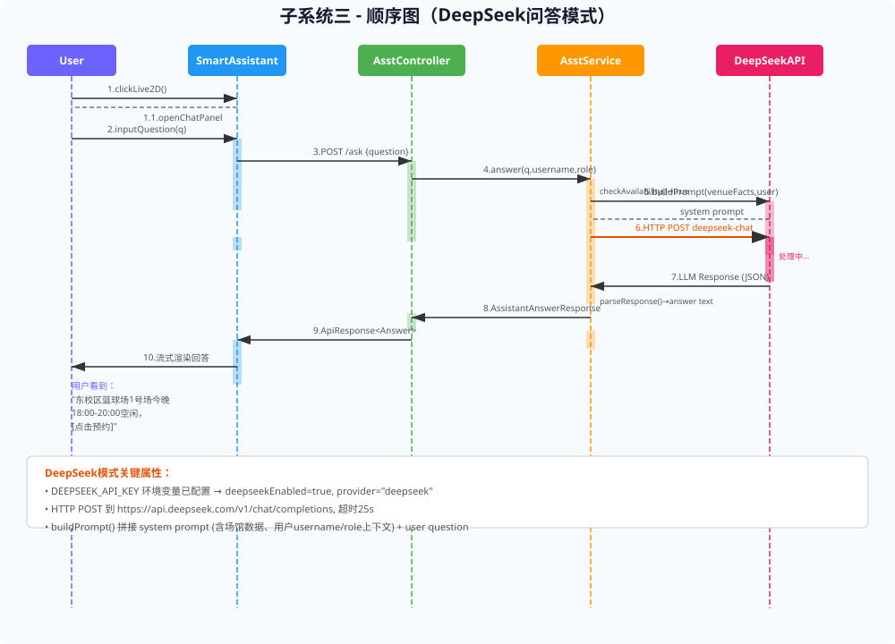
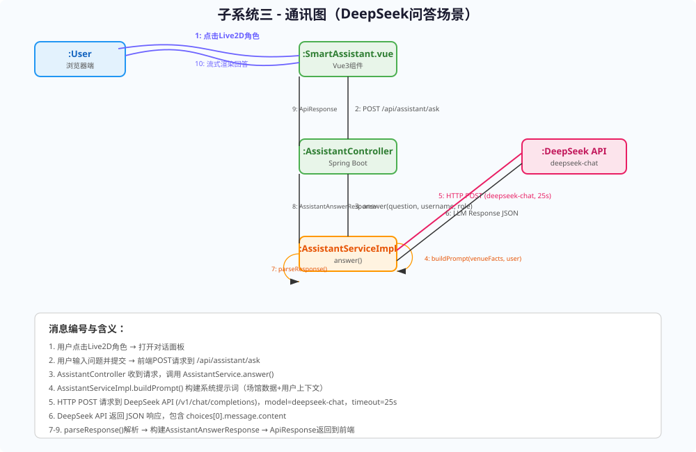
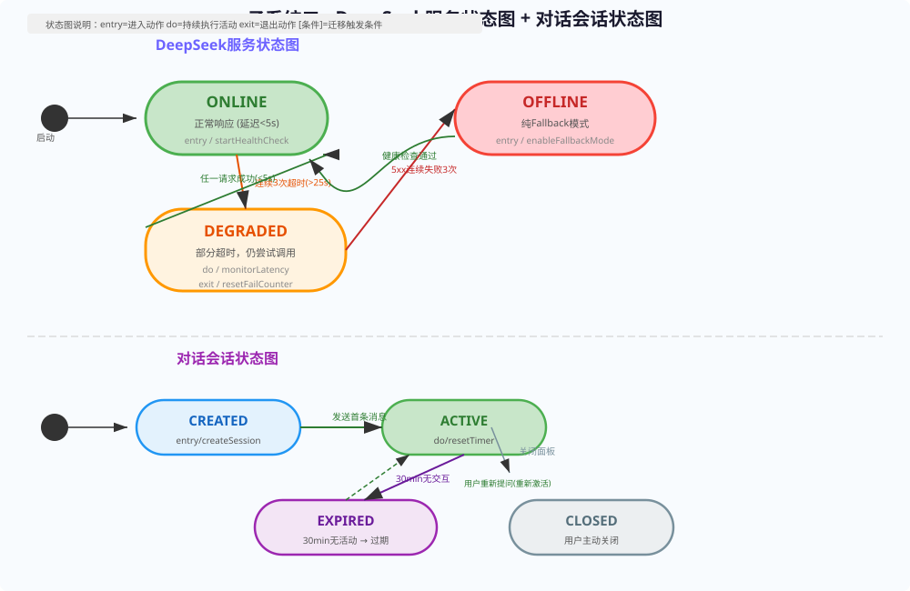
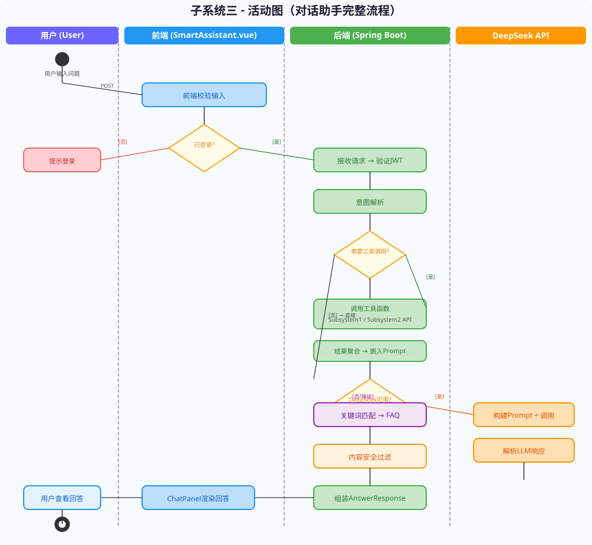

# 实验报告5：动态建模与系统交互实践

> **实验名称**：实验五 动态建模与系统交互实践  
> **子系统**：子系统三——智能辅助与多角色用户服务子系统（DeepSeek）

---

## 一、实验目的

1. 掌握UML动态建模方法，针对子系统三的两个核心交互场景绘制顺序图（DeepSeek模式与Fallback模式）。
2. 通过通讯图展示消息编号和对象间的交互路径，理解消息传递的拓扑结构。
3. 通过状态图对DeepSeek服务健康状态和对话会话生命周期进行形式化建模。
4. 通过活动图（含游泳道）展示从用户输入到回答渲染的完整业务工作流，包括条件分支和并行路径。

---

## 二、顺序图

### 2.1 场景1：用户提问——DeepSeek模式

**参与生命线：** User(Browser) → SmartAssistant.vue → AssistantController → AssistantService(AssistantServiceImpl) → DeepSeek API

**消息序列（10步）：**

| 序号 | 来源 | 目标 | 消息 |
|------|------|------|------|
| 1 | User | SmartAssistant.vue | `clickLive2D()` → 打开对话面板 |
| 2 | User | SmartAssistant.vue | `inputQuestion("我想预约篮球场")` |
| 3 | SmartAssistant.vue | AssistantController | `POST /api/assistant/ask` (AssistantAskRequest) |
| 4 | AssistantController | AssistantService | `answer(question, username, role)` |
| 5 | AssistantService | DeepSeek API | `buildPrompt() → HTTP POST /v1/chat/completions` (model=deepseek-chat, timeout=25s) |
| 6 | DeepSeek API | AssistantService | LLM Response JSON (`choices[0].message.content`) |
| 7 | AssistantService | (内部) | `parseResponse()` → 提取自然语言文本 |
| 8 | AssistantService | AssistantController | 返回 `AssistantAnswerResponse(provider="deepseek")` |
| 9 | AssistantController | SmartAssistant.vue | 返回 `ApiResponse<AssistantAnswerResponse>` |
| 10 | SmartAssistant.vue | User | 流式渲染回答文本 |

**关键属性：** DeepSeek模式下`provider="deepseek"`，前端状态指示器为**绿色圆点**，回答包含deep-link跳转链接。

### 2.2 场景2：用户提问——Fallback降级模式

**参与生命线：** User(Browser) → SmartAssistant.vue → AssistantController → AssistantService(AssistantServiceImpl) → RuleEngine

**消息序列（8步）：**

| 序号 | 来源 | 目标 | 消息 |
|------|------|------|------|
| 1 | User | SmartAssistant.vue | 提问"如何预约场地" |
| 2 | SmartAssistant.vue | AssistantController | `POST /api/assistant/ask` |
| 3 | AssistantController | AssistantService | `answer(question, username, role)` |
| 4 | AssistantService | (内部) | `checkDeepSeekAvailability()` → **false**（KEY未配置/服务OFFLINE） |
| 5 | AssistantService | RuleEngine | `keywordMatch("如何预约场地")` |
| 6 | RuleEngine | AssistantService | 返回匹配的静态FAQ文本（"预约操作指南"） |
| 7 | AssistantService | AssistantController → SmartAssistant.vue | `AssistantAnswerResponse(provider="fallback")` |
| 8 | SmartAssistant.vue | User | 渲染FAQ + 人工客服联系电话 |

**关键属性：** Fallback模式下`provider="fallback"`，前端状态指示器为**黄色圆点**，回答不含deep-link。

---

## 三、通讯图

将DeepSeek问答场景的顺序图转换为通讯图，编号消息清晰展示了对象间的拓扑关系：

| 编号 | 调用链路 |
|------|----------|
| 1→2 | User → SmartAssistant.vue (openChatPanel → POST /ask) |
| 2→3 | SmartAssistant.vue → AssistantController (HTTP POST 请求) |
| 3→4 | AssistantController → AssistantService (answer() 方法调用) |
| 4→5 | AssistantService.buildPrompt → HTTP POST DeepSeek API |
| 5→6 | DeepSeek API → AssistantService (LLM JSON响应返回) |
| 6→7 | AssistantService.parseResponse (本地解析) |
| 7→8 | AssistantService → AssistantController (AssistantAnswerResponse) |
| 8→9→10 | AssistantController → SmartAssistant.vue → User (ApiResponse → 渲染) |

---

## 四、状态图

### 4.1 DeepSeek服务状态机

定义三种核心状态，通过健康检查机制维护状态迁移：

| 状态 | 描述 | 进入动作 | 退出动作 |
|------|------|----------|----------|
| **ONLINE** | API正常，延迟<5s | 启动健康检查定时器 | - |
| **DEGRADED** | 部分超时，仍在尝试 | 监控延迟 | 重置失败计数器 |
| **OFFLINE** | 纯Fallback模式 | 启用规则引擎 | 恢复健康检查 |

**迁移路径：**
1. ONLINE → DEGRADED：连续3次请求超时(>25s)
2. DEGRADED → ONLINE：任一请求成功响应(<5s)
3. DEGRADED → OFFLINE：5xx连续失败3次
4. OFFLINE → ONLINE：定时健康检查通过（延迟<5s）

### 4.2 对话会话状态机

| 状态 | 含义 | 迁移条件 |
|------|------|----------|
| **CREATED** | 用户打开ChatPanel，会话创建 | 发送首条消息 → ACTIVE |
| **ACTIVE** | 对话活跃中，30分钟计时器运行 | 30min无活动 → EXPIRED |
| **EXPIRED** | 会话过期，上下文清空 | 用户重新提问 → ACTIVE(重新激活) |
| **CLOSED** | 用户手动关闭对话面板 | -（终态） |

---

## 五、活动图（游泳道视图）

活动图采用四泳道设计（用户/前端/后端/DeepSeek API），完整展示对话助手流程：

### 5.1 泳道：用户（User）
1. 用户输入自然语言问题
2. 查看前端渲染的回答
3. 可选择点击deeplink跳转或继续对话

### 5.2 泳道：前端（SmartAssistant.vue）
1. 校验输入（非空、长度≤500字符）
2. **决策：已登录？** [否] → 提示"请先登录使用助手" [是] → 继续
3. POST `/api/assistant/ask` 发送请求
4. 接收ApiResponse后，ChatPanel流式渲染回答
5. 根据provider字段更新状态指示器（green/yellow）

### 5.3 泳道：后端（Spring Boot + AssistantServiceImpl）
1. AssistantController接收请求，验证JWT
2. 意图解析（提取关键词/实体）
3. **决策：需要工具调用？** [是] → 调用Subsystem1/2 API，结果聚合嵌入Prompt [否] → 直接进入下一步
4. **决策：DeepSeek可用？** [是] → 构建Prompt → 调用DeepSeek API → 解析LLM响应 [否] → 关键词匹配 → 返回静态FAQ
5. 内容安全过滤（敏感词检测）
6. 组装AssistantAnswerResponse（含provider、answer、suggestions字段）
7. 包裹于ApiResponse中返回

### 5.4 泳道：DeepSeek API
1. 接收System Prompt + User Message
2. 模型推理（deepseek-chat，25s超时）
3. 返回JSON响应 → choices[0].message.content

---

## 六、实验总结

本次实验完成了子系统三的四种UML动态模型设计。顺序图分别刻画了DeepSeek模式（10步消息序列）和Fallback模式（8步消息序列）的完整交互过程，清晰展示了`User→SmartAssistant→Controller→Service→DeepSeek/RuleEngine`的调用链。通讯图将DeepSeek场景的顺序图转化为编号消息的拓扑图，直观展示了对象间的链接关系。

状态图对DeepSeek服务健康状态（ONLINE→DEGRADED→OFFLINE）和对话会话生命周期（CREATED→ACTIVE→EXPIRED→CLOSED）进行了形式化定义，为后续实现服务的自动降级和会话过期机制提供了精确的状态机参考。活动图采用四泳道设计，完整覆盖从用户输入到回答渲染的所有分支路径（登录校验/工具调用/DeepSeek可用性/内容过滤），特别突出了two-tier路由策略在两个条件分支中的核心角色。

通过动态建模实践，深刻理解了子系统三作为一个AI集成系统的复杂性：它不仅需要处理常规的请求-响应模式，还需要管理DeepSeek服务的不确定性（超时/5xx）、工具调用的异步编排、以及用户会话的时效性。这些动态模型为开发团队提供了精确的运行时行为参考，将大大降低编码阶段的沟通成本和实现偏差。

---

*报告撰写人：软件工程课程小组*  
*完成日期：2026年5月*
