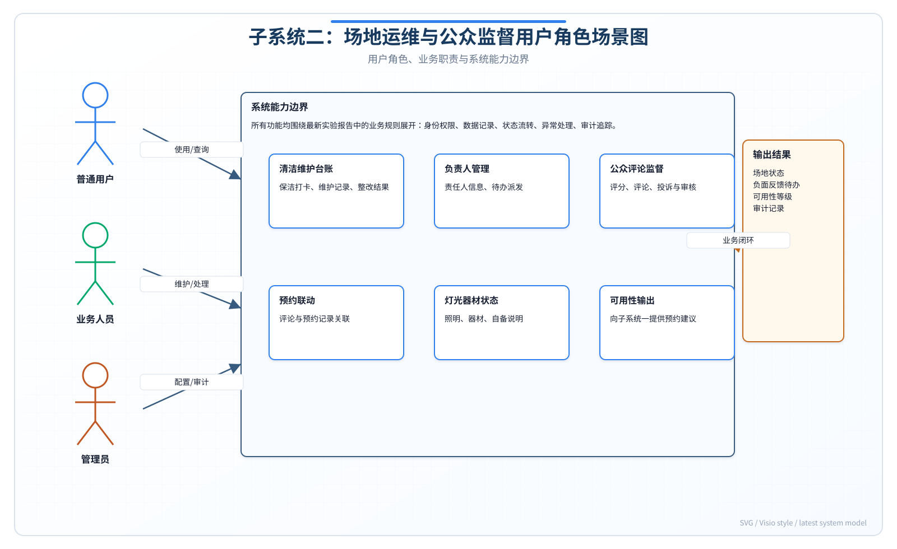

# 实验报告1——需求描述与分析实验

**实验名称：** 实验一 需求描述与分析实验

**子系统：** 子系统二——场地运维与公众监督子系统

**技术栈：** Java 17 + Spring Boot 3.4.4 + MyBatis-Plus 3.5.7 + Spring Security + JWT + MySQL 8.4 / Vue 3 + Vite + Pinia + Ant Design Vue + TypeScript

---

## 报告说明

本报告面向"子系统二：场地运维与公众监督"展开需求描述与分析，是后续结构化分析、面向对象建模、静态建模和动态建模的基础文档。子系统二并不直接承担普通预约排班，而是围绕场地清洁维护、负责人信息管理、公众评论监督、灯光与器材可用性信息、以及向子系统一输出场地可用性判断等职责展开。通过本报告，可以明确运维数据如何影响预约决策，公众反馈如何形成监督闭环，以及管理人员如何对异常信息进行处理。

与子系统一相比，子系统二更强调"场地状态真实可信"和"公众监督可追溯"。场地是否可预约，不只取决于时间段是否空闲，还取决于清洁维护状态、设施灯光状态、器材可用性、用户负面反馈和负责人处理结果。因此，本报告将需求分析重点放在运维台账、评论审核、预约联动、责任人待办和可用性输出等方面，为后续模型设计提供完整业务依据。

## 一. 实验目的

本实验旨在对"场地运维、资产与公众监督子系统"进行全面深入的需求分析。通过系统化地梳理用户角色与业务场景，开展技术、经济与操作三个维度的可行性分析，对需求进行功能性与非功能性的分类定义，最终撰写规范的需求规格说明书（SRS）并形成完整的需求分析报告。通过本实验掌握需求工程的基本方法与实践技能。

## 二. 实验内容

本实验以场地运维与公众监督为核心领域，对子系统二进行全面需求分析。具体内容包括：梳理四类核心用户角色及其业务场景，开展三维度可行性分析，定义7大功能需求模块和5类非功能需求，撰写需求规格说明书片段，为后续的结构化分析、面向对象分析和系统实现奠定需求基础。

### 实验过程补充说明

本实验按照"业务问题识别—角色场景拆解—监督链路分析—运维规则抽取—需求分类—规格化表达"的顺序开展。首先从体育场地日常管理痛点出发，分析清洁记录不完整、责任人信息不透明、用户反馈无法闭环、灯光和器材信息不能及时同步、场地维护状态影响预约但缺少标准输出等问题。随后将系统边界限定在场地运维和公众监督范围内，避免与子系统一的预约排班功能、子系统三的智能辅助与用户服务功能发生职责混淆。

在角色分析阶段，本实验将用户分为普通用户、保洁运维人员、场地负责人和管理员四类。普通用户主要通过评论、评分和投诉反馈场地问题；保洁运维人员负责清洁打卡和维护记录填报；场地负责人负责接收负面反馈、处理待办和更新整改结果；管理员负责评论审核、违规处理、基础信息维护和全局监督。通过这种角色划分，可以明确每类用户在监督闭环中的输入、处理和输出责任。

在需求获取阶段，本实验采用场景推演、台账分析、异常案例归纳和跨系统接口分析相结合的方法。场景推演用于梳理"用户发表场地评论""保洁完成清洁打卡""管理员处理违规评论""负责人接收负面反馈待办"等典型流程；台账分析用于抽取清洁记录、维护记录、灯光状态、器材状态等数据项；异常案例归纳用于补充恶意评论、重复投诉、场地维护中仍被预约等异常情况；跨系统接口分析用于明确向子系统一输出可用性结果的条件和格式。

需求整理完成后，本实验将功能需求分为运维管理、负责人管理、公众评论、预约联动、灯光管理、器材信息和可用性输出七类，并补充相应非功能需求，包括数据实时性、评论审核可追溯性、运维记录完整性、权限控制、跨系统接口稳定性和隐私保护。最终形成的需求规格说明书为后续DFD、ER图、用例图、类图和动态交互图提供统一依据。

## 三. 实验步骤和结果

### 1. 用户角色与业务场景梳理

子系统二共涉及四类核心用户角色，每个角色对应多项典型业务场景。

#### 1.1 学生/教师（普通用户）

本角色是系统的最大用户群体，主要关注场地的可用状态、器材信息以及历史评价。

1. **查看场地运维状态**：用户进入场地列表（VenueList.vue），浏览各场地的运维状态标签。系统通过 `GET /api/venue-ops/{venueId}` 返回 `VenueOps` 实体，前端渲染颜色编码标签：绿色"可开放"（NORMAL）、红色"维护中"（MAINTENANCE）、橙色"灯光故障"（PARTIAL_FAULT）、黄色"待整改"（PENDING_RECTIFICATION）。其中电话号码经 `maskPhone()` 方法脱敏显示为 138****5678 格式。

2. **发表评论与评分**：用户进入场地详情后，点击"查看评论"打开抽屉，嵌入式 `CommentList.vue` 组件展示评论表单。用户输入 1-5 星评分和文字内容（最大500字），提交后由 `CommentServiceImpl.validateBeforeCreate()` 进行反刷屏检测（60秒冷却期）和敏感词过滤（匹配配置列表：诈骗、赌博、代打、代练、广告），通过后写入 `t_comment` 表。

3. **按关键词搜索评论**：用户可输入关键词搜索已有评论，系统调用 `GET /api/comments?keyword=xxx` 按时间倒序返回匹配结果。

#### 1.2 保洁运维人员

本角色负责场地的日常清洁、灯光巡检和器材维护工作。

1. **保洁完成清洁打卡**：保洁人员选择已分配的场地，填写清洁时间、清洁结果（合格/待整改），可选上传现场照片。系统通过 `POST` 接口保存清洁日志到 `t_cleaning_log` 表，同时更新 `t_venue_ops.cleaningStatus` 字段。
2. **灯光系统检查与记录**：检查各灯区的运行状态，记录故障灯具数量与区域。
3. **器材补充与盘点**：查看当前器材清单，更新器材数量状态。

#### 1.3 场地负责人

本角色对特定场地负有管理责任，接收系统告警并协调处理。

1. **接收负面反馈待办**：系统检测某场地出现高频负面评论（连续多条评分≤2），自动生成负责人待办任务。
2. **协调维修并更新状态**：确认问题后联系维修人员，维修完成后通过 `PUT /api/venue-ops/{venueId}` 接口将状态恢复为 NORMAL。
3. **查看场地综合运维报表**：汇总查看负责场地的清洁历史、灯光检查记录、器材盘点情况和评论摘要。

#### 1.4 管理员

本角色拥有系统的最高操作权限，负责内容管理、规则配置和用户管理。

1. **处理违规评论**：发现敏感词报警或违规内容后，管理员可通过 `DELETE /api/comments/{id}` 删除评论，记录操作原因。
2. **配置场地负责人与运维规则**：在 `AdminManage.vue` 中配置场地运维信息的所有字段。
3. **敏感词与反刷屏规则配置**：通过修改 `application.yml` 文件中的配置项调整敏感词库和冷却时间。

**角色场景关系图：**

### 2. 可行性分析

#### 2.1 技术可行性

本项目采用业界成熟稳定的技术栈。后端基于 Spring Boot 3.4.4 框架，MyBatis-Plus 3.5.7 实现高效数据访问层，Spring Security + JWT 提供完善认证授权机制。前端 Vue 3 + Vite + Pinia + Ant Design Vue 提供组件化开发。MySQL 8.4 支持 ENUM 类型字段和高效索引。整体技术方案在团队能力范围内，不存在无法攻克的技术难点。

#### 2.2 经济可行性

系统开发成本主要为人力和服务器资源。采用开源技术栈（Java、Spring、Vue）无需支付软件授权费用；MySQL Community Edition 免费可用。系统运行于通用云服务器或校园内部服务器，月成本可控。子系统二作为场馆预约系统的辅助模块，其投入可显著提升场地运维效率、减少人工沟通成本，符合经济合理性原则。

#### 2.3 操作可行性

系统用户界面基于 Ant Design Vue 组件库构建，表单交互规范，状态标签采用直观的颜色编码，用户学习成本低。保洁人员的清洁打卡流程仅需选择场地、填写结果、可选上传照片三步操作，可在移动端完成。评论发表的敏感词提示和冷却时间提示能引导用户规范使用。

### 3. 功能需求定义

#### FR-O1：清洁与维护台账

| 子需求编号 | 描述 | 对应接口 |
|-----------|------|---------|
| FR-O1.1 | 按场地ID和时间查询清洁记录 | `GET /api/venue-ops/{venueId}` |
| FR-O1.2 | 记录清洁人身份、开始/结束时间 | `t_cleaning_log` 表 |
| FR-O1.3 | 记录清洁检查结果（合格/待整改） | `t_venue_ops.cleaningStatus` |
| FR-O1.4 | 支持上传清洁现场照片 | `t_cleaning_log.photo_url` |
| FR-O1.5 | 待整改结果触发预约禁止 | `evaluateAvailability()` 联动 |

#### FR-O2：负责人信息管理

| 子需求编号 | 描述 | 对应接口 |
|-----------|------|---------|
| FR-O2.1 | 管理员配置负责人姓名/角色/电话 | `PUT /api/venue-ops/{venueId}` |
| FR-O2.2 | 用户端可见负责人信息 | `GET /api/venue-ops/{venueId}` |
| FR-O2.3 | 变更历史追踪 | `t_responsible_history` 表 |
| FR-O2.4 | 电话对非管理员脱敏显示 | `maskPhone()` 方法 |

#### FR-O3：公众评论

| 子需求编号 | 描述 | 对应接口 |
|-----------|------|---------|
| FR-O3.1 | 登录用户发表评论（1-5星+文字） | `POST /api/comments` |
| FR-O3.2 | 评论按时间倒序展示+关键词搜索 | `GET /api/comments` |
| FR-O3.3 | 作者自删评论 | `DELETE /api/comments/{id}` |
| FR-O3.4 | 60秒反刷屏控制 | `checkSpam()` 方法 |
| FR-O3.5 | 敏感词过滤 | `filterSensitiveWords()` 方法 |

#### FR-O4：评论-预约联动

| 子需求编号 | 描述 | 触发条件 |
|-----------|------|---------|
| FR-O4.1 | 高频负面反馈生成待办 | 评分≤2且连续N条 |
| FR-O4.2 | 持续未处理触发升级 | 超时未处理则通知管理员 |

#### FR-O5：灯光管理

| 子需求编号 | 描述 | 对应字段 |
|-----------|------|---------|
| FR-O5.1 | 灯区状态记录 | `t_venue_ops.lightingStatus` |
| FR-O5.2 | 完全故障禁止夜间户外预约 | `evaluateAvailability()` 逻辑 |

#### FR-O6：器材与自备信息

| 子需求编号 | 描述 | 对应字段 |
|-----------|------|---------|
| FR-O6.1 | 展示器材清单/数量/收费方式 | `t_venue_ops.equipmentPolicy` |
| FR-O6.2 | 显示自备器材要求列表 | `t_venue_ops.selfEquipmentList` |

#### FR-O7：可用性输出到子系统一

| 子需求编号 | 描述 | 对应接口 |
|-----------|------|---------|
| FR-O7.1 | 提供场地可预约性判断 | `GET /api/venue-ops/{venueId}/availability` |
| FR-O7.2 | 返回不可预约原因码和显示文本 | `VenueAvailabilityResponse` |
| FR-O7.3 | 状态同步（最终一致性） | 推送或下次调阅时感知 |

### 4. 非功能需求定义

1. **内容安全**：评论内容需通过敏感词过滤器，配置化词库支持动态扩展。
2. **审计完整性**：管理员删除评论需写入审计日志，含操作人ID、IP、时间戳和原因。
3. **移动端可用性**：前端采用响应式布局，保洁打卡操作适应移动端浏览器。
4. **性能效率**：评论列表采用分页查询，反刷屏检测使用内存缓存或Redis。
5. **合规性**：用户电话信息对非管理员执行掩码处理，符合个人信息保护要求。

### 5. 需求规格说明书

**子系统二名称：** 场地运维、资产与公众监督子系统

**版本：** V1.0

**范围：** 本子系统为场馆预约系统的辅助模块，负责场地的运维状态管理、评论交互、器材信息和可用性判断。本子系统不独立处理用户认证，依赖统一的 Spring Security + JWT 认证体系。

**核心实体：**
- `VenueOps`：场地运维信息，包含维护状态、清洁状态、灯光状态、预约策略、负责人信息、器材策略等。
- `Comment`：用户评论，包含评分(1-5)、内容(max 500字)、发布用户和关联场地。

**核心业务流程：**
1. 保洁打卡 → 更新清洁状态 → 触发可用性重新评估
2. 用户评论 → 反刷屏+敏感词双校验 → 保存发布 → 低分触发待办
3. 管理员配置运维 → 即时生效 → 负责人变更历史记录

**外部接口：** 向子系统一输出 `VenueAvailabilityResponse`（reservable, reasonCode, displayMessage, maintenanceFlags），采用最终一致性策略。

## 四. 实验总结

### 实验中遇到的问题

1. **多角色需求收集的全面性**：子系统二涉及保洁人员、场地负责人等非技术角色，在需求获取阶段难以准确理解他们的实际工作流程和痛点。

2. **子系统间接口边界定义**：子系统二向子系统一输出的可用性数据（VenueAvailabilityResponse）的字段设计和更新策略需要两端协商，初期存在接口定义不一致的问题。

3. **敏感词与内容安全策略的粒度**：敏感词过滤采用简单的字符串包含算法，可能存在误判（如正常文本中包含敏感词片段）和漏判（如变体绕过）的问题。

### 解决方法

1. **实地跟访与工作流程记录**：跟随保洁人员进行实地清洁工作，记录完整工作流程，整理出标准化的"清洁打卡"操作步骤。通过现场观察发现了"清洁前后拍照对比""灯具故障分级"等关键需求。

2. **接口契约先行**：在与子系统一的开发团队沟通中，采用"先定义接口契约（API Contract），再实现业务逻辑"的策略。双方共同审定了VenueAvailabilityResponse的字段定义和语义，约定最终一致性策略的更新触发条件。

3. **多策略敏感词过滤**：在字符串包含算法的基础上，增加了全角半角转换、拼音检测和正则表达式模式匹配等多层过滤策略。同时将敏感词库配置化，支持管理员动态调整。

### 思考与收获

通过本实验，我系统完成了子系统二的需求描述与分析工作。梳理了四类核心用户角色及其12个典型业务场景，明确了各角色在系统中的职责边界。在可行性分析中，从技术、经济、操作三个维度论证了项目的可行性。在需求定义方面，将系统功能细化为FR-O1至FR-O7共7个功能需求模块，明确了对应的接口、字段和业务规则。同时从内容安全、审计完整性、移动端可用性、性能效率和合规性五个方面界定了系统的非功能性约束。本实验为后续的结构化分析、面向对象设计和实现奠定了坚实的需求基础。

---

### 附图

*图1-1：子系统二用户角色与业务场景梳理*
