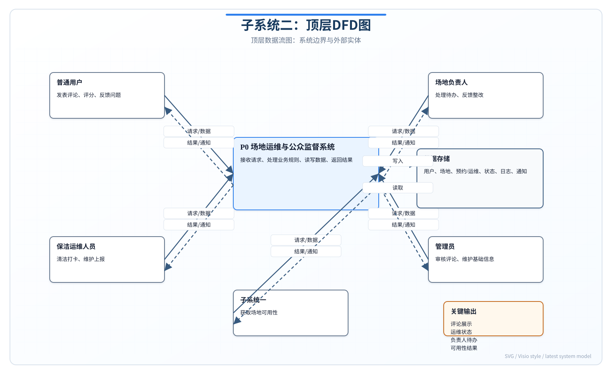
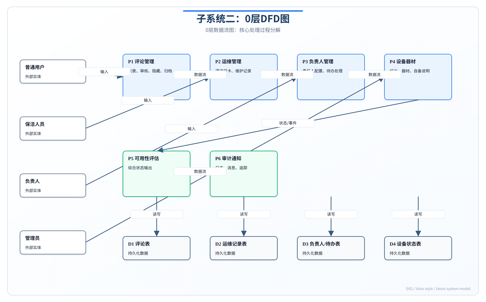
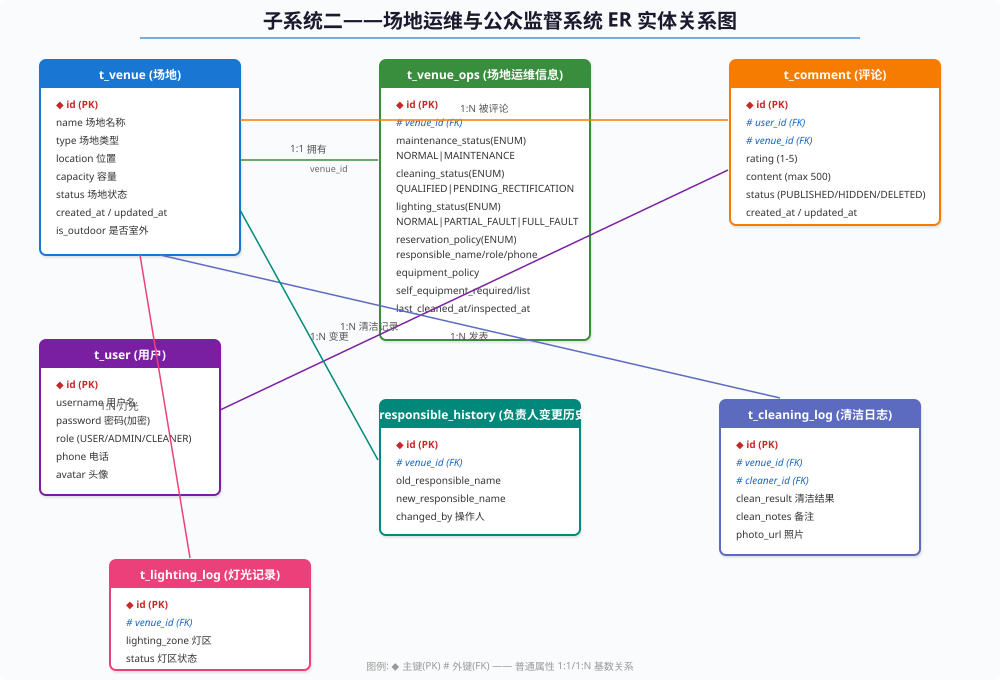
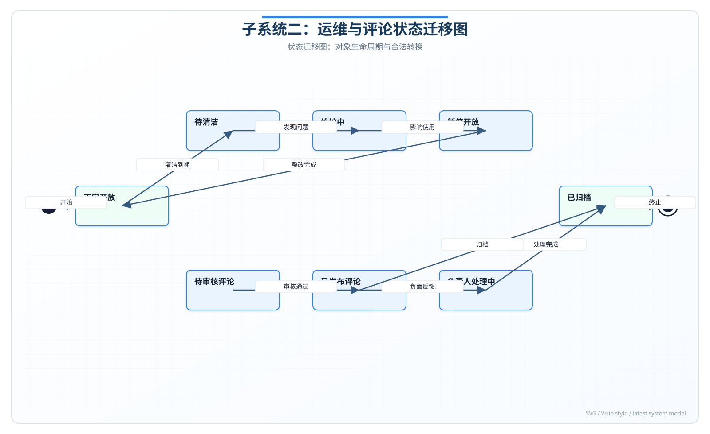

# 实验报告2——结构化分析与设计实验

**实验名称：** 实验二 结构化分析与设计实验

**子系统：** 子系统二——场地运维与公众监督子系统

---

## 一、实验目的

本实验旨在运用结构化分析方法对子系统二进行建模与设计。通过绘制分层数据流图（DFD），描述系统内部的数据流动和处理逻辑；通过ER图刻画系统的核心数据实体及其关系；通过状态迁移图描述关键业务对象的状态变化。在此基础上开展总体设计和详细设计，划分系统模块并定义接口和核心算法。通过本实验掌握结构化分析与设计的方法论和实战技能。

## 二、分层数据流图（DFD）

### 2.1 顶层DFD（场地运维与公众监督系统）

顶层DFD将整个子系统二视为一个黑盒处理过程，展示系统与四个外部实体之间的数据流交互：

- **普通用户（学生/教师）**：向系统发送"查看运维状态"请求和数据流"发表评论/评分"，系统返回"状态/评论数据显示"。
- **保洁运维人员**：向系统发送"清洁打卡/灯光记录/器材更新"数据流，系统返回"保存确认"。
- **管理员**：向系统发送"处理评论/配置负责人"数据流，系统返回"操作结果"。
- **子系统一（场地预约系统）**：向系统发送"查询可用性请求"，系统返回"场地可用性数据"（VenueAvailabilityResponse结构体，含reservable、reasonCode、displayMessage、maintenanceFlags字段）。

系统内部核心处理由 `VenueOpsController`、`CommentController`、`VenueOpsService`、`CommentService` 以及 `t_venue_ops` 和 `t_comment` 数据表协同完成。

### 2.2 零层DFD

零层DFD将子系统二分解为三个核心处理过程：

**P1: 运维管理**——负责清洁打卡处理、灯光状态更新、器材信息管理和负责人配置。接收来自保洁运维人员的清洁打卡和灯光记录数据流，以及管理员的配置负责人/规则数据流，读写 `D1: t_venue_ops` 数据存储。当运维状态变更时向 P3 发送"触发可用性重算"控制流。

**P2: 评论管理**——负责评论发表与展示、敏感词过滤、反刷屏控制和违规评论处理。接收来自普通用户的发表/查看评论数据流和管理员的处理违规评论数据流，读写 `D2: t_comment` 数据存储。

**P3: 可用性输出**——负责可用性评估、状态码生成、原因文本输出和维护标志列表生成。读取 `D1: t_venue_ops` 和 `D3: t_venue` 数据存储，向子系统一输出场地可用性数据。

### 2.3 一层DFD：评论管理的细化

评论管理（P2）的细化处理流程如下：

1. **评论提交处理（P2.1）**：接收来自前端的 `POST /api/comments` 请求，提取用户ID、场地ID、评分和内容。
2. **校验过滤处理（P2.2）**：依次执行反刷屏检测（`checkSpam()`，检查用户-场地60秒冷却）和敏感词过滤（`filterSensitiveWords()`，匹配配置词库）。
3. **存储处理（P2.3）**：将通过校验的评论数据写入 `INSERT INTO t_comment`。
4. **展示处理（P2.4）**：按条件查询 `t_comment` 表（按场地ID、关键词过滤），关联用户表获取用户名，按时间倒序返回。

## 三、ER图（实体关系图）

系统ER图包含以下核心实体及其关系：

### 3.1 核心实体

1. **t_venue（场地）**：主键 `id`，属性包含 name、type、location、capacity、status、is_outdoor 等。与 `t_venue_ops` 呈1:1关系，与 `t_comment`、`t_cleaning_log`、`t_lighting_log`、`t_responsible_history` 均呈1:N关系。

2. **t_venue_ops（场地运维信息）**：主键 `id`，外键 `venue_id` 关联 t_venue。包含四个枚举字段：`maintenanceStatus`（NORMAL/MAINTENANCE）、`cleaningStatus`（QUALIFIED/PENDING_RECTIFICATION）、`lightingStatus`（NORMAL/PARTIAL_FAULT/FULL_FAULT）、`reservationPolicy`（FORBIDDEN/ALLOW_WITH_WARNING）。

3. **t_comment（评论）**：主键 `id`，外键 `user_id` 和 `venue_id` 分别关联 t_user 和 t_venue。核心字段 `rating`（1-5整数）和 `content`（最大500字）。

4. **t_user（用户）**：主键 `id`，包含 username、password、role（USER/ADMIN/CLEANER）、phone 等属性。

5. **t_responsible_history（负责人变更历史）**：记录场馆负责人的变更轨迹，含 old_responsible_name、new_responsible_name、changed_by、changed_at 字段。

6. **t_cleaning_log（清洁日志）**：记录每次清洁的详细信息，含 cleaner_id、clean_result、clean_notes、photo_url、cleaned_at 字段。

7. **t_lighting_log（灯光记录）**：记录灯区检查和状态变更，含 lighting_zone、status 字段。

### 3.2 关系约束

- 一个场地仅对应一条运维信息（1:1）
- 一个场地可有多条评论、多条清洁日志、多条灯光记录、多条负责人变更记录（1:N）
- 一个用户可发表多条评论（1:N）
- 评论和运维信息通过 venue_id 实现业务联动

## 四、状态迁移图

### 4.1 场地运维状态迁移

场地运维信息的核心状态为 `maintenanceStatus` 枚举，其状态迁移规则如下：

- **NORMAL → MAINTENANCE**：触发条件为管理员通过 `PUT /api/venue-ops/{venueId}` 设置 maintenanceStatus=MAINTENANCE，通常因报修或计划维护触发。
- **MAINTENANCE → NORMAL**：维修完成后管理员恢复 maintenanceStatus=NORMAL。
- **NORMAL → PENDING_RECTIFICATION**：触发条件为保洁打卡 `cleaningStatus=PENDING_RECTIFICATION`（清洁结果=不合格），视学校配置可能禁止预约。
- **PENDING_RECTIFICATION → NORMAL**：重新清洁并检查通过后 recovery。
- **NORMAL → FULL_FAULT_LIGHTING**：灯光子系统检测到 `lightingStatus=FULL_FAULT`，禁止夜间户外预约。
- **FULL_FAULT_LIGHTING → NORMAL**：灯具全部修复后恢复正常。

### 4.2 评论生命周期状态迁移

评论状态包括：**DRAFT（草稿）→ PENDING_REVIEW（待审核）→ PUBLISHED（已发布）→ HIDDEN（已隐藏）→ DELETED（已删除）**。

- 用户提交评论后，若无敏感词则直接进入 PUBLISHED 状态；若命中敏感词可进入 PENDING_REVIEW 或直接拒绝。
- 管理员可将 PUBLISHED 评论设为 HIDDEN 或直接 DELETED（软删除）。
- 作者可自删评论（状态变为 DELETED）。
- 删除操作需记录审计日志。

## 五、总体设计

### 5.1 技术架构分层

系统采用经典的四层架构：

- **表示层（Presentation）**：`VenueOpsController`、`CommentController`，接收HTTP请求，调用业务层，返回JSON响应。
- **业务层（Service）**：`VenueOpsServiceImpl`、`CommentServiceImpl`，执行核心业务逻辑（可用性评估、反刷屏、敏感词过滤）。
- **持久层（Mapper）**：`VenueOpsMapper`、`CommentMapper`，基于 MyBatis-Plus `BaseMapper<T>` 提供CRUD操作。
- **数据层（Model/Entity）**：`VenueOps`、`Comment`，ORM实体映射到数据库表。

前端采用 MVVM 模式：Vue 3 组件层 + Pinia 状态管理 + Axios HTTP客户端。

### 5.2 模块划分

| 模块编号 | 模块名称 | 核心功能 | 关键类 |
|---------|---------|---------|-------|
| M1 | 清洁台账模块 | 清洁打卡、记录查询、可预约性联动 | VenueOpsController, VenueOpsServiceImpl |
| M2 | 负责人管理模块 | 负责人CRUD、变更历史、电话脱敏 | VenueOpsServiceImpl.maskPhone() |
| M3 | 评论管理模块 | 评论CRUD、敏感词过滤、反刷屏 | CommentController, CommentServiceImpl |
| M4 | 灯光管理模块 | 灯区状态、故障影响判断 | evaluateAvailability() 内嵌逻辑 |
| M5 | 器材管理模块 | 器材清单、自备信息、收费方式 | VenueOpsUpdateRequest 字段管理 |
| M6 | 可用性输出模块 | 评估算法、响应生成、子系统一接口 | evaluateAvailability() |

## 六、详细设计

### 6.1 评论创建流程伪代码

```
FUNCTION createComment(CommentCreateRequest req, Long userId):
    // 步骤1: 反刷屏检测
    lastComment = t_comment SELECT MAX(created_at)
                  WHERE user_id = userId AND venue_id = req.venueId
    IF lastComment IS NOT NULL AND (NOW() - lastComment) < 60s THEN
        THROW AntiSpamException("请稍候60秒后再发表评论")
    END IF

    // 步骤2: 敏感词过滤
    sensitiveWords = CONFIG "comment.sensitive-words" SPLIT BY ","
    FOR EACH word IN sensitiveWords:
        IF req.content CONTAINS word THEN
            THROW SensitiveWordException("评论包含敏感词: " + word)
        END IF
    END FOR

    // 步骤3: 重复内容检测
    duplicate = SELECT COUNT(*) FROM t_comment
                WHERE user_id = userId AND venue_id = req.venueId
                AND content = req.content
    IF duplicate > 0 THEN
        THROW DuplicateContentException("请勿重复发表相同内容")
    END IF

    // 步骤4: 保存评论
    comment = NEW Comment()
    comment.userId = userId
    comment.venueId = req.venueId
    comment.rating = req.rating
    comment.content = req.content
    comment.createdAt = NOW()
    t_comment INSERT comment

    // 步骤5: 检查是否需要生成负责人待办
    IF req.rating <= 2 THEN
        recentNegativeCount = SELECT COUNT(*) FROM t_comment
                              WHERE venue_id = req.venueId
                              AND rating <= 2
                              AND created_at > (NOW() - 7 DAYS)
        IF recentNegativeCount >= THRESHOLD THEN
            CREATE_TODO(venueId, "负面反馈待办")
        END IF
    END IF

    RETURN comment
END FUNCTION
```

### 6.2 可用性评估算法伪代码

```
FUNCTION evaluateAvailability(Long venueId):
    ops = t_venue_ops SELECT WHERE venue_id = venueId
    venue = t_venue SELECT WHERE id = venueId

    response = NEW VenueAvailabilityResponse()
    response.maintenanceFlags = NEW ArrayList()

    // 规则1: 维护状态检查
    IF ops.maintenanceStatus == MAINTENANCE THEN
        response.reservable = FALSE
        response.reasonCode = "MAINTENANCE"
        response.displayMessage = "场地维护中，暂不可预约"
        response.maintenanceFlags.ADD("维护中")
        RETURN response
    END IF

    // 规则2: 清洁状态检查
    IF ops.cleaningStatus == PENDING_RECTIFICATION
       AND schoolConfig.blockOnCleaningFail THEN
        response.reservable = FALSE
        response.reasonCode = "CLEANING_FAIL"
        response.displayMessage = "场地清洁未达标，暂不可预约"
        response.maintenanceFlags.ADD("待整改")
        RETURN response
    END IF

    // 规则3: 灯光检查（仅影响夜间户外场地）
    IF ops.lightingStatus == FULL_FAULT
       AND venue.isOutdoor
       AND CURRENT_TIME.isNighttime() THEN
        response.reservable = FALSE
        response.reasonCode = "LIGHTING_FAULT"
        response.displayMessage = "场地灯光故障，夜间不可预约"
        response.maintenanceFlags.ADD("灯光全故障")
        RETURN response
    END IF

    // 通过所有检查
    response.reservable = TRUE
    response.reasonCode = "OK"
    response.displayMessage = "场地可预约"
    RETURN response
END FUNCTION
```

## 七、实验总结

本实验完成了子系统二的结构化分析与设计。在数据流分析方面，绘制了顶层DFD、0层DFD和1层DFD，逐层细化了系统的数据处理逻辑，明确了外部实体、处理过程和数据存储之间的数据流向。在数据建模方面，通过ER图刻画了7个核心实体及其关系，清晰定义了主键、外键约束和基数关系。在状态建模方面，分别为场地运维状态和评论生命周期绘制了状态迁移图，明确了各状态的进入条件和转换触发事件。在总体设计方面，将系统划分为6个功能模块，采用经典的四层架构实现了关注点分离。在详细设计方面，给出了评论创建流程和可用性评估算法的完整伪代码，为后续编码实现提供了精确的指导。结构化分析方法为理解系统的功能和数据逻辑提供了直观而严谨的视图。

---

### 附图



*图2-1：顶层数据流图*



*图2-2：0层数据流图*



*图2-3：实体关系图*



*图2-4：状态迁移图*
