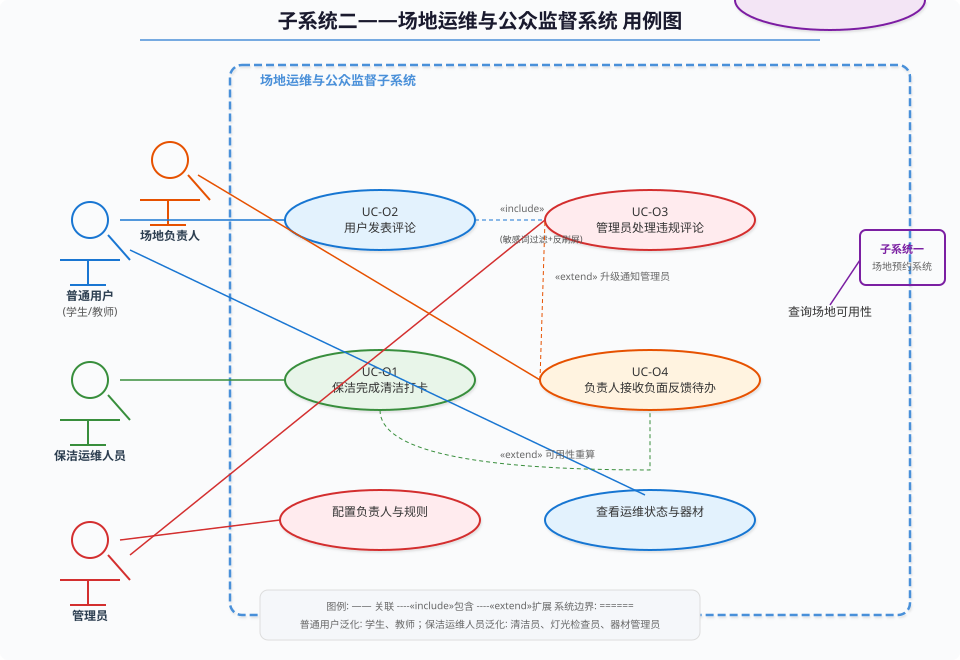

# 实验报告3——面向对象分析与设计实践

**实验名称：** 实验三 面向对象分析与设计实践

**子系统：** 子系统二——场地运维与公众监督子系统

---

## 一、实验目的

本实验旨在运用面向对象分析方法对子系统二进行用例驱动的需求建模。通过识别系统参与者（Actor）与用例（Use Case），梳理用例与参与者、用例之间的关系（包含、扩展、泛化），绘制规范的UML用例图。在此基础上，针对四个核心用例撰写完整的用例规格说明，包含前置条件、后置条件、基本事件流和异常事件流。通过本实验掌握基于用例的面向对象分析方法。

## 二、参与者识别

子系统二共涉及五类参与者（Actor），其中四类为人类用户，一类为外部系统：

### 2.1 普通用户（学生/教师）

泛化自"普通用户"角色，是系统的最大参与者群体。通过 `GET /api/venue-ops/{venueId}` 查看场地运维状态（电话脱敏），通过 `POST /api/comments` 发表评论，通过 `GET /api/comments` 搜索和浏览评论。

### 2.2 运维保洁人员

负责场地的日常清洁、灯光检查和器材维护。通过清洁打卡接口更新 `t_venue_ops.cleaningStatus`，通过灯光记录接口更新 `lightingStatus`。其操作可能触发 `evaluateAvailability()` 可用性重算。该角色可泛化出清洁员、灯光检查员和器材管理员三个子角色。

### 2.3 场地负责人

对特定场地负有管理责任。接收系统自动生成的负面反馈待办（UC-O4），查看负责场地的综合运维报表，协调维修并更新场地状态。

### 2.4 管理员

系统最高权限用户。通过 `AdminManage.vue` 中的运维配置弹窗配置场地负责人和规则（`PUT /api/venue-ops/{venueId}`），处理违规评论（`DELETE /api/comments/{id}` 并记录审计日志），管理敏感词配置（`application.yml` 中的 `comment.sensitive-words`）。

### 2.5 子系统一（外部系统）

场地预约子系统，通过调用 `GET /api/venue-ops/{venueId}/availability` 接口获取场地的可预约状态，接收 `VenueAvailabilityResponse` 结构体（reservable、reasonCode、displayMessage、maintenanceFlags）。

## 三、用例图

用例图将系统边界（场地运维与公众监督子系统）内的7个用例、5类参与者和它们之间的关联关系可视化。核心用例包括：

- **UC-O1 保洁完成清洁打卡**：由保洁运维人员发起，扩展触发可用性重算。
- **UC-O2 用户发表评论**：由普通用户发起，包含敏感词过滤和反刷屏子流程。
- **UC-O3 管理员处理违规评论**：由管理员发起，写入审计日志。
- **UC-O4 负责人接收负面反馈待办**：由系统检测低分评论自动生成，由负责人处理，若持续未处理则扩展升级通知管理员。
- 此外还包括"查看运维状态与器材"（普通用户/管理员共用）、"查询场地可用性"（子系统一专用）、"配置负责人与规则"（管理员专用）等支撑用例。

## 四、用例规格说明

### UC-O1：保洁完成清洁打卡

**参与者：** 运维保洁人员

**前置条件：**
1. 保洁人员已通过 Spring Security + JWT 认证，拥有 `ROLE_CLEANER` 角色权限。
2. 该保洁人员已被分配至目标场地（场地负责人信息中记录了该保洁人员或系统管理员已授权）。
3. 当前时间在系统允许的保洁在岗时间范围内。

**后置条件：**
1. 成功：清洁记录被保存到 `t_cleaning_log` 表；`t_venue_ops.cleaningStatus` 被更新为清洁结果（QUALIFIED 或 PENDING_RECTIFICATION）；`t_venue_ops.lastCleanedAt` 更新为当前时间；若清洁结果为 PENDING_RECTIFICATION 且配置禁止预约，场地可预约性状态更新为 NOT_RESERVABLE。
2. 失败：系统状态不变，向用户返回具体错误信息。

**基本事件流：**
1. 保洁人员登录系统，进入场地管理页面（管理员分配后可见已分配场地列表）。
2. 保洁人员选择目标场地（系统通过 `venueId` 定位到 `t_venue_ops` 记录和 `t_venue` 记录）。
3. 系统展示当前场地的运维状态信息（现有清洁状态、维护状态等）。
4. 保洁人员点击"清洁打卡"按钮，系统弹出打卡表单。
5. 保洁人员填写以下信息：
   - 清洁开始时间和结束时间（系统默认为当前时间，可手动调整）
   - 清洁检查结果：选择"合格"或"待整改"
   - 备注信息（可选）
   - 现场照片（可选上传）
6. 保洁人员确认提交，系统执行以下操作：
   - 创建新 `t_cleaning_log` 记录
   - 更新 `t_venue_ops.cleaningStatus` 字段
   - 更新 `t_venue_ops.lastCleanedAt` 和 `updatedAt` 字段
   - 调用 `evaluateAvailability(venueId)` 重新计算场地可预约性
7. 系统返回操作成功确认，显示更新后的运维状态。

**异常事件流：**
1. **重复打卡**：系统检测到同一保洁人员在短时间内（如同一小时内）对同一场地重复打卡，返回提示"请勿重复打卡，如需更正请联系管理员"。
2. **场地不存在**：若 `venueId` 对应的场地不存在，系统返回404错误"指定场地不存在"。
3. **权限不足**：若当前用户角色不包含 `ROLE_CLEANER`，`SecurityContextHolder` 权限检查失败，返回403错误"无权限执行清洁打卡操作"。
4. **网络异常**：若保存请求因网络中断失败，前端显示"网络异常，请重试"，表单数据暂存在本地（Pinia Store），用户可重试提交。

---

### UC-O2：用户发表评论

**参与者：** 普通用户（学生/教师）

**前置条件：**
1. 用户已通过 JWT 认证登录系统。
2. 目标场地存在于系统中（`t_venue.id` 有效）。
3. 用户未被管理员禁言（可选功能，取决于系统配置）。

**后置条件：**
1. 成功：评论记录保存到 `t_comment` 表（userId、venueId、rating、content、createdAt），评论状态为 PUBLISHED 并公开可见。若评分 ≤ 2，系统异步检查是否触发 UC-O4（负责人待办生成）。
2. 失败：系统状态不变，用户收到错误提示。

**基本事件流：**
1. 用户登录系统，进入场地列表（`VenueList.vue`）。
2. 用户点击某个场地的"查看评论"按钮，前端打开右侧抽屉（Drawer），加载嵌入式 `CommentList.vue` 组件。
3. `CommentList.vue` 执行 `mounted()` 生命周期钩子，调用 `GET /api/comments?venueId={id}` 获取已有评论列表（包含用户名、评分、内容、时间）。
4. 用户在评论表单区域输入评分（1-5星，Ant Design Rate组件）和评论内容（Textarea，最多500字）。
5. 用户点击"提交评论"按钮。
6. 前端执行客户端校验：检查评分是否有效、内容是否为空、字数是否超限。
7. 校验通过后，前端发送 `POST /api/comments` 请求，Body 为 `CommentCreateRequest` JSON。
8. 后端 `CommentController.create()` 接收请求，调用 `CommentServiceImpl.validateBeforeCreate(userId, venueId, content)`。
9. `validateBeforeCreate()` 内部依次执行：
   - `checkSpam(userId, venueId)`：查询该用户对该场地在60秒内是否存在评论记录，若存在则抛 `AntiSpamException`。
   - `filterSensitiveWords(content)`：遍历配置的敏感词列表，若内容包含任一敏感词则抛 `SensitiveWordException`。
   - `checkDuplicate(userId, venueId, content)`：检查是否与已有评论内容完全相同，若是则抛 `DuplicateContentException`。
10. 校验通过后，`create(req)` 方法构造 `Comment` 实体并执行 `INSERT INTO t_comment`。
11. 数据库保存成功后，返回201 Created状态码和完整的 `Comment` JSON 对象。
12. 前端接收到成功响应后，调用 `GET /api/comments?venueId={id}` 刷新评论列表，新评论出现在列表顶部。
13. 后端异步检查：若 `rating <= 2`，统计该场地近期低分评论数量，若超过阈值则自动生成负责人待办（UC-O4）。

**异常事件流：**
1. **敏感词拦截**：`filterSensitiveWords()` 检测到内容包含敏感词（如"诈骗"、"赌博"），返回400错误"评论包含敏感词，请修改后重新提交"。前端显示红色提示信息。
2. **刷屏限制**：`checkSpam()` 检测到60秒冷却期内，返回429错误"请稍候60秒后再发表评论"。前端显示倒计时提示。
3. **重复内容**：`checkDuplicate()` 检测到完全相同的评论已存在，返回400错误"请勿重复发表相同内容"。
4. **场地不存在**：若 `req.venueId` 对应的场地不存在于数据库，返回404错误"指定场地不存在"。
5. **未登录**：若请求缺少 JWT Token，Spring Security 拦截器返回401 Unauthorized。

---

### UC-O3：管理员处理违规评论

**参与者：** 管理员

**前置条件：**
1. 管理员已通过 JWT 认证，拥有 `ROLE_ADMIN` 角色。
2. 存在需要处理的违规评论（经敏感词检测报警或被用户举报）。
3. 管理员有明确的处理依据（系统已标记匹配的敏感词或违规类型）。

**后置条件：**
1. 成功：评论状态从 PUBLISHED 变为 HIDDEN 或 DELETED（软删除）。操作记录写入审计日志表，包含操作人ID、操作类型、目标评论ID、IP地址、时间戳和操作原因。
2. 失败：评论状态不变，管理员收到操作失败提示。

**基本事件流：**
1. 管理员登录系统，进入后台管理页面（`AdminManage.vue`）。
2. 管理员在评论管理模块中查看标记为"待处理"的违规评论（系统通过敏感词检测或用户举报自动标记）。
3. 管理员查看违规评论的详细内容，确认违规事实。
4. 管理员选择处理方式：
   - 隐藏评论：将评论状态设为 HIDDEN（对普通用户不可见，但数据保留）
   - 删除评论：将评论状态设为 DELETED（软删除，通过 `deleted` 标记字段实现）
5. 系统弹出确认对话框，要求管理员填写操作原因。
6. 管理员确认操作，系统执行以下步骤：
   - 调用 `CommentServiceImpl.deleteById(commentId, adminUserId)` 或 `hideById()`
   - 更新 `t_comment.status` 字段
   - 写入审计日志记录
7. 系统返回操作成功确认，评论从公共视图消失（已登录管理员仍可查看已隐藏/已删除评论用于审计追溯）。

**异常事件流：**
1. **评论不存在**：目标评论ID对应的记录已被其他管理员删除，返回404错误"评论不存在或已被处理"。
2. **权限不足**：若当前用户不具有 `ROLE_ADMIN` 角色，返回403错误"无管理权限"。
3. **未填写操作原因**：管理员未在确认对话框中填写操作原因，前端拦截并提示"请填写操作原因"。
4. **审计日志写入失败**：若审计日志写入因数据库异常失败，记录到系统日志并以降级方式继续执行删除操作。

---

### UC-O4：负责人接收负面反馈待办

**参与者：** 场地负责人（主要）、管理员（扩展参与者）

**前置条件：**
1. 系统中存在某场地连续多条评分 ≤ 2 的评论（触发阈值可配置，默认可为近7天内≥3条）。
2. 该场地已通过 `t_venue_ops.responsibleName` 指定了负责人。
3. 负责人账号已激活并有权查看待办列表。

**后置条件：**
1. 成功：系统为负责人创建一条待办任务，包含场地名称、负面评论摘要、问题类型和创建时间。负责人跟进后更新待办状态和处理说明。若持续未处理（超过配置天数），系统将待办升级并通知管理员。
2. 失败：不创建待办，系统记录日志但不影响正常业务流程。

**基本事件流：**
1. 系统在评论发表（UC-O2）的后置处理中检测到 `rating <= 2`。
2. 系统异步统计该场地近7天内评分 ≤ 2 的评论数量。
3. 若评论数量达到配置的阈值（如≥3条），系统自动生成为该场地负责人创建待办任务。
4. 待办任务包含以下信息：
   - 场地名称和ID
   - 负面评论摘要（最近3条低分评论的内容片段）
   - 问题分类（如"卫生问题"、"设施故障"、"服务态度"）
   - 创建时间和优先级
5. 场地负责人登录系统后，在待办列表中看到新任务。
6. 负责人查看待办详情，浏览相关评论，进行现场核实。
7. 负责人填写处理说明（如"已安排清洁人员重新打扫"、"已联系维修队"）。
8. 负责人更新待办状态为"处理中"或"已解决"。
9. 若负责人将状态更新为"已解决"，系统再次统计近期低分评论数量作为验证。

**异常事件流：**
1. **场地无指定负责人**：若 `t_venue_ops.responsibleName` 为空，系统无法分配待办对象，记录日志并通知管理员"场地XXX缺少负责人配置"。
2. **待办积压升级**：若待办任务在配置的天数内未被处理（状态仍为"待处理"），系统自动提升待办优先级并通知管理员介入。
3. **低分评论不足阈值**：若统计结果未达到配置的阈值，不创建待办，系统仅在日志中记录本次低分评分。
4. **并发创建**：若多个低分评论在短时间内同时到达，系统通过去重机制避免为同一场地重复创建待办。

---

## 五、实验总结

本实验完成了子系统二的面向对象分析与设计。通过识别系统的五类参与者（普通用户、保洁运维人员、场地负责人、管理员、子系统一）和七个核心用例，构建了完整的用例模型。用例图清晰地展示了参与者与用例的关联关系、用例之间的包含和扩展依赖，以及系统边界的划分。针对四个核心用例（UC-O1至UC-O4），编写了完整的用例规格说明，包括前置条件、后置条件、基本事件流（6-12步）和异常事件流（4-5种异常场景）。规格说明中引用了实际的类名（`VenueOpsController`、`CommentServiceImpl`）、接口路径（`GET /api/venue-ops/{venueId}`）、方法名（`evaluateAvailability()`、`maskPhone()`、`checkSpam()`）和数据库表（`t_venue_ops`、`t_comment`、`t_cleaning_log`），确保用例规格与实际系统实现紧密对应。

---

### 附图

*图3-1：子系统二用例图*
