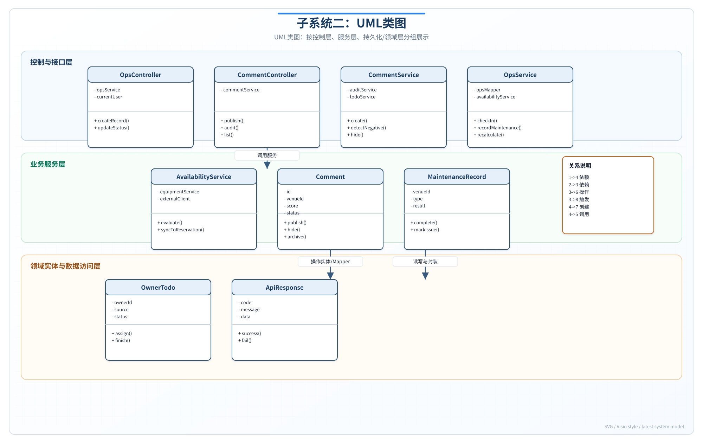
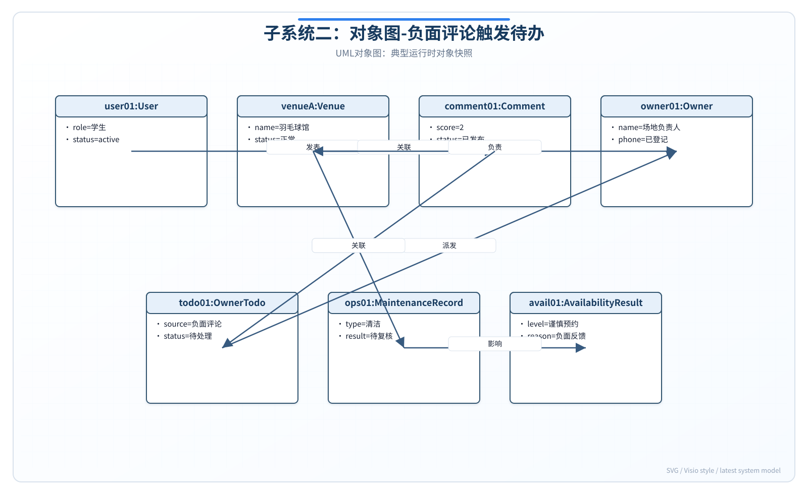
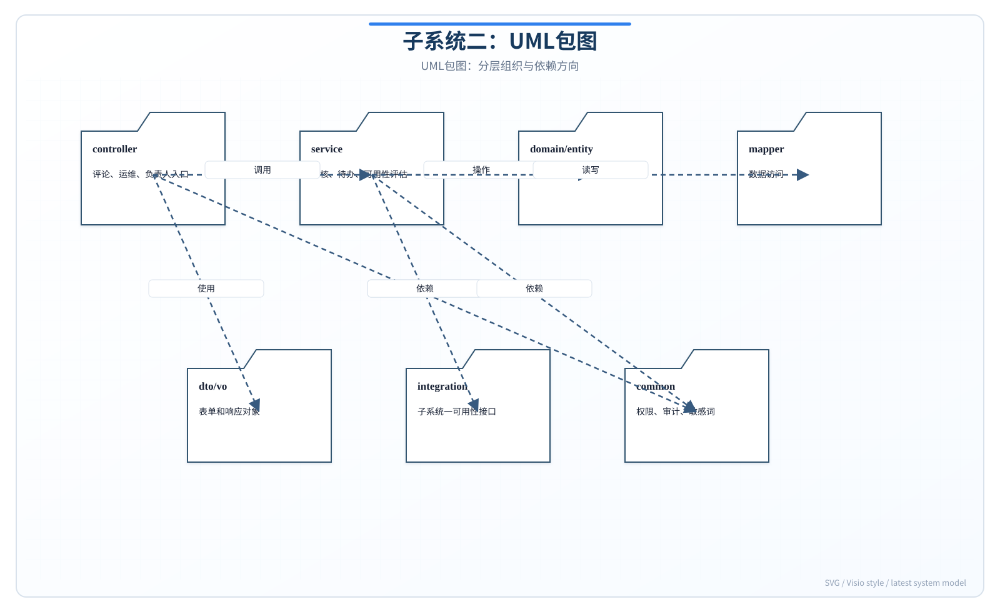
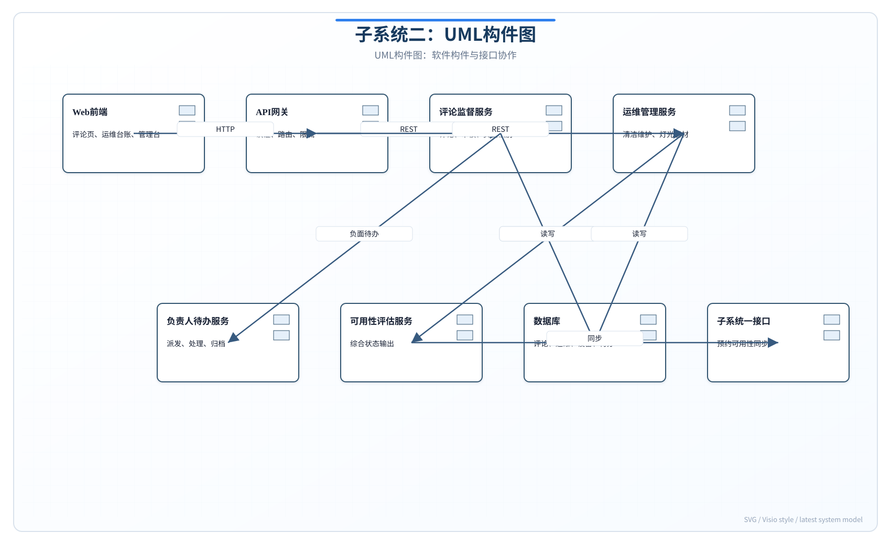
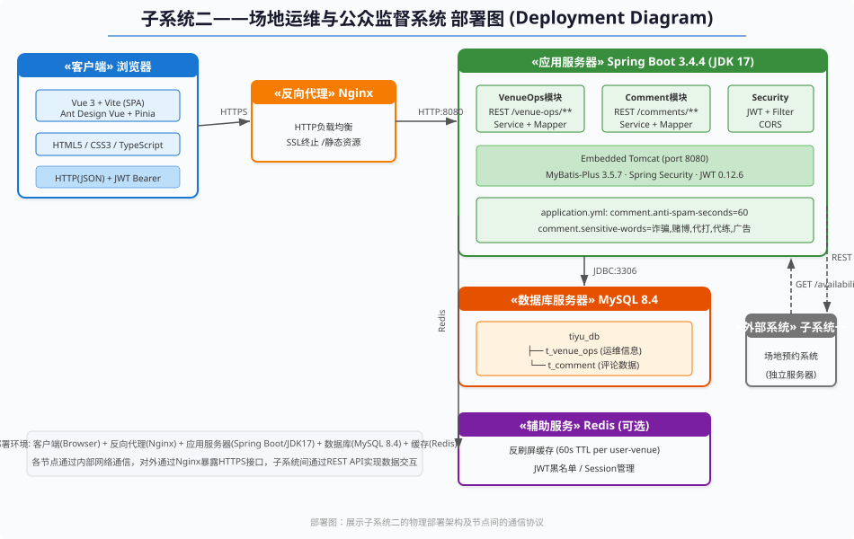

# 实验报告4——静态建模实践

**实验名称：** 实验四 静态建模实践

**子系统：** 子系统二——场地运维与公众监督子系统

**对应代码：** `com.example.tiyu` 包下运维与评论相关类

---

## 报告说明

本报告对子系统二进行 UML 静态建模，类图和包图严格对照 `VenueOps.java`、`Comment.java` 及对应 Controller/Service 源码。

## 一. 实验目的

1. 绘制类图，定义运维与评论核心类及关系。
2. 绘制对象图，实例化运维填报场景。
3. 绘制包图、构件图、部署图。
4. 使静态模型与 db.sql 表结构一致。

## 二. 实验内容

绘制五种静态视图，覆盖 VenueOps 四维状态模型和 Comment 简化评论模型。

## 三. 实验步骤和结果

### 1. 类图

#### 1.1 核心类

| 类别 | 类名 | 职责 |
| --- | --- | --- |
| 控制层 | VenueOpsController | 运维 CRUD + 可约性查询 |
| 控制层 | CommentController | 评论 CRUD |
| 服务接口 | VenueOpsService | 运维业务接口 |
| 服务实现 | VenueOpsServiceImpl | 运维逻辑 + getAvailability() |
| 服务 | CommentService / CommentServiceImpl | 评论 CRUD（无自定义方法） |
| 实体 | VenueOps | 映射 t_venue_ops |
| 实体 | Comment | 映射 t_comment |
| 实体 | Venue | 映射 t_venue（共享） |
| DTO | VenueOpsRequest | 填报请求体 |
| DTO | VenueAvailabilityResponse | 可约性响应 |
| DTO | CommentCreateRequest | 评论请求体 |

#### 1.2 VenueOps 实体属性

| 属性 | 类型 | 列名 |
| --- | --- | --- |
| id | Long | id (PK) |
| venueId | Long | venue_id (UNIQUE FK) |
| maintenanceStatus | String | maintenance_status |
| cleaningStatus | String | cleaning_status |
| lightingStatus | String | lighting_status |
| equipmentStatus | String | equipment_status |
| responsiblePerson | String | responsible_person |
| contactPhone | String | contact_phone |
| lastInspector | String | last_inspector |
| lastCheckedAt | LocalDateTime | last_checked_at |
| remark | String | remark |

#### 1.3 VenueOpsServiceImpl 阻断常量

```java
BLOCKING_MAINTENANCE = {"MAINTENANCE", "CLOSED"}
BLOCKING_CLEANING    = {"NEED_CLEANING", "PENDING_RECHECK"}
BLOCKING_LIGHTING    = {"FAULT"}
BLOCKING_EQUIPMENT   = {"MISSING", "DAMAGED"}
```

#### 1.4 类间关系

| 关系 | 说明 |
| --- | --- |
| VenueOpsController → VenueOpsService | 依赖注入 |
| VenueOpsServiceImpl → VenueOpsService | 实现 |
| VenueOpsServiceImpl → VenueOpsMapper | 数据访问 |
| VenueOpsServiceImpl → VenueService | 校验场馆存在 |
| CommentController → CommentService | 依赖注入 |
| VenueOps → Venue | 1:1 关联（venue_id UNIQUE） |
| Comment → Venue, User | N:1 关联 |



### 2. 对象图

**场景：** 运维人员 wangwu（STAFF）填报篮球A馆（venue_id=2）清洁状态为 PENDING_RECHECK。

| 对象 | 属性值 |
| --- | --- |
| wangwu : User | id=4, username="wangwu", role="STAFF" |
| basketballA : Venue | id=2, name="篮球A馆" |
| ops2 : VenueOps | venueId=2, maintenanceStatus="NORMAL", cleaningStatus="PENDING_RECHECK", lightingStatus="NORMAL", equipmentStatus="COMPLETE", lastInspector="wangwu" |
| avail : VenueAvailabilityResponse | venueId=2, available=false, status="PENDING_RECHECK", reason="清洁状态未达开放标准" |



### 3. 包图

子系统二相关类分布在 `com.example.tiyu` 各子包：

| 包 | 类 |
| --- | --- |
| controller | VenueOpsController, CommentController |
| service | VenueOpsService, CommentService |
| service.impl | VenueOpsServiceImpl, CommentServiceImpl |
| mapper | VenueOpsMapper, CommentMapper |
| entity | VenueOps, Comment, Venue, User |
| dto | VenueOpsRequest, VenueAvailabilityResponse, CommentCreateRequest |

**跨子系统依赖：** ReservationServiceImpl（子系统一）→ VenueOpsService（子系统二）



### 4. 构件图

| 构件 | 接口 | 说明 |
| --- | --- | --- |
| VenueMaintenanceUI | — | 运维填报前端页面 |
| VenueOpsAPI | PUT/GET /api/venue-ops/* | 运维后端构件 |
| AvailabilityService | getAvailability() | 可约性评估（VenueOpsServiceImpl 内） |
| CommentAPI | GET/POST/DELETE /api/comments | 评论后端构件 |
| VenueListUI | — | 场馆列表+运维标签+评论抽屉 |
| ReservationAPI（子系统一） | 内部调用 getAvailability() | 预约前校验 |
| MySQL | t_venue_ops, t_comment | 数据存储 |



### 5. 部署图

| 节点 | 内容 |
| --- | --- |
| 浏览器客户端 | Vue 3 SPA（VenueList + VenueMaintenance + CommentList） |
| 应用服务器 :8080 | Spring Boot 单体（含子系统一/二） |
| MySQL :3306 | tiyu 数据库 |

**关键部署约束：** VenueOps 与 Reservation 同库同应用，getAvailability() 为进程内同步调用。



## 四. 实验总结

### 实验中遇到的问题

原类图包含 CleaningLog、CommentServiceImpl 的 validateBeforeCreate()、maskPhone() 等未实现元素。

### 解决方法

类图仅保留 entity/ 目录下实际类和 VenueOpsServiceImpl 的四个 BLOCKING 常量集。

### 思考与收获

VenueOps 四维状态 + getAvailability() 单入口的设计在静态模型中清晰可见，为动态建模中的阻断场景提供了结构基础。
