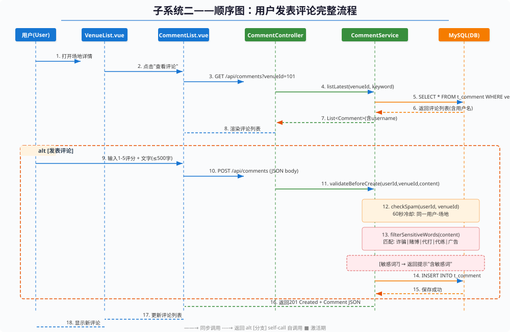
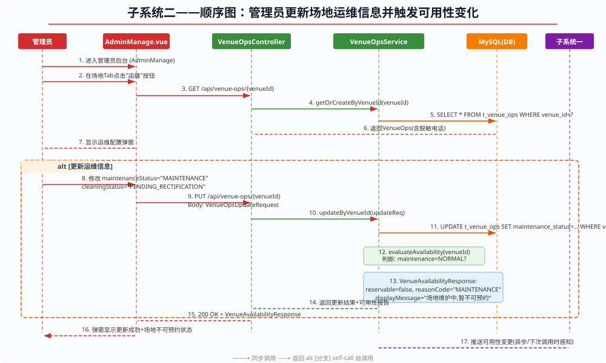
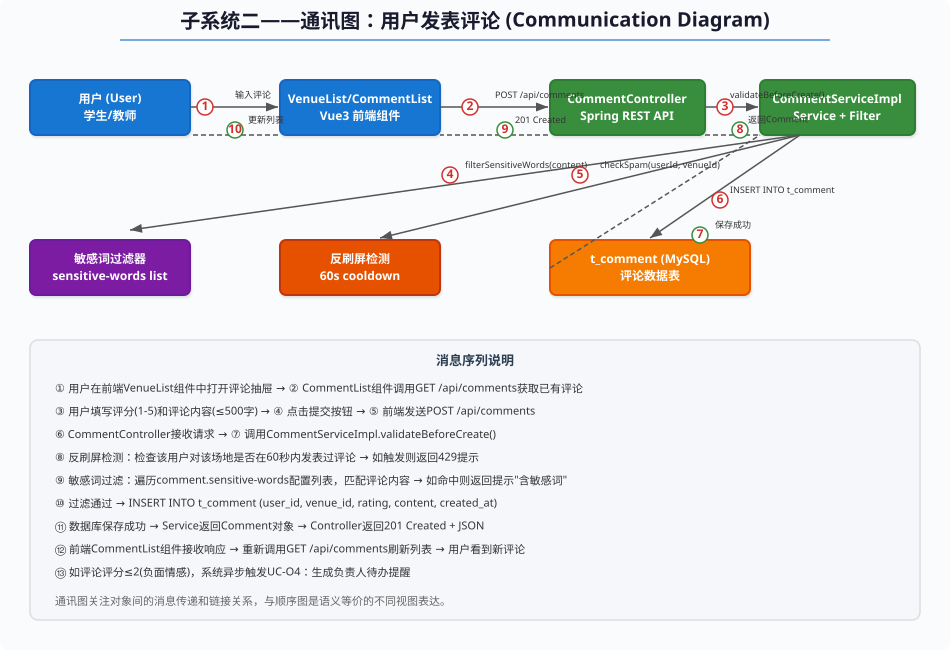
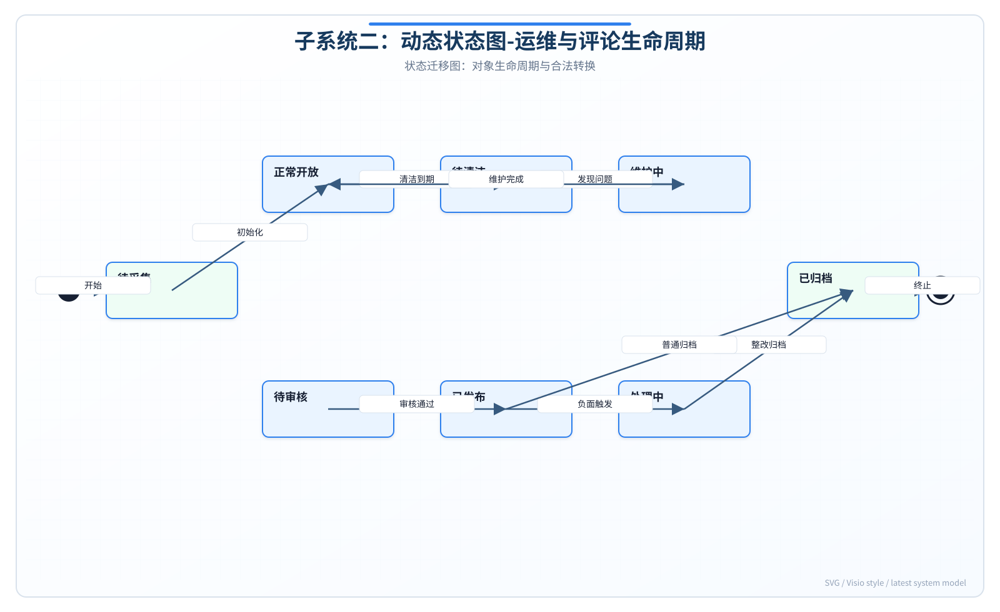
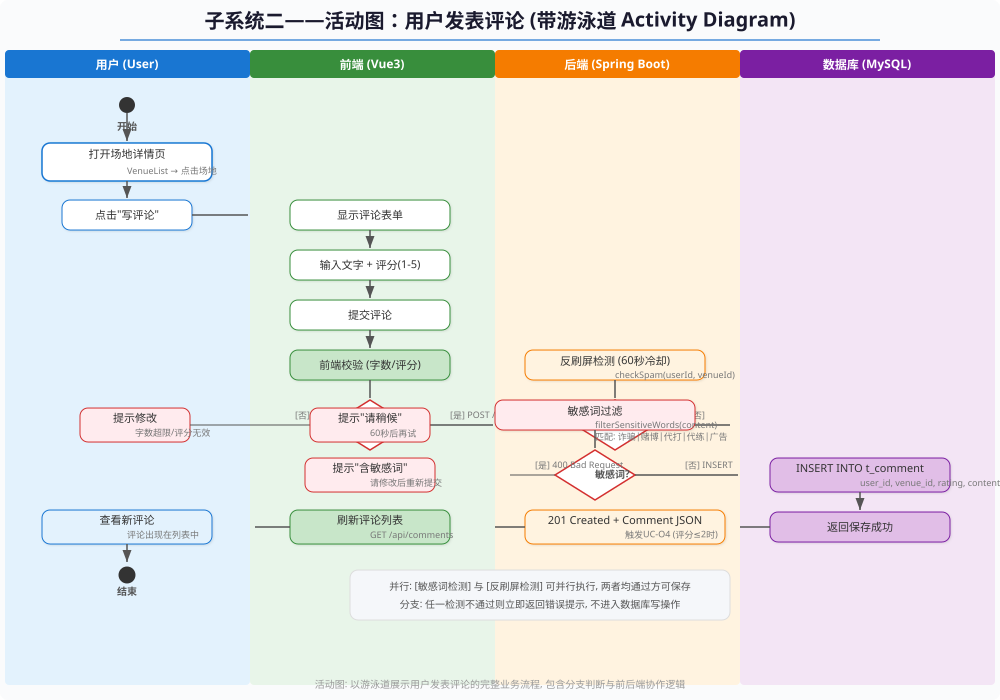

# 实验报告5——动态建模与系统交互实践

**实验名称：** 实验五 动态建模与系统交互实践

**子系统：** 子系统二——场地运维与公众监督子系统

---

## 报告说明

本报告从动态行为角度描述子系统二在关键业务场景下的对象交互、状态变化和流程分支，是对前四次实验成果的运行时验证。静态模型说明系统由哪些对象和构件组成，动态模型进一步说明用户评论、运维状态更新、可用性评估和跨系统通知在执行过程中如何协同完成。

子系统二的动态复杂度主要来自评论监督闭环和运维状态联动。用户发表评论可能触发敏感内容校验、预约关联校验、负面反馈待办和负责人通知；管理员更新场地运维信息可能改变场地可用性，并影响子系统一的预约展示结果。因此，本报告通过顺序图、通讯图、状态图和活动图，展开说明系统在关键场景下的消息顺序、协作关系、状态转换和流程闭环。

## 一. 实验目的

本实验旨在运用UML动态建模技术对子系统二的核心业务流程和对象交互进行建模。通过顺序图（Sequence Diagram）和通讯图（Communication Diagram）刻画对象之间的消息传递和时间顺序；通过状态图（State Machine Diagram）描述关键对象的生命周期和状态变迁；通过活动图（Activity Diagram）展示业务流程的分支、并行和对象流动。通过本实验掌握面向对象动态建模的方法论，为系统实现提供精确的行为规范。

## 二. 实验内容

本实验运用UML动态建模技术对子系统二的核心业务流程和对象交互进行建模。通过顺序图绘制"用户发表评论"和"管理员更新场地运维"两个核心场景；通过通讯图从空间协调角度展示对象间的消息传递；通过状态图刻画场地运维状态和灯光复合子状态的两层状态机；通过活动图以四泳道形式展示用户发表评论的完整业务流程及决策分支、并行校验路径。

### 实验过程补充说明

本实验按照"场景选择—参与对象识别—消息顺序整理—协作关系转换—状态生命周期分析—活动流程校验"的步骤展开。场景选择时，本实验重点选择用户发表评论和管理员更新场地运维信息两个流程。前者代表公众监督入口，能够体现评论提交、审核、负面反馈和负责人待办；后者代表运维管理入口，能够体现状态变更、可用性重算和跨系统同步。

顺序图建模时，先识别界面、控制器、服务、审核模块、Mapper、数据库、通知模块和外部子系统等参与对象，再按照实际执行顺序排列消息。用户发表评论流程从页面提交开始，经过参数校验、预约关联校验、内容审核、评论写入、评分统计、负面反馈判断和待办通知；管理员更新运维信息流程则包括权限校验、运维记录写入、场地状态更新、可用性评估、缓存刷新和向子系统一同步结果。

通讯图在顺序图基础上转换得到，重点检查对象之间是否存在必要协作关系。若评论服务需要触发负责人待办，则必须能够访问负责人信息和通知模块；若可用性评估服务需要输出给子系统一，则必须能够读取运维状态、灯光状态、器材状态并调用外部接口。通过通讯图可以发现顺序图中遗漏的对象连接，也可以判断某些对象是否被过度建模。

状态图用于描述场地运维状态和评论状态的生命周期。场地状态可能从正常进入待清洁、维护中、暂停开放，再恢复到正常；评论状态可能从待审核进入已发布、已隐藏、已处理或已归档。状态图的重点是约束非法转换，例如维护中场地不应直接输出完全可预约，已隐藏评论不应继续公开展示，已归档待办不应再次触发负责人通知。

活动图用于从业务流程角度验证控制流是否闭环。本实验围绕用户发表评论流程展示登录校验、场地选择、内容填写、审核判断、保存评论、触发待办、返回结果等活动，并补充内容违规、重复评论、场地不存在、负面反馈处理等分支。通过活动图可以检查用户操作路径、系统自动处理路径和异常路径是否都有明确结束点。

## 三. 实验步骤和结果

### 1. 顺序图

#### 1.1 场景一：用户发表评论完整流程

本顺序图展示了从用户打开场地详情到新评论显示的完整交互过程，跨越六个对象生命线：用户（User）、VenueList.vue、CommentList.vue、CommentController、CommentService、MySQL。

**消息流如下：**

| 序号 | 调用方 | 被调方 | 消息 | 说明 |
|------|--------|--------|------|------|
| 1 | 用户 | VenueList.vue | 点击场地，打开详情 | 用户操作 |
| 2 | VenueList.vue | CommentList.vue | 打开抽屉，加载组件 | 组件切换 |
| 3 | CommentList.vue | CommentController | GET /api/comments | 获取评论列表 |
| 4 | CommentController | CommentService | listLatest(venueId) | 委托服务层 |
| 5 | CommentService | MySQL | SELECT * FROM t_comment | 数据库查询 |
| 6 | MySQL | CommentService | 返回评论列表 | 含用户名 |
| 7 | CommentService | CommentController | 返回List<Comment> | 业务层返回 |
| 8 | CommentController | CommentList.vue | JSON响应 | 渲染评论列表 |
| 9 | 用户 | CommentList.vue | 填写评分+内容，点击提交 | 用户操作 |
| 10 | CommentList.vue | CommentController | POST /api/comments | 提交评论 |
| 11 | CommentController | CommentService | create(req) | 委托服务层 |
| 12 | CommentService | (自调用) | checkSpam() | 反刷屏检测 |
| 13 | CommentService | (自调用) | filterSensitiveWords() | 敏感词过滤 |
| 14 | CommentService | MySQL | INSERT INTO t_comment | 保存评论 |
| 15 | MySQL | CommentService | 保存成功 | 返回id |
| 16 | CommentService | CommentController | 返回Comment对象 | 业务层返回 |
| 17 | CommentController | CommentList.vue | 201 Created + JSON | 成功响应 |
| 18 | CommentList.vue | MySQL | 重新GET /api/comments | 刷新评论列表 |
| 19 | 用户 | — | 看到新评论 | 最终结果 |

**顺序图：**

#### 1.2 场景二：管理员更新场地运维信息并触发可用性变化

本顺序图展示了管理员通过 AdminManage.vue 修改场地运维配置并触发可用性重算的完整流程。

**消息流如下：**

| 序号 | 调用方 | 被调方 | 消息 | 说明 |
|------|--------|--------|------|------|
| 1 | 管理员 | AdminManage.vue | 进入后台管理页面 | 用户操作 |
| 2 | 管理员 | AdminManage.vue | 点击场地"运维"按钮 | 用户操作 |
| 3 | AdminManage.vue | VenueOpsController | GET /api/venue-ops/{venueId} | 获取运维信息 |
| 4 | VenueOpsController | VenueOpsService | getOrCreateByVenueId() | 委托服务层 |
| 5 | VenueOpsService | MySQL | SELECT * FROM t_venue_ops | 数据库查询 |
| 6 | MySQL | VenueOpsService | 返回VenueOps | 查询结果 |
| 7 | VenueOpsService | AdminManage.vue | 返回运维信息（电话脱敏） | 渲染配置弹窗 |
| 8 | 管理员 | AdminManage.vue | 修改字段，点击保存 | 用户操作 |
| 9 | AdminManage.vue | VenueOpsController | PUT /api/venue-ops/{venueId} | 更新运维配置 |
| 10 | VenueOpsController | VenueOpsService | updateByVenueId(req) | 委托服务层 |
| 11 | VenueOpsService | MySQL | UPDATE t_venue_ops | 更新数据库 |
| 12 | MySQL | VenueOpsService | 更新成功 | 返回确认 |
| 13 | VenueOpsService | (自调用) | evaluateAvailability() | 可用性重算 |
| 14 | VenueOpsService | AdminManage.vue | 返回可用性报告 | 更新结果 |
| 15 | VenueOpsService | 子系统一 | 最终一致性通知 | 异步告知变更 |

**顺序图：**

### 2. 通讯图

基于场景一（用户发表评论）的顺序图转换为通讯图，展示六个对象之间的链接和消息传递。

**消息序列（编号与顺序图对应）：**
1. ① 用户 → VenueList：打开场地详情，输入评论
2. ② CommentList → CommentController：`POST /api/comments`
3. ③ CommentController → CommentServiceImpl：`create(req)`
4. ④ CommentServiceImpl → 敏感词过滤器：`filterSensitiveWords(content)`
5. ⑤ CommentServiceImpl → 反刷屏检测：`checkSpam(userId, venueId)`
6. ⑥ CommentServiceImpl → t_comment (MySQL)：`INSERT INTO t_comment`
7. ⑦ t_comment → CommentServiceImpl：保存成功信号
8. ⑧ CommentServiceImpl → CommentController：返回Comment对象
9. ⑨ CommentController → CommentList：返回 201 Created + JSON
10. ⑩ CommentList → 用户：刷新评论列表，显示新评论

**通讯图：**

### 3. 状态图

#### 3.1 场地运维状态图

场地运维信息（VenueOps）的状态机以 maintenanceStatus 和 lightingStatus 两个核心枚举字段的取值作为状态。

**核心状态：**
- **NORMAL**（正常使用）：场地可预约，可评论，为系统初始状态。
- **MAINTENANCE**（维护中）：管理员设置，禁止预约。
- **PENDING_RECTIFICATION**（待整改）：保洁打卡结果为"不合格"触发。
- **FULL_FAULT_LIGHTING**（灯光全故障）：禁止夜间预约。

**迁移规则：**
- NORMAL → MAINTENANCE：管理员设置维护
- MAINTENANCE → NORMAL：维修完成，管理员恢复
- NORMAL → PENDING_RECTIFICATION：保洁打卡 cleaningStatus=PENDING_RECTIFICATION
- PENDING_RECTIFICATION → NORMAL：重新清洁，检查通过
- NORMAL → FULL_FAULT_LIGHTING：灯区全部故障
- FULL_FAULT_LIGHTING → NORMAL：灯具全部修复

**灯光复合状态：** 灯光系统包含三个子状态：LIGHTING_NORMAL → PARTIAL_FAULT → FULL_FAULT。

无论主状态或灯光子状态发生变更，均触发出口动作 `evaluateAvailability()`。

**状态图：**

### 4. 活动图

活动图以游泳道（Swimlane）形式展示"用户发表评论"的完整业务流程，划分为四个泳道：用户、前端（Vue3）、后端（Spring Boot）、数据库（MySQL）。

**业务流程如下：**

1. **开始** → 用户打开场地详情页。
2. **用户泳道**：用户点击"写评论"按钮。
3. **前端泳道**：CommentList.vue 显示评论表单。用户填写评分和内容后点击提交。前端执行客户端校验。
4. **决策节点一（校验通过？）**：[否]返回修改；[是] POST /api/comments，转入后端。
5. **后端泳道**——并行执行两条校验路径：
   - 路径A：`checkSpam()` 反刷屏检测（60秒冷却）
   - 路径B：`filterSensitiveWords()` 敏感词过滤
6. **决策节点二（刷屏？）**：[是]返回"请稍候60秒"；[否]继续。
7. **决策节点三（敏感词？）**：[是]返回"包含敏感词"；[否]继续。
8. **数据库泳道**：执行 `INSERT INTO t_comment`。
9. 数据库返回保存成功 → 后端生成 201 Created → 前端刷新列表 → 用户看到新评论。
10. **异步分支**：评分≤2时触发负责人待办生成流程（不阻塞主流程）。
11. **结束**。

**活动图：**

## 四. 实验总结

### 实验中遇到的问题

1. **顺序图与系统实现的技术细节平衡**：顺序图需要在"足够详细以指导编码"和"足够抽象以保持可读性"之间取得平衡。例如，在"用户发表评论"场景中，checkSpam()和filterSensitiveWords()是两次独立的自调用，但在顺序图中是否要表示为两条显式消息存在争议。

2. **同步与异步消息的表达**：评论创建完成后的"低分评论触发负责人待办"是异步操作，在顺序图中如何与主流程的同步消息区分表达，以及是否需要在图中标注异步消息的返回路径。

3. **活动图的并行路径与验证**：反刷屏检测和敏感词过滤在逻辑上是"与"关系（两者必须同时通过），但在活动图中用Fork-Join表达并行时，需要确保两条路径的验证结果都能正确汇合到决策节点。

### 解决方法

1. **两级抽象策略**：在顺序图中将checkSpam()和filterSensitiveWords()合并为一条"validateBeforeCreate()"消息表示完整的校验步骤，在底层的"调用说明"或"方法说明"中展开两个子步骤的详细内容。这样顺序图保持简洁，同时不丢失技术细节。

2. **异步消息的标注规范**：在顺序图中采用非阻塞返回的异步消息箭头（半箭头），并配合"异步"文本标注。异步消息不等待返回，主流程继续执行。在图中使用注释说明异步消息的触发条件和后续处理逻辑。

3. **并行路径的Guard条件合成**：在活动图中，两条并行校验路径在Join节点汇合后，进入一个统一的决策节点。该决策节点的Guard条件为"校验结果"（通过/不通过），实际业务逻辑中通过将两个校验结果合并为一个布尔值来实现。在图中用注释说明"两条路径同时通过才视为校验通过"。

### 思考与收获

本实验完成了子系统二的动态建模与系统交互实践。在顺序图方面，选取了两个核心场景进行建模：用户发表评论的完整流程和管理员更新场地运维的流程，精确刻画了对象间消息传递的时间顺序和嵌套调用关系。在通讯图方面，将顺序图等价转换为通讯图，突出了对象之间的链接结构。在状态图方面，为场地运维状态设计了包含主状态和灯光复合子状态的两层状态机。在活动图方面，以四泳道形式展示了用户发表评论的完整业务流程，包含决策分支和并行校验路径。四种动态视图相互补充，从时间序列、对象通信、状态变迁和流程控制四个维度完整刻画了子系统二的行为模型，为后续的编码实现和测试用例设计提供了精确的规范指导。

---

### 附图

*图5-1：用户发表评论顺序图*

*图5-2：管理员更新场地运维顺序图*

*图5-3：用户发表评论通讯图*

*图5-4：场地运维状态机图*

*图5-5：用户发表评论活动图*
